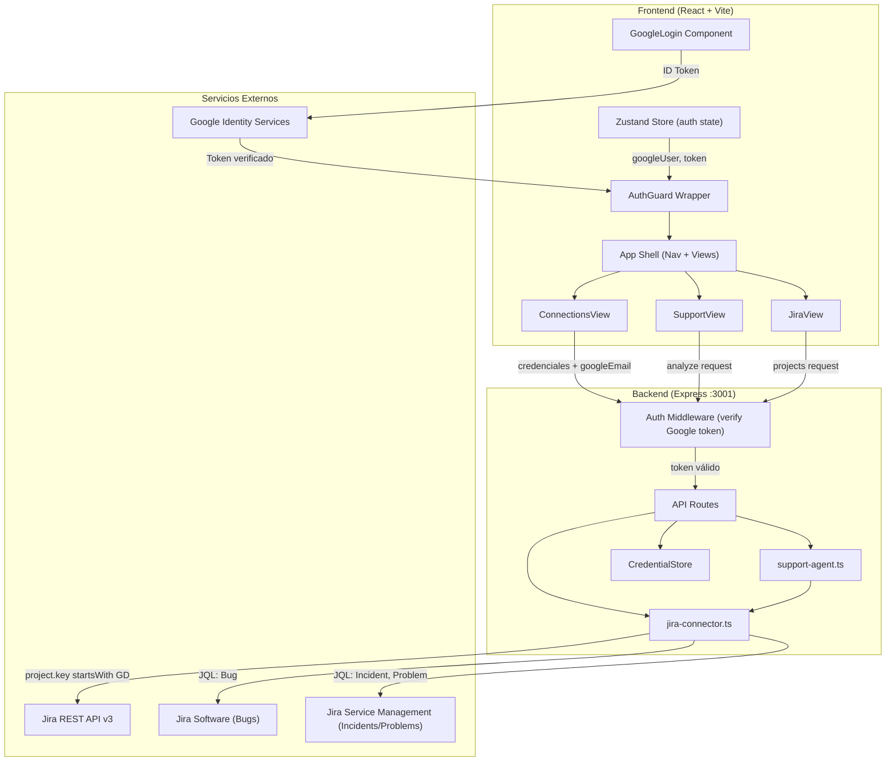
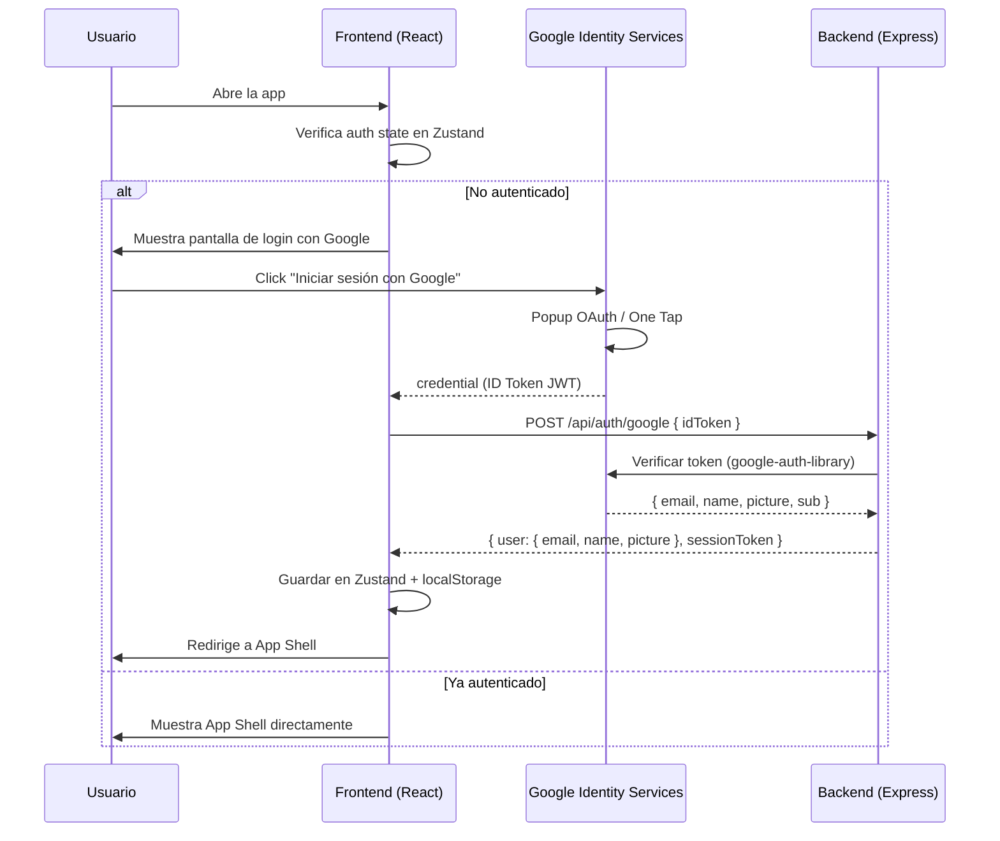
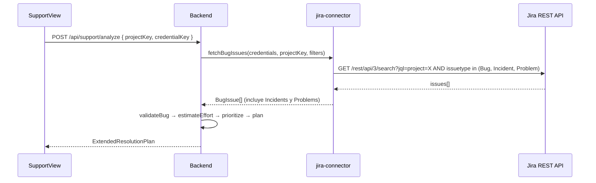
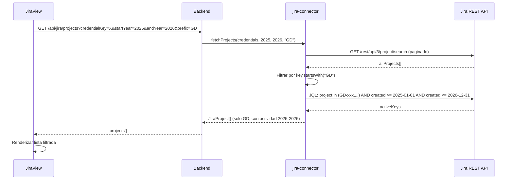

# Documento de Diseño: Corporate Auth + JSM + Filtro GD

## Resumen

Este diseño cubre tres ajustes al sistema PO AI: (1) Google Sign-In como mecanismo de autenticación principal del frontend, donde el usuario debe autenticarse con su correo corporativo de Google antes de acceder a cualquier funcionalidad, y las credenciales de servicios externos (Jira, Figma, Datadog) se asocian al usuario autenticado; (2) extensión del Support Agent para traer tickets de Jira Service Management (JSM) de tipo "Incident" y "Problem" además de los bugs existentes; (3) filtro de proyectos por tribus con clave "GD" y rango de fechas 2025-2026.

Los tres cambios son incrementales sobre la arquitectura existente. Google Sign-In introduce una capa de autenticación en el frontend con `@react-oauth/google` y un middleware de verificación de token en el backend. La extensión JSM modifica el JQL existente en `fetchBugIssues()` para incluir tipos adicionales. El filtro GD ajusta `fetchProjects()` para filtrar por prefijo de clave de proyecto.

## Arquitectura



## Diagramas de Secuencia

### Flujo 1: Autenticación con Google Sign-In



### Flujo 2: Support Agent con tickets JSM



### Flujo 3: Filtro de proyectos GD



## Componentes e Interfaces

### Componente 1: Google Auth (Frontend)

**Propósito**: Gestionar la autenticación con Google Identity Services y proteger el acceso a la app.

**Interfaz**:
```typescript
// Nuevo estado en useAppStore.ts
interface GoogleUser {
  email: string;
  name: string;
  picture: string;
  idToken: string;
}

interface AuthState {
  googleUser: GoogleUser | null;
  isAuthenticated: boolean;
  loginWithGoogle: (credential: string) => Promise<void>;
  logout: () => void;
}
```

**Responsabilidades**:
- Renderizar botón de Google Sign-In usando `@react-oauth/google`
- Enviar ID token al backend para verificación
- Almacenar sesión en Zustand + localStorage
- Bloquear acceso a la app si no hay sesión activa

### Componente 2: Auth Middleware (Backend)

**Propósito**: Verificar el token de Google en cada request protegido.

**Interfaz**:
```typescript
// Nuevo middleware en packages/backend/src/api/auth-middleware.ts
import { Request, Response, NextFunction } from 'express';

interface AuthenticatedRequest extends Request {
  user?: {
    email: string;
    name: string;
    sub: string; // Google user ID
  };
}

function verifyGoogleToken(req: AuthenticatedRequest, res: Response, next: NextFunction): void;
```

**Responsabilidades**:
- Extraer Bearer token del header Authorization
- Verificar token con `google-auth-library`
- Inyectar datos del usuario en `req.user`
- Rechazar requests sin token válido (401)

### Componente 3: JSM Issue Fetcher (Backend)

**Propósito**: Extender `fetchBugIssues()` para incluir tickets JSM.

**Interfaz**:
```typescript
// Extensión en jira-connector.ts
// El JQL cambia de:
//   issuetype = Bug
// a:
//   issuetype in (Bug, Incident, Problem)

export async function fetchBugIssues(
  credentials: JiraCredentials,
  projectKey: string,
  filters?: BugFilters
): Promise<BugIssue[]>;
// Misma firma, diferente JQL interno
```

**Responsabilidades**:
- Construir JQL que incluya Bug, Incident y Problem
- Mapear campos de Incident/Problem al modelo BugIssue existente
- Mantener compatibilidad con filtros existentes (severities, components, dates)

### Componente 4: Filtro de Proyectos GD (Backend)

**Propósito**: Filtrar proyectos por prefijo de clave y rango de fechas.

**Interfaz**:
```typescript
// Extensión en jira-connector.ts
export async function fetchProjects(
  credentials: JiraCredentials,
  startYear?: number,
  endYear?: number,
  keyPrefix?: string  // Nuevo parámetro
): Promise<JiraProject[]>;
```

**Responsabilidades**:
- Filtrar proyectos cuya clave empiece con el prefijo dado (ej: "GD")
- Aplicar filtro de rango de fechas existente
- Pasar el prefijo desde el query param del endpoint

## Modelos de Datos

### GoogleUser

```typescript
interface GoogleUser {
  email: string;       // correo corporativo Google
  name: string;        // nombre completo
  picture: string;     // URL del avatar
  idToken: string;     // JWT de Google (para enviar al backend)
}
```

**Reglas de validación**:
- `email` debe ser un correo válido (dominio corporativo)
- `idToken` debe ser un JWT válido verificable por Google

### BugIssue (extendido)

```typescript
// El modelo BugIssue existente ya soporta los campos necesarios.
// Los tickets JSM de tipo Incident y Problem se mapean así:
// - Incident.summary → BugIssue.summary
// - Incident.priority → BugIssue.priority
// - Incident.status → BugIssue.status
// - Problem.summary → BugIssue.summary
// No se requieren cambios al modelo, solo al JQL.
```

### Auth Response (Backend)

```typescript
interface AuthResponse {
  user: {
    email: string;
    name: string;
    picture: string;
  };
  sessionToken: string; // Token de sesión (puede ser el mismo ID token o un JWT propio)
}
```

## Pseudocódigo Algorítmico

### Algoritmo: Verificación de Google Token

```typescript
// POST /api/auth/google
async function handleGoogleAuth(req: Request, res: Response): Promise<void> {
  const { idToken } = req.body;

  // Precondición: idToken no es vacío
  if (!idToken) {
    res.status(400).json({ error: 'idToken is required' });
    return;
  }

  // Verificar con Google
  const client = new OAuth2Client(GOOGLE_CLIENT_ID);
  const ticket = await client.verifyIdToken({
    idToken,
    audience: GOOGLE_CLIENT_ID,
  });
  const payload = ticket.getPayload();

  // Postcondición: payload contiene email verificado
  if (!payload || !payload.email_verified) {
    res.status(401).json({ error: 'Token inválido o email no verificado' });
    return;
  }

  res.json({
    user: {
      email: payload.email,
      name: payload.name,
      picture: payload.picture,
    },
    sessionToken: idToken, // Reusar el ID token como sesión
  });
}
```

**Precondiciones:**
- `idToken` es un string no vacío
- `GOOGLE_CLIENT_ID` está configurado en variables de entorno

**Postcondiciones:**
- Si el token es válido: retorna datos del usuario y sessionToken
- Si el token es inválido: retorna 401
- No se crean efectos secundarios en la base de datos

### Algoritmo: JQL Extendido para JSM

```typescript
// Dentro de fetchBugIssues() en jira-connector.ts
function buildJqlWithJSM(projectKey: string, filters?: BugFilters): string {
  // Base JQL: incluir Bug, Incident y Problem
  let jql = `project = ${projectKey} AND issuetype in (Bug, Incident, Problem) AND status in (Open, "In Progress", Reopened)`;

  // Aplicar filtros opcionales (sin cambios)
  if (filters?.severities?.length) {
    const priorities = filters.severities
      .map(s => SEVERITY_TO_JIRA_PRIORITY[s])
      .filter(Boolean)
      .map(p => `"${p}"`)
      .join(', ');
    if (priorities) jql += ` AND priority in (${priorities})`;
  }

  if (filters?.components?.length) {
    const comps = filters.components.map(c => `"${c}"`).join(', ');
    jql += ` AND component in (${comps})`;
  }

  if (filters?.createdAfter) {
    jql += ` AND created >= "${filters.createdAfter.toISOString().split('T')[0]}"`;
  }
  if (filters?.createdBefore) {
    jql += ` AND created <= "${filters.createdBefore.toISOString().split('T')[0]}"`;
  }

  return jql;
}
```

**Precondiciones:**
- `projectKey` es un string válido de proyecto Jira
- Los tipos Incident y Problem existen en la instancia de Jira (JSM habilitado)

**Postcondiciones:**
- El JQL retornado incluye los tres tipos de issue
- Los filtros opcionales se aplican correctamente
- Compatible con la API REST v3 de Jira

**Invariantes de bucle:** N/A (no hay bucles)

### Algoritmo: Filtro de Proyectos por Prefijo

```typescript
// Dentro de fetchProjects() en jira-connector.ts
function filterProjectsByPrefix(
  projects: JiraProject[],
  keyPrefix?: string
): JiraProject[] {
  if (!keyPrefix) return projects;
  return projects.filter(p => p.key.startsWith(keyPrefix));
}
```

**Precondiciones:**
- `projects` es un array válido de JiraProject
- `keyPrefix` si se proporciona, es un string no vacío

**Postcondiciones:**
- Si `keyPrefix` es undefined: retorna todos los proyectos
- Si `keyPrefix` tiene valor: retorna solo proyectos cuya clave empiece con ese prefijo
- El array original no se muta

## Funciones Clave con Especificaciones Formales

### loginWithGoogle()

```typescript
// En useAppStore.ts
async function loginWithGoogle(credential: string): Promise<void>
```

**Precondiciones:**
- `credential` es un JWT de Google válido (obtenido del callback de GoogleLogin)
- El backend está disponible en `VITE_API_URL`

**Postcondiciones:**
- Si exitoso: `googleUser` se establece en el store, `isAuthenticated = true`, datos persistidos en localStorage
- Si falla: se lanza error, estado no cambia

### verifyGoogleToken() (middleware)

```typescript
function verifyGoogleToken(req: AuthenticatedRequest, res: Response, next: NextFunction): void
```

**Precondiciones:**
- Header `Authorization: Bearer <token>` presente en el request

**Postcondiciones:**
- Si token válido: `req.user` contiene `{ email, name, sub }`, llama `next()`
- Si token inválido o ausente: responde 401, no llama `next()`

### fetchBugIssues() (modificado)

```typescript
async function fetchBugIssues(
  credentials: JiraCredentials,
  projectKey: string,
  filters?: BugFilters
): Promise<BugIssue[]>
```

**Precondiciones:**
- `credentials` son válidas para la instancia de Jira
- `projectKey` existe en Jira
- La instancia tiene JSM habilitado (para tipos Incident/Problem)

**Postcondiciones:**
- Retorna array de BugIssue que incluye bugs, incidents y problems
- Si JSM no está habilitado, los tipos Incident/Problem simplemente no retornan resultados (no error)
- Mantiene compatibilidad total con el flujo existente del Support Agent

### fetchProjects() (modificado)

```typescript
async function fetchProjects(
  credentials: JiraCredentials,
  startYear?: number,
  endYear?: number,
  keyPrefix?: string
): Promise<JiraProject[]>
```

**Precondiciones:**
- `credentials` son válidas
- `keyPrefix` si se proporciona, es un string no vacío

**Postcondiciones:**
- Si `keyPrefix = "GD"`: solo retorna proyectos cuya clave empiece con "GD"
- El filtro de años se aplica después del filtro de prefijo
- Si no hay proyectos que coincidan, retorna array vacío

## Ejemplo de Uso

```typescript
// 1. Google Sign-In en el frontend
import { GoogleOAuthProvider, GoogleLogin } from '@react-oauth/google';

function LoginScreen() {
  const { loginWithGoogle } = useAppStore();

  return (
    <GoogleOAuthProvider clientId={import.meta.env.VITE_GOOGLE_CLIENT_ID}>
      <GoogleLogin
        onSuccess={(response) => loginWithGoogle(response.credential!)}
        onError={() => console.error('Login failed')}
      />
    </GoogleOAuthProvider>
  );
}

// 2. AuthGuard protege la app
function App() {
  const { isAuthenticated } = useAppStore();
  if (!isAuthenticated) return <LoginScreen />;
  return <AppShell />;
}

// 3. Backend: JQL extendido (cambio mínimo)
// Antes:
//   `project = ${projectKey} AND issuetype = Bug AND status in (...)`
// Después:
//   `project = ${projectKey} AND issuetype in (Bug, Incident, Problem) AND status in (...)`

// 4. Backend: Filtro de proyectos con prefijo
// GET /api/jira/projects?credentialKey=jira-main&startYear=2025&endYear=2026&prefix=GD
```

## Correctness Properties

*A property is a characteristic or behavior that should hold true across all valid executions of a system—essentially, a formal statement about what the system should do. Properties serve as the bridge between human-readable specifications and machine-verifiable correctness guarantees.*

### Property 1: Login/Logout round-trip

*For any* datos de usuario válidos retornados por el backend (email, name, picture), al ejecutar loginWithGoogle el Auth_Store debe reflejar esos datos con isAuthenticated en true y localStorage debe contenerlos; y al ejecutar logout inmediatamente después, googleUser debe ser null, isAuthenticated debe ser false, y localStorage debe estar limpio de datos de sesión.

**Validates: Requirements 1.3, 1.6, 6.3**

### Property 2: AuthGuard bloquea acceso no autenticado

*For any* estado del Auth_Store, el AuthGuard renderiza el App Shell si y solo si isAuthenticated es true; cuando isAuthenticated es false, el AuthGuard renderiza exclusivamente la pantalla de login.

**Validates: Requirements 1.4, 1.5**

### Property 3: Auth Middleware valida tokens correctamente

*For any* request a una ruta protegida /api/*, si el request no tiene un header Authorization Bearer válido, el Auth_Middleware retorna 401; si el request tiene un token válido con payload (email, name, sub), el Auth_Middleware inyecta esos datos en req.user y llama a next().

**Validates: Requirements 2.4, 2.5**

### Property 4: JQL siempre incluye los tres tipos de issue con filtros

*For any* projectKey y cualquier combinación de filtros opcionales (severities, components, dates), el JQL generado por fetchBugIssues() siempre contiene `issuetype in (Bug, Incident, Problem)` y los filtros se aplican correctamente sobre los tres tipos.

**Validates: Requirements 3.1, 3.5**

### Property 5: Mapeo de tickets JSM preserva campos

*For any* ticket de Jira de tipo Incident o Problem con campos arbitrarios (summary, priority, status, reporter, assignee, comments, components, labels), el mapeo a BugIssue debe preservar todos esos campos sin pérdida de información.

**Validates: Requirement 3.3**

### Property 6: Filtro de proyectos por prefijo

*For any* array de proyectos Jira y cualquier prefijo de clave, filterProjectsByPrefix retorna solo proyectos cuya clave comience con ese prefijo; si el prefijo es undefined, retorna todos los proyectos sin filtrar. Además, cuando se combina con filtro de rango de fechas, el resultado es un subconjunto de los proyectos que pasan el filtro de prefijo.

**Validates: Requirements 4.2, 4.3, 4.5**

## Manejo de Errores

### Error 1: Token de Google expirado o inválido

**Condición**: El ID token de Google ha expirado (duración ~1 hora) o fue manipulado.
**Respuesta**: Backend retorna 401. Frontend limpia la sesión y muestra pantalla de login.
**Recuperación**: El usuario hace click en "Iniciar sesión con Google" nuevamente.

### Error 2: JSM no habilitado en la instancia de Jira

**Condición**: Los tipos "Incident" y "Problem" no existen en el proyecto Jira.
**Respuesta**: La API de Jira simplemente no retorna issues de esos tipos (no lanza error). El flujo continúa solo con bugs.
**Recuperación**: No se requiere acción. El sistema es resiliente a la ausencia de JSM.

### Error 3: No hay proyectos con prefijo "GD"

**Condición**: Ningún proyecto accesible tiene clave que empiece con "GD".
**Respuesta**: `fetchProjects()` retorna array vacío. JiraView muestra mensaje "No se encontraron proyectos".
**Recuperación**: El usuario puede verificar sus permisos o contactar al administrador de Jira.

### Error 4: Google Client ID no configurado

**Condición**: La variable de entorno `VITE_GOOGLE_CLIENT_ID` no está definida.
**Respuesta**: El componente GoogleLogin no se renderiza correctamente.
**Recuperación**: Configurar la variable en `.env` del frontend.

## Estrategia de Testing

### Testing Unitario

- **Auth Store**: Verificar que `loginWithGoogle()` actualiza el estado correctamente y que `logout()` limpia todo.
- **Auth Middleware**: Mock de `google-auth-library` para verificar que tokens válidos pasan y tokens inválidos son rechazados.
- **JQL Builder**: Verificar que el JQL generado incluye `issuetype in (Bug, Incident, Problem)`.
- **Filtro de prefijo**: Verificar que `fetchProjects()` con `keyPrefix="GD"` filtra correctamente.

### Testing Property-Based

**Librería**: fast-check

- **Propiedad**: Para cualquier array de proyectos y cualquier prefijo, `filterProjectsByPrefix(projects, prefix)` retorna solo proyectos cuya clave empiece con ese prefijo.
- **Propiedad**: Para cualquier JQL generado con `buildJqlWithJSM()`, el string siempre contiene `issuetype in (Bug, Incident, Problem)`.

### Testing de Integración

- Verificar flujo completo de login → acceso a vista → logout.
- Verificar que el endpoint `/api/jira/projects?prefix=GD` retorna solo proyectos GD.
- Verificar que el Support Agent procesa correctamente una mezcla de bugs, incidents y problems.

## Consideraciones de Seguridad

- El ID token de Google se verifica en el backend con `google-auth-library`, nunca se confía solo en el frontend.
- Las credenciales de servicios externos (Jira, Figma, Datadog) se almacenan encriptadas en `CredentialStore` y se asocian al contexto del usuario autenticado.
- El middleware de autenticación se aplica a todas las rutas `/api/*` excepto `/api/auth/google` y `/health`.
- Los tokens de Google tienen expiración corta (~1 hora); el frontend debe manejar la renovación.

## Consideraciones de Rendimiento

- La verificación de token de Google se puede cachear brevemente (ej: 5 minutos) para evitar llamadas repetidas a Google en cada request.
- El filtro de prefijo de proyectos se aplica en memoria después de obtener todos los proyectos, lo cual es eficiente para volúmenes típicos (<1000 proyectos).
- La extensión del JQL para incluir Incident y Problem no impacta significativamente el rendimiento ya que es una sola query.

## Dependencias

### Nuevas dependencias (Frontend)
- `@react-oauth/google` — Componentes React para Google Identity Services

### Nuevas dependencias (Backend)
- `google-auth-library` — Verificación de tokens de Google en Node.js

### Variables de entorno nuevas
- `VITE_GOOGLE_CLIENT_ID` — Client ID de Google OAuth (frontend)
- `GOOGLE_CLIENT_ID` — Client ID de Google OAuth (backend, para verificación)
