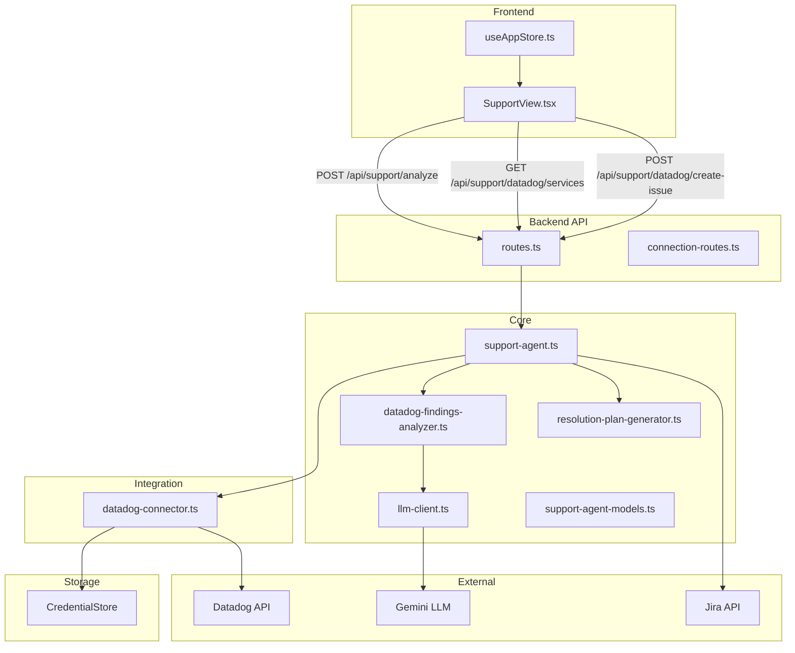
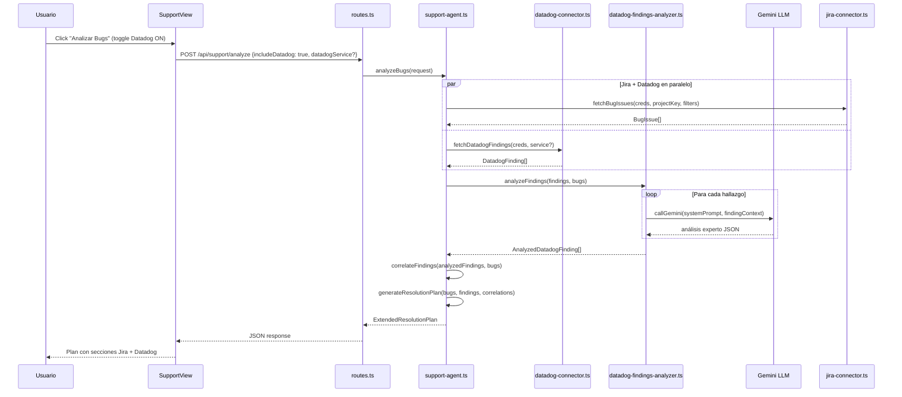

# Diseño Técnico — Integración Datadog con Support Agent

## Resumen

Esta funcionalidad extiende el Support Agent existente para consultar la API de Datadog (logs de error, monitores en alerta, incidentes activos), analizar cada hallazgo con el LLM Gemini ya configurado, y presentar los resultados integrados en el Plan de Resolución junto con los bugs de Jira. El diseño reutiliza la infraestructura existente: `datadog-connector.ts` para peticiones HTTPS, `CredentialStore` para credenciales (`datadog-main`), `callGemini` de `story-generator.ts` para análisis experto, y el flujo de `support-agent.ts` como orquestador.

### Decisiones de Diseño Clave

1. **Reutilización de `callGemini`**: Se extrae la función `callGemini` de `story-generator.ts` a un módulo compartido `llm-client.ts` para que tanto el generador de historias como el analizador de hallazgos de Datadog puedan usarla sin duplicar código.
2. **Extensión no-destructiva del flujo existente**: El campo `includeDatadog` en la solicitud de análisis activa la consulta a Datadog. Si no está presente o es `false`, el flujo se comporta exactamente como antes (compatibilidad total).
3. **Resiliencia parcial**: Si Datadog falla (credenciales inválidas, error de red), el análisis continúa solo con Jira y se registra una advertencia en la respuesta.
4. **Correlación por similitud textual**: Se reutiliza el patrón de `detectDuplicates` de `bug-validator.ts` (tokenización + Jaccard) para correlacionar hallazgos de Datadog con bugs de Jira.
5. **Propuestas de issue, nunca creación automática**: Los hallazgos sin correlación generan propuestas pre-llenadas que requieren confirmación explícita del PO.

## Arquitectura



### Flujo de Análisis Combinado



## Componentes e Interfaces

### 1. `datadog-connector.ts` — Extensión

Se agregan funciones para consultar logs, monitores, incidentes y servicios. Reutiliza `datadogRequest` existente.

```typescript
// Nuevas funciones exportadas
export async function fetchErrorLogs(
  credentials: DatadogCredentials,
  service?: string,
  hoursBack?: number
): Promise<DatadogLogEntry[]>;

export async function fetchAlertingMonitors(
  credentials: DatadogCredentials,
  service?: string
): Promise<DatadogMonitor[]>;

export async function fetchActiveIncidents(
  credentials: DatadogCredentials,
  service?: string
): Promise<DatadogIncident[]>;

export async function fetchAvailableServices(
  credentials: DatadogCredentials
): Promise<string[]>;
```

### 2. `llm-client.ts` — Nuevo módulo (extraído de `story-generator.ts`)

Extrae `callGemini` (y opcionalmente `callOpenAI`, `callAnthropic`) a un módulo reutilizable.

```typescript
export async function callLLM(
  systemPrompt: string,
  userPrompt: string
): Promise<string>;
```

Internamente selecciona el provider según `LLM_PROVIDER` env var, igual que hoy en `story-generator.ts`.

### 3. `datadog-findings-analyzer.ts` — Nuevo módulo

Orquesta el análisis experto de cada hallazgo usando el LLM.

```typescript
export interface DatadogFindingAnalysis {
  finding: DatadogFinding;
  suggestedCriticality: SuggestedCriticality;
  affectedService: string;
  affectedEndpoint?: string;
  resolutionSuggestion: string;
  resolutionSteps: string[];
  label: string; // siempre "Sugerencia del Agente IA Support"
}

export async function analyzeDatadogFindings(
  findings: DatadogFinding[]
): Promise<DatadogFindingAnalysis[]>;
```

### 4. `support-agent.ts` — Extensión

Se extiende `analyzeBugs` para aceptar `includeDatadog` y `datadogService`. Se agrega lógica de correlación y generación de propuestas de issue.

```typescript
// Extensión de AnalysisRequest
interface AnalysisRequest {
  projectKey: string;
  credentialKey: string;
  filters?: BugFilters;
  includeDatadog?: boolean;
  datadogService?: string;
}
```

### 5. `support-agent-models.ts` — Extensión

Nuevos tipos para hallazgos de Datadog y plan extendido.

### 6. `resolution-plan-generator.ts` — Extensión

Se extiende para incluir sección de hallazgos de Datadog en el plan y en la exportación Markdown.

### 7. `routes.ts` — Nuevos endpoints

- `GET /api/support/datadog/services` — Lista servicios disponibles
- `POST /api/support/datadog/create-issue` — Crea issue en Jira desde hallazgo

### 8. `SupportView.tsx` — Extensión UI

Toggle de Datadog, selector de servicio, sección de hallazgos, botón "Crear Issue en Jira" con diálogo de confirmación.

## Modelos de Datos

### Tipos de Datadog (en `support-agent-models.ts`)

```typescript
// Tipos base de hallazgos
export type DatadogFindingType = 'log' | 'monitor' | 'incident';
export type SuggestedCriticality = 'critical' | 'high' | 'medium' | 'low';

export interface DatadogLogEntry {
  id: string;
  message: string;
  service: string;
  status: string;        // "error", "warn"
  timestamp: string;
  host?: string;
  tags: string[];
}

export interface DatadogMonitor {
  id: number;
  name: string;
  type: string;
  overallState: string;  // "Alert", "Warn", "OK"
  message: string;
  tags: string[];
  query: string;
}

export interface DatadogIncident {
  id: string;
  title: string;
  severity: string;      // "SEV-1", "SEV-2", "SEV-3", etc.
  status: string;        // "active", "stable", "resolved"
  createdAt: string;
  services: string[];
  commanderUser?: string;
}

// Hallazgo unificado
export interface DatadogFinding {
  id: string;
  type: DatadogFindingType;
  title: string;
  message: string;
  service: string;
  tags: string[];
  timestamp: string;
  rawData: DatadogLogEntry | DatadogMonitor | DatadogIncident;
}

// Hallazgo analizado por el agente IA
export interface AnalyzedDatadogFinding {
  finding: DatadogFinding;
  suggestedCriticality: SuggestedCriticality;
  affectedService: string;
  affectedEndpoint?: string;
  resolutionSuggestion: string;
  resolutionSteps: string[];
  label: string; // "Sugerencia del Agente IA Support"
  correlatedBugKey?: string;  // key del bug de Jira correlacionado, si existe
}

// Propuesta de issue para hallazgos sin correlación
export interface DatadogIssueProposal {
  findingId: string;
  title: string;
  description: string;
  suggestedSeverity: SuggestedCriticality;
  component: string;
  service: string;
}

// Métricas de Datadog en el plan
export interface DatadogMetrics {
  totalFindings: number;
  correlatedCount: number;
  uncorrelatedCount: number;
  distributionByType: Record<DatadogFindingType, number>;
  distributionByCriticality: Record<SuggestedCriticality, number>;
}

// Extensión del Plan de Resolución
export interface ExtendedResolutionPlan extends ResolutionPlan {
  datadogFindings: AnalyzedDatadogFinding[];
  datadogMetrics?: DatadogMetrics;
  datadogWarning?: string; // advertencia si Datadog falló
  issueProposals: DatadogIssueProposal[];
}
```

### Extensión de `AnalysisRequest`

```typescript
export interface AnalysisRequest {
  projectKey: string;
  credentialKey: string;
  filters?: BugFilters;
  includeDatadog?: boolean;
  datadogService?: string;
}
```

### Mapeo de Criticidad

| Tipo de Hallazgo | Condición | Criticidad Sugerida |
|---|---|---|
| Monitor | Estado `Alert` | `critical` o `high` |
| Monitor | Estado `Warn` | `medium` |
| Incidente | SEV-1 o SEV-2 | `critical` |
| Incidente | SEV-3+ | `high` o `medium` |
| Log de error | Alta frecuencia (>10 en 24h) | `high` |
| Log de error | Baja frecuencia | `medium` o `low` |

El LLM (Gemini) refina esta criticidad inicial basándose en el contenido del hallazgo.

### Correlación Hallazgo-Bug

Se usa similitud de Jaccard (tokenización de palabras) entre el `title`/`message` del hallazgo y el `summary`/`description` de cada bug. Umbral: >0.3 (más bajo que el 0.8 de duplicados, ya que son fuentes distintas).

```typescript
export function correlateFindings(
  findings: AnalyzedDatadogFinding[],
  bugs: BugIssue[]
): AnalyzedDatadogFinding[];
```


## Propiedades de Correctitud

*Una propiedad es una característica o comportamiento que debe mantenerse verdadero en todas las ejecuciones válidas de un sistema — esencialmente, una declaración formal sobre lo que el sistema debe hacer. Las propiedades sirven como puente entre especificaciones legibles por humanos y garantías de correctitud verificables por máquina.*

### Propiedad 1: Resiliencia ante fallo de Datadog

*Para cualquier* solicitud de análisis con `includeDatadog: true`, si las credenciales de Datadog no existen, son inválidas, o la API de Datadog falla por error de red, el plan de resolución resultante debe ser válido (contener los bugs de Jira analizados) y debe incluir un campo `datadogWarning` no vacío describiendo el problema.

**Valida: Requerimientos 1.5, 1.6**

### Propiedad 2: Extracción de servicios únicos

*Para cualquier* conjunto de monitores y logs de Datadog, la lista de servicios extraída debe contener exactamente los valores únicos del tag `service` presentes en los datos, sin duplicados y sin valores vacíos.

**Valida: Requerimiento 2.2**

### Propiedad 3: Filtrado por servicio

*Para cualquier* conjunto de hallazgos de Datadog y un filtro de servicio especificado, todos los hallazgos retornados deben pertenecer al servicio indicado. Si no se especifica filtro, todos los hallazgos de todos los servicios deben estar incluidos.

**Valida: Requerimientos 2.5, 5.2**

### Propiedad 4: Reglas de mapeo de criticidad

*Para cualquier* hallazgo de Datadog analizado, la criticidad sugerida debe ser un valor válido (`critical`, `high`, `medium` o `low`). Además: si el hallazgo es un monitor en estado `Alert`, la criticidad debe ser `critical` o `high`; si es un incidente con severidad `SEV-1` o `SEV-2`, la criticidad debe ser `critical`.

**Valida: Requerimientos 3.1, 3.5, 3.6**

### Propiedad 5: Completitud del análisis de hallazgos

*Para cualquier* hallazgo de Datadog analizado, el resultado debe contener: un `affectedService` no vacío, un array `resolutionSteps` con al menos un paso, y el campo `label` igual a `"Sugerencia del Agente IA Support"`.

**Valida: Requerimientos 3.2, 3.3, 3.4**

### Propiedad 6: Estructura del plan con Datadog

*Para cualquier* plan de resolución generado con `includeDatadog: true` que obtuvo hallazgos exitosamente, el plan debe contener un array `datadogFindings` separado de `prioritizedBugs`, y un objeto `datadogMetrics` con `totalFindings`, `distributionByType` y `distributionByCriticality` definidos.

**Valida: Requerimientos 4.1, 4.2**

### Propiedad 7: Ordenamiento de hallazgos por criticidad

*Para cualquier* plan de resolución con múltiples hallazgos de Datadog, los hallazgos deben estar ordenados por criticidad sugerida de mayor a menor (critical > high > medium > low).

**Valida: Requerimiento 4.3**

### Propiedad 8: Exportación Markdown incluye Datadog

*Para cualquier* plan de resolución con hallazgos de Datadog, la exportación a Markdown debe contener una sección dedicada a hallazgos de Datadog con el título, criticidad y sugerencia de cada hallazgo.

**Valida: Requerimiento 4.4**

### Propiedad 9: Resumen ejecutivo combinado

*Para cualquier* plan de resolución que contenga tanto bugs de Jira como hallazgos de Datadog, el resumen ejecutivo debe mencionar ambas fuentes de datos (Jira y Datadog).

**Valida: Requerimiento 4.5**

### Propiedad 10: Compatibilidad retroactiva

*Para cualquier* solicitud de análisis donde `includeDatadog` no está presente o es `false`, el plan de resolución resultante no debe contener hallazgos de Datadog y debe ser estructuralmente idéntico al formato anterior.

**Valida: Requerimiento 5.4**

### Propiedad 11: Correctitud de correlación

*Para cualquier* par de hallazgo de Datadog y bug de Jira, si la similitud textual (Jaccard) entre el mensaje del hallazgo y el summary/description del bug supera el umbral, el hallazgo debe tener `correlatedBugKey` igual al key del bug. Si ningún bug supera el umbral, `correlatedBugKey` debe ser `undefined`.

**Valida: Requerimientos 7.1, 7.2, 7.3**

### Propiedad 12: Invariante de conteo de correlaciones

*Para cualquier* plan de resolución con hallazgos de Datadog, la suma de `datadogMetrics.correlatedCount` y `datadogMetrics.uncorrelatedCount` debe ser igual a `datadogMetrics.totalFindings`.

**Valida: Requerimiento 7.4**

### Propiedad 13: Generación de propuestas de issue

*Para cualquier* hallazgo de Datadog sin correlación con un bug de Jira (sin `correlatedBugKey`), debe existir una propuesta de issue correspondiente en `issueProposals` con `title`, `description`, `suggestedSeverity` y `component` no vacíos.

**Valida: Requerimiento 8.1**

### Propiedad 14: Nunca creación automática de issues

*Para cualquier* ejecución de `analyzeBugs`, la función nunca debe invocar la creación de issues en Jira. La creación solo debe ocurrir a través del endpoint explícito `POST /api/support/datadog/create-issue` activado por el usuario.

**Valida: Requerimiento 8.6**

## Manejo de Errores

### Errores de Datadog

| Escenario | Comportamiento | Código de Error |
|---|---|---|
| Credenciales no encontradas en CredentialStore | Omitir Datadog, continuar con Jira, agregar `datadogWarning` | N/A (degradación) |
| Credenciales inválidas (403) | Omitir Datadog, continuar con Jira, agregar `datadogWarning` | `DATADOG_PERMISSION_DENIED` |
| Error de red (ECONNREFUSED, ETIMEDOUT) | Omitir Datadog, continuar con Jira, agregar `datadogWarning` | `SERVICE_UNREACHABLE` |
| API rate limit (429) | Omitir Datadog, continuar con Jira, agregar `datadogWarning` | `DATADOG_ERROR_429` |
| Fallo parcial (ej: logs OK, monitores fallan) | Incluir datos parciales, registrar advertencia | N/A (degradación parcial) |

### Errores del LLM

| Escenario | Comportamiento |
|---|---|
| LLM no disponible (`LLM_API_KEY` no configurado) | Usar análisis heurístico (criticidad basada en reglas de mapeo, sin sugerencia detallada del LLM) |
| LLM retorna respuesta no parseable | Usar análisis heurístico como fallback, registrar advertencia |
| LLM timeout | Usar análisis heurístico como fallback |

### Errores de Creación de Issue

| Escenario | Comportamiento |
|---|---|
| Credenciales de Jira inválidas | Retornar error 401 al frontend |
| Proyecto no encontrado | Retornar error 404 al frontend |
| Permisos insuficientes | Retornar error 403 al frontend |

Se reutiliza `error-handler.ts` existente con los códigos `DATADOG_AUTH_FAILED`, `DATADOG_PERMISSION_DENIED` y `SERVICE_UNREACHABLE` ya definidos.

## Estrategia de Testing

### Testing Dual: Unit + Property-Based

Se usa un enfoque dual complementario:
- **Tests unitarios**: Verifican ejemplos específicos, edge cases, integraciones y flujos de UI.
- **Tests de propiedades (PBT)**: Verifican propiedades universales con inputs generados aleatoriamente.

### Librería de Property-Based Testing

Se usa **fast-check** (`fc`) como librería de PBT, consistente con el ecosistema TypeScript/Jest del proyecto. Cada test de propiedad ejecuta mínimo 100 iteraciones.

### Configuración de Tests de Propiedades

Cada test de propiedad debe:
- Referenciar la propiedad del diseño con un comentario tag
- Formato: `Feature: datadog-support-agent, Property {N}: {título}`
- Ejecutar mínimo 100 iteraciones (`numRuns: 100`)
- Cada propiedad de correctitud se implementa con UN SOLO test de propiedad

### Tests Unitarios (ejemplos y edge cases)

| Área | Tests |
|---|---|
| `datadog-connector.ts` | Fetch de logs, monitores, incidentes con mocks HTTP. Edge: respuesta vacía, paginación. |
| `datadog-findings-analyzer.ts` | Análisis con LLM mock. Edge: hallazgo sin tags, LLM fallback. |
| `support-agent.ts` | Flujo completo con mocks. Edge: 0 bugs + hallazgos, hallazgos + 0 bugs, ambos vacíos. |
| `correlation` | Coincidencia exacta, parcial, sin coincidencia. Edge: strings vacíos, caracteres especiales. |
| `routes.ts` | Endpoints nuevos con supertest. Edge: body incompleto, servicio inexistente. |
| `SupportView.tsx` | Toggle Datadog, selector servicio, sección hallazgos, diálogo confirmación. |
| `resolution-plan-generator.ts` | Markdown con sección Datadog. Edge: plan sin hallazgos, plan solo Datadog. |

### Tests de Propiedades

| Propiedad | Generadores |
|---|---|
| P1: Resiliencia | Generar requests con credenciales inválidas/ausentes y errores de red simulados |
| P2: Servicios únicos | Generar arrays de monitores/logs con tags `service` aleatorios (incluyendo duplicados y vacíos) |
| P3: Filtrado por servicio | Generar hallazgos con servicios variados + filtro aleatorio |
| P4: Mapeo de criticidad | Generar hallazgos de cada tipo (log, monitor, incidente) con estados/severidades variados |
| P5: Completitud del análisis | Generar hallazgos aleatorios y verificar campos requeridos en el output |
| P6: Estructura del plan | Generar planes con combinaciones de bugs y hallazgos |
| P7: Ordenamiento | Generar arrays de hallazgos con criticidades aleatorias |
| P8: Markdown export | Generar planes con hallazgos y verificar presencia de secciones en el output |
| P9: Resumen ejecutivo | Generar planes con ambas fuentes y verificar mención de Jira y Datadog |
| P10: Compatibilidad | Generar requests sin `includeDatadog` y verificar ausencia de datos Datadog |
| P11: Correlación | Generar pares hallazgo-bug con similitud variable y verificar umbral |
| P12: Conteo correlaciones | Generar planes y verificar invariante de suma |
| P13: Propuestas de issue | Generar hallazgos sin correlación y verificar propuestas completas |
| P14: No auto-creación | Verificar que `analyzeBugs` nunca invoca creación de issues |
