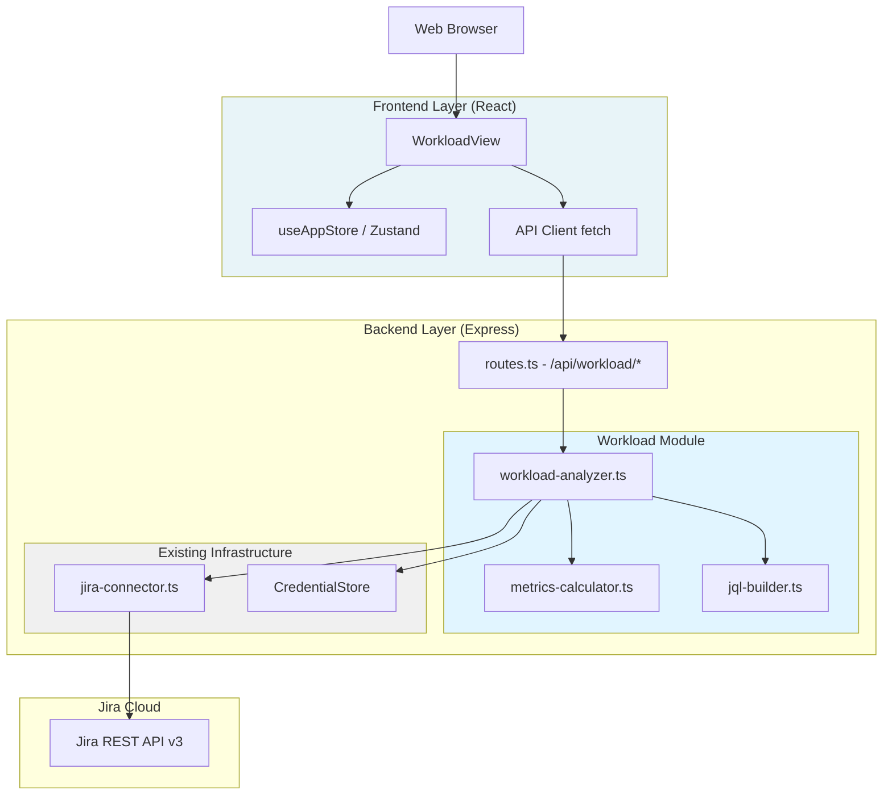
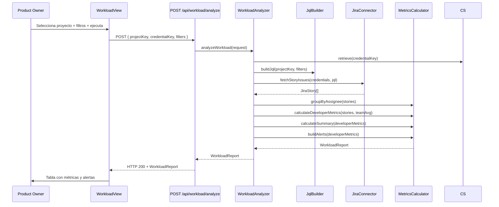

# Design Document: Developer Workload

## Overview

El módulo Developer Workload extiende el sistema PO AI para analizar la carga de trabajo y productividad de los desarrolladores asignados a Historias de Usuario (HU) en Jira. Consulta Jira mediante JQL, agrupa HUs por assignee, calcula métricas de carga y productividad, identifica alertas automáticas, y presenta un reporte visual interactivo en el frontend.

El módulo sigue la misma arquitectura del sistema existente: un agente orquestador en el backend (`workload-analyzer.ts`) que usa el `Jira_Connector` y `Credential_Store` existentes, expone endpoints REST en `routes.ts`, y un componente React `WorkloadView` en el frontend.

### Principios de Diseño

1. **Reutilización**: Usa `jiraRequest`, `createJiraError` y el patrón de retry del `jira-connector.ts` existente sin duplicar lógica
2. **Separación de responsabilidades**: Cálculo de métricas separado de la consulta a Jira y de la presentación
3. **Consistencia**: Mismos patrones de error handling, credential lookup y respuesta HTTP que `support-agent`
4. **Pureza funcional**: Las funciones de cálculo de métricas son puras (sin side effects) para facilitar testing

---

## Architecture

### Arquitectura de Alto Nivel



### Flujo de Datos Principal



---

## Components and Interfaces

### 1. WorkloadAnalyzer (`packages/backend/src/core/workload-analyzer.ts`)

Orquestador principal. Coordina la consulta a Jira, el cálculo de métricas y la construcción del reporte.

```typescript
// Punto de entrada principal
export async function analyzeWorkload(request: WorkloadRequest): Promise<WorkloadReport>

// Obtiene sprints disponibles de un proyecto
export async function getProjectSprints(
  credentials: JiraCredentials,
  projectKey: string
): Promise<SprintInfo[]>
```

### 2. JqlBuilder (`packages/backend/src/core/jql-builder.ts`)

Construye consultas JQL a partir de los filtros recibidos. Función pura, sin side effects.

```typescript
export function buildWorkloadJql(projectKey: string, filters?: WorkloadFilters): string
// Ejemplo: "project = PROJ AND issuetype = Story AND sprint = \"Sprint 1\" AND created >= \"2024-01-01\""
```

### 3. MetricsCalculator (`packages/backend/src/core/metrics-calculator.ts`)

Todas las funciones de cálculo son puras. Reciben datos y retornan métricas sin llamadas externas.

```typescript
export function groupStoriesByAssignee(stories: JiraStory[]): Map<string, JiraStory[]>

export function calculateDeveloperMetrics(
  assigneeId: string,
  stories: JiraStory[],
  teamAverageActivePoints: number,
  teamAverageVelocity: number
): DeveloperMetrics

export function calculateTeamAverages(allStories: JiraStory[]): TeamAverages

export function buildAlerts(developers: DeveloperMetrics[]): WorkloadAlert[]

export function calculateSummary(
  developers: DeveloperMetrics[],
  allStories: JiraStory[]
): WorkloadSummary
```

### 4. Extensión de JiraConnector (`packages/backend/src/integration/jira-connector.ts`)

Se agregan dos funciones al conector existente, reutilizando `jiraRequest` y el patrón de retry:

```typescript
// Obtiene HUs de tipo Story con los campos necesarios para workload
export async function fetchStoryIssues(
  credentials: JiraCredentials,
  jql: string
): Promise<JiraStory[]>

// Obtiene sprints activos/cerrados de un proyecto via Agile API
export async function fetchProjectSprints(
  credentials: JiraCredentials,
  projectKey: string
): Promise<SprintInfo[]>
```

### 5. API Routes (extensión de `packages/backend/src/api/routes.ts`)

```typescript
// POST /api/workload/analyze
// Body: WorkloadRequest
// Response: WorkloadReport | ErrorResponse

// GET /api/workload/:projectKey/sprints
// Query: credentialKey
// Response: SprintInfo[]
```

### 6. WorkloadView (`packages/frontend/src/components/WorkloadView.tsx`)

Componente React con tres estados: `idle` → `loading` → `report`, siguiendo el mismo patrón de `SupportView`.

```typescript
type ViewState = 'idle' | 'loading' | 'report'

// Sub-componentes internos:
// - FilterPanel: selección de proyecto, sprint, rango de fechas
// - AlertsBanner: sección de alertas cuando hasAlerts=true
// - SummaryCards: métricas de resumen (total devs, HUs, avg SP)
// - DeveloperTable: tabla principal con una fila por desarrollador
// - DeveloperRow: fila con color según workloadStatus
```

---

## Data Models

### Request / Response Models

```typescript
// Entrada del endpoint POST /api/workload/analyze
export interface WorkloadRequest {
  projectKey: string;
  credentialKey: string;
  filters?: WorkloadFilters;
}

export interface WorkloadFilters {
  sprint?: string;       // Nombre exacto del sprint en Jira
  startDate?: string;    // ISO 8601 date string: "YYYY-MM-DD"
  endDate?: string;      // ISO 8601 date string: "YYYY-MM-DD"
}

// Reporte completo retornado por el analyzer
export interface WorkloadReport {
  projectKey: string;
  generatedAt: string;           // ISO 8601 datetime
  filters: WorkloadFilters;
  summary: WorkloadSummary;
  developers: DeveloperMetrics[];
  alerts: WorkloadAlert[];
  hasAlerts: boolean;
}

export interface WorkloadSummary {
  totalDevelopers: number;
  totalHUs: number;
  averageStoryPointsPerDeveloper: number;
  teamVelocityAverage: number;
  teamCycleTimeAverage: number | null;
}

// Métricas calculadas por desarrollador
export interface DeveloperMetrics {
  accountId: string;
  displayName: string;
  email?: string;
  assignedHUs: number;
  activeStoryPoints: number;       // SP de HUs no completadas
  completedHUs: number;
  completedStoryPoints: number;
  velocityIndividual: number;      // >= 0
  cycleTimeIndividual: number | null; // >= 0 o null si no hay HUs completadas
  workloadStatus: WorkloadStatus;
  productivityStatus: ProductivityStatus;
  husByStatus: HusByStatus;
  unestimatedHUs: number;
  inProgressCount: number;
  multitaskingAlert: boolean;      // true si inProgressCount > 3
}

export interface HusByStatus {
  todo: number;
  inProgress: number;
  done: number;
  blocked: number;
  other: number;
}

export type WorkloadStatus = 'overloaded' | 'normal' | 'underloaded';
export type ProductivityStatus = 'high' | 'normal' | 'low';

export interface WorkloadAlert {
  accountId: string;
  displayName: string;
  type: 'overloaded' | 'low_productivity' | 'multitasking';
  description: string;
  severity: 'high' | 'medium';    // high = ambos problemas, medium = uno solo
  activeStoryPoints?: number;
  excessPercentage?: number;       // % sobre el promedio del equipo
  velocityIndividual?: number;
  velocityDifference?: number;     // diferencia respecto al promedio
}

// Modelo interno para HUs de Jira (Stories)
export interface JiraStory {
  id: string;
  key: string;
  summary: string;
  status: string;                  // "To Do", "In Progress", "Done", "Blocked", etc.
  storyPoints: number | null;      // customfield_10016
  assignee: {
    accountId: string;
    displayName: string;
    emailAddress?: string;
  } | null;
  sprint: string | null;           // nombre del sprint activo
  created: string;                 // ISO 8601
  resolutionDate: string | null;   // ISO 8601
  updated: string;                 // ISO 8601
  changelog?: StatusChange[];      // historial de cambios de estado
}

export interface StatusChange {
  field: string;
  fromStatus: string;
  toStatus: string;
  changedAt: string;               // ISO 8601
}

export interface SprintInfo {
  id: number;
  name: string;
  state: 'active' | 'closed' | 'future';
  startDate?: string;
  endDate?: string;
}

// Intermediario para cálculo de promedios del equipo
export interface TeamAverages {
  averageActivePoints: number;
  averageVelocity: number;
  averageCycleTime: number | null;
}
```

### Umbrales de Clasificación

```typescript
// Workload thresholds (Requirement 3.2)
const OVERLOADED_THRESHOLD = 1.5;   // > 1.5x promedio del equipo
const UNDERLOADED_THRESHOLD = 0.5;  // < 0.5x promedio del equipo

// Productivity thresholds (Requirement 4.4)
const HIGH_PRODUCTIVITY_THRESHOLD = 1.3;  // > 1.3x promedio del equipo
const LOW_PRODUCTIVITY_THRESHOLD = 0.7;   // < 0.7x promedio del equipo

// Multitasking threshold (Requirement 3.5)
const MULTITASKING_THRESHOLD = 3;   // > 3 HUs en In Progress simultáneamente
```

---

## Correctness Properties

*A property is a characteristic or behavior that should hold true across all valid executions of a system — essentially, a formal statement about what the system should do. Properties serve as the bridge between human-readable specifications and machine-verifiable correctness guarantees.*

### Property 1: Agrupación por assignee produce exactamente un Developer_Metrics por assignee único

*For any* lista de JiraStory con assignees, `groupStoriesByAssignee` debe producir exactamente un grupo por cada `accountId` único presente en la lista. El número de grupos debe ser igual al número de accountIds únicos.

**Validates: Requirements 1.2**

### Property 2: Construcción de JQL incluye todos los filtros activos combinados con AND

*For any* combinación de filtros (sprint, startDate, endDate), la función `buildWorkloadJql` debe producir una cadena JQL que contenga `issuetype = Story`, el `project = <projectKey>`, y cada filtro activo como cláusula separada unida por `AND`. Si no hay filtros, el JQL solo debe contener las cláusulas base.

**Validates: Requirements 2.1, 2.2, 2.4**

### Property 3: Agregación de métricas es consistente con los datos de entrada

*For any* lista de JiraStory asignadas a un desarrollador, los campos calculados en `DeveloperMetrics` deben ser consistentes: `assignedHUs` debe igualar la longitud de la lista, `husByStatus.done` debe igualar `completedHUs`, la suma de todos los campos de `husByStatus` debe igualar `assignedHUs`, y `inProgressCount` debe igualar `husByStatus.inProgress`.

**Validates: Requirements 3.1, 4.3**

### Property 4: Workload_Status sigue los umbrales definidos

*For any* conjunto de desarrolladores con story points activos, la clasificación `workloadStatus` de cada desarrollador debe ser: `"overloaded"` si sus SP activos superan 1.5x el promedio del equipo, `"underloaded"` si están por debajo de 0.5x el promedio, y `"normal"` en cualquier otro caso. Ningún desarrollador puede tener un status que contradiga su relación con el promedio.

**Validates: Requirements 3.2**

### Property 5: Multitasking alert sigue el umbral de 3 HUs en progreso

*For any* desarrollador, `multitaskingAlert` debe ser `true` si y solo si `inProgressCount > 3`. Para cualquier valor de `inProgressCount` de 0 a 3, `multitaskingAlert` debe ser `false`.

**Validates: Requirements 3.5**

### Property 6: Velocity_Individual y Cycle_Time_Individual son no negativos o null

*For any* `DeveloperMetrics` en un `WorkloadReport`, `velocityIndividual` debe ser un número >= 0, y `cycleTimeIndividual` debe ser un número >= 0 o `null`. Nunca pueden ser negativos.

**Validates: Requirements 4.5, 8.5**

### Property 7: Productivity_Status sigue los umbrales definidos

*For any* conjunto de desarrolladores con velocidades calculadas, la clasificación `productivityStatus` debe ser: `"high"` si la velocidad supera 1.3x el promedio del equipo, `"low"` si está por debajo de 0.7x, y `"normal"` en cualquier otro caso.

**Validates: Requirements 4.4**

### Property 8: Alertas contienen exactamente los desarrolladores con problemas, ordenados por severidad

*For any* `WorkloadReport`, la lista `alerts` debe contener una entrada por cada desarrollador con `workloadStatus = "overloaded"` o `productivityStatus = "low"` o `multitaskingAlert = true`. Los desarrolladores con múltiples problemas simultáneos deben aparecer antes que los que tienen un solo problema.

**Validates: Requirements 5.1, 5.2, 5.4**

### Property 9: hasAlerts es el reflejo exacto del estado de la lista de alertas

*For any* `WorkloadReport`, `hasAlerts` debe ser `true` si y solo si `alerts.length > 0`. Esta invariante debe mantenerse para cualquier combinación de estados de desarrolladores.

**Validates: Requirements 5.3, 5.5**

### Property 10: Estructura completa del WorkloadReport

*For any* resultado de `analyzeWorkload`, el objeto retornado debe contener todos los campos requeridos: `projectKey`, `generatedAt`, `filters`, `summary`, `developers`, `alerts`, `hasAlerts`. Cada elemento de `developers` debe contener todos los campos de `DeveloperMetrics`. El campo `summary` debe contener todos sus campos requeridos.

**Validates: Requirements 8.1, 8.2, 8.3**

### Property 11: Fechas en formato ISO 8601

*For any* `WorkloadReport`, el campo `generatedAt` debe ser una cadena que cumpla el formato ISO 8601 (`YYYY-MM-DDTHH:mm:ss.sssZ`). La propiedad debe ser parseable por `new Date()` sin producir `Invalid Date`.

**Validates: Requirements 8.4**

### Property 12: Endpoint rechaza requests sin campos obligatorios

*For any* request al endpoint `POST /api/workload/analyze` que omita `projectKey` o `credentialKey`, la respuesta debe ser HTTP 400 con un mensaje de error descriptivo. Ninguna combinación de campos opcionales puede compensar la ausencia de un campo obligatorio.

**Validates: Requirements 7.2**

---

## Error Handling

### Códigos de Error

| Código | HTTP | Descripción |
|--------|------|-------------|
| `MISSING_REQUIRED_FIELDS` | 400 | Falta `projectKey` o `credentialKey` |
| `CREDENTIALS_NOT_FOUND` | 404 | `credentialKey` no existe en el store |
| `JIRA_AUTH_FAILED` | 401 | Token inválido o expirado |
| `JIRA_NOT_FOUND` | 404 | El proyecto no existe en Jira |
| `JIRA_PERMISSION_DENIED` | 403 | Sin permisos de lectura en el proyecto |
| `NETWORK_ERROR` | 502 | Error de red al conectar con Jira |
| `NO_STORIES_FOUND` | 200 | Proyecto sin HUs asignadas (no es error, retorna reporte vacío) |

### Estrategia de Retry

Igual que el `jira-connector.ts` existente: hasta 3 reintentos con backoff exponencial (1s, 2s, 4s) solo para `NETWORK_ERROR`. Los errores de autenticación y permisos no se reintentan.

```typescript
// Patrón de retry reutilizado del jira-connector existente
for (let attempt = 0; attempt < MAX_RETRIES; attempt++) {
  try {
    return await jiraRequest(credentials, 'GET', path);
  } catch (error: any) {
    if (error.code !== 'NETWORK_ERROR') throw error;
    if (attempt < MAX_RETRIES - 1) {
      await new Promise(r => setTimeout(r, Math.pow(2, attempt) * 1000));
    }
  }
}
throw lastError;
```

### Manejo en el Frontend

`WorkloadView` muestra el mensaje de error del backend en un componente de alerta con botón de reintento, siguiendo el mismo patrón de `SupportView`.

---

## Testing Strategy

### Enfoque Dual de Testing

El módulo requiere tanto pruebas unitarias como pruebas basadas en propiedades:

**Unit Tests** — casos específicos, integraciones y condiciones de error:
- Endpoint retorna 400 cuando falta `projectKey`
- Endpoint retorna 404 cuando `credentialKey` no existe
- Endpoint retorna 401 cuando Jira rechaza las credenciales
- `WorkloadView` muestra sección de alertas cuando `hasAlerts = true`
- `WorkloadView` muestra indicador de carga durante el fetch
- Reporte vacío cuando el proyecto no tiene HUs asignadas

**Property-Based Tests** — propiedades universales verificadas con múltiples entradas generadas:
- Todas las propiedades de corrección definidas en la sección anterior

### Configuración de Property-Based Testing

**Framework**: `fast-check` (ya disponible en el proyecto)

**Configuración**:
- Mínimo 100 iteraciones por prueba de propiedad
- Cada prueba referencia la propiedad del documento de diseño
- Tag format: `Feature: developer-workload, Property {N}: {property_text}`

**Ejemplo de prueba de propiedad**:

```typescript
// Feature: developer-workload, Property 1: Agrupación por assignee
import * as fc from 'fast-check';
import { groupStoriesByAssignee } from '../../../src/core/metrics-calculator';

describe('MetricsCalculator Properties', () => {
  it('Property 1: grouping produces exactly one entry per unique assignee', () => {
    fc.assert(
      fc.property(
        fc.array(jiraStoryArbitrary(), { minLength: 0, maxLength: 50 }),
        (stories) => {
          const grouped = groupStoriesByAssignee(stories);
          const uniqueAssignees = new Set(
            stories
              .filter(s => s.assignee !== null)
              .map(s => s.assignee!.accountId)
          );
          return grouped.size === uniqueAssignees.size;
        }
      ),
      { numRuns: 100 }
    );
  });
});
```

**Arbitrarios necesarios**:
- `jiraStoryArbitrary()`: genera `JiraStory` con assignees aleatorios, estados y story points
- `workloadFiltersArbitrary()`: genera combinaciones de filtros opcionales
- `developerMetricsArbitrary()`: genera `DeveloperMetrics` con valores válidos

### Ubicación de Tests

```
packages/backend/tests/
  unit/
    core/
      workload-analyzer.test.ts      # Unit tests del orquestador
      metrics-calculator.test.ts     # Unit tests de funciones de cálculo
      jql-builder.test.ts            # Unit tests del constructor JQL
  property/
    workload.property.test.ts        # Property-based tests (Properties 1-12)
```
