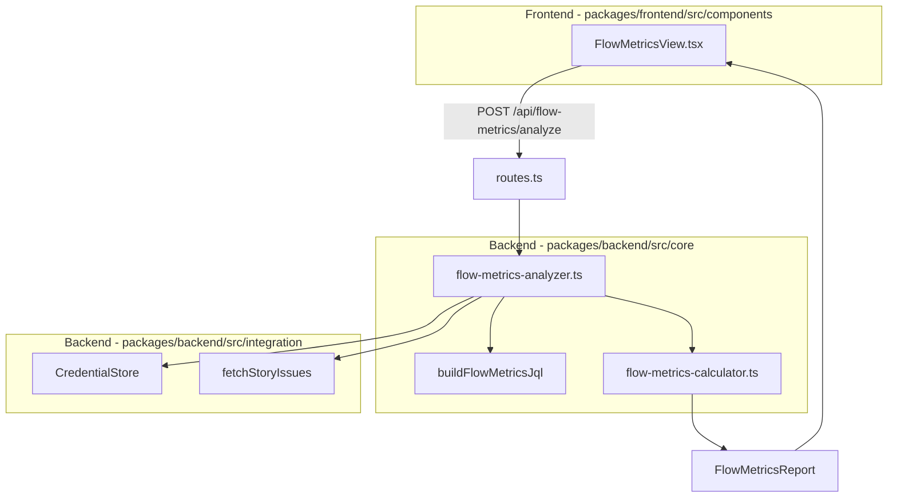

# Design Document: Flow Metrics Workload

## Overview

Esta feature agrega una vista paralela de Flow Metrics basada en Lean Agile Flow Analytics. Es una vista completamente independiente de la WorkloadView existente, con su propio endpoint backend (`POST /api/flow-metrics/analyze`), módulos de cálculo puros y componente React dedicado.

El flujo de datos sigue el patrón existente del módulo workload:
1. El frontend envía `projectKey`, `credentialKey` y filtros opcionales al endpoint.
2. El `flow-metrics-analyzer.ts` orquesta: recupera credenciales, construye JQL (sin filtro de `issuetype` para capturar toda la tipología), llama a `fetchStoryIssues` del `jira-connector`, y delega el cálculo a funciones puras en `flow-metrics-calculator.ts`.
3. El frontend renderiza el `FlowMetricsReport` en `FlowMetricsView.tsx`.

Las métricas calculadas incluyen: Lead Time, Cycle Time, Throughput (total y por tipo), WIP por desarrollador, Flow Efficiency (Touch Time vs Wait Time), tipología de trabajo (Value vs Support), detección de cuellos de botella, aging issues y recomendaciones accionables.

Todos los textos de la UI están en español. El diseño visual sigue el sistema de Seguros Bolívar (#009056, Roboto).

## Architecture



### Decisiones de diseño

1. **JQL sin filtro de issuetype**: A diferencia del workload existente que filtra por Story, flow-metrics necesita todos los tipos de issue para calcular la tipología Value vs Support. Se crea `buildFlowMetricsJql` en `flow-metrics-calculator.ts` (o como función local en el analyzer) que omite el filtro `issuetype`.

2. **Reutilización de `fetchStoryIssues`**: La función ya retorna `JiraStory[]` con `changelog` (transiciones de estado con timestamps). El modelo `JiraStory` de `workload-models.ts` ya tiene los campos necesarios (`created`, `resolutionDate`, `changelog`, `issueType`, `status`, `assignee`). Se reutiliza directamente sin modificaciones.

3. **Funciones puras en `flow-metrics-calculator.ts`**: Todas las funciones de cálculo son puras (sin side effects), reciben `JiraStory[]` y retornan resultados calculados. Esto facilita el testing con property-based tests.

4. **Modelos en `flow-metrics-models.ts`**: Interfaces separadas del módulo workload existente para evitar acoplamiento. Se definen constantes de status sets (Active, Passive, Done) como arrays exportados para facilitar testing.

5. **Vista independiente**: `FlowMetricsView.tsx` es un componente nuevo, no modifica `WorkloadView.tsx`. Se agrega como nuevo nav item "Flow Metrics" en `App.tsx`.

## Components and Interfaces

### Backend

#### `flow-metrics-models.ts`
Define todas las interfaces y constantes del módulo:
- `FlowMetricsRequest`: `{ projectKey, credentialKey, filters? }`
- `FlowMetricsFilters`: `{ sprint?, startDate?, endDate? }`
- `FlowMetricsReport`: Estructura completa del reporte
- `FlowMetricsSummary`: Lead Time avg, Cycle Time avg, Throughput, WIP total, Flow Efficiency avg
- `ThroughputByType`: `{ issueType, count }`
- `DeveloperWIP`: `{ accountId, displayName, wipCount }`
- `TypologyBreakdown`: `{ valueWorkCount, supportWorkCount, valueWorkPercent, supportWorkPercent }`
- `Bottleneck`: `{ status, percentageOfCycleTime, message }`
- `AgingIssue`: `{ issueKey, summary, currentStatus, daysInStatus, averageDaysForStatus }`
- `FlowRecommendation`: `{ type, message }`
- Constantes: `ACTIVE_STATUSES`, `PASSIVE_STATUSES`, `DONE_STATUSES`, `VALUE_WORK_TYPES`, `SUPPORT_WORK_TYPES`

#### `flow-metrics-calculator.ts`
Funciones puras exportadas:
- `buildFlowMetricsJql(projectKey, filters?)`: Construye JQL sin filtro de issuetype, con `assignee is not EMPTY`.
- `calculateLeadTime(issue)`: Retorna días o null. Usa `resolutionDate` o última transición a Done del changelog.
- `calculateCycleTime(issue)`: Retorna días o null. Desde primera transición a Active hasta resolución.
- `calculateTouchTime(issue)`: Suma días en Active_Statuses del changelog.
- `calculateWaitTime(issue)`: Suma días en Passive_Statuses del changelog.
- `calculateFlowEfficiency(touchTime, waitTime)`: `touchTime / (touchTime + waitTime) * 100`. Retorna null si ambos son 0.
- `calculateThroughput(issues, filters?)`: Cuenta issues completados, desglosado por tipo.
- `calculateWIPByDeveloper(issues)`: Cuenta issues en Active_Statuses por assignee.
- `classifyWorkType(issueType)`: Retorna `'value'` o `'support'`.
- `calculateTypology(issues)`: Retorna `TypologyBreakdown`.
- `detectBottlenecks(completedIssues)`: Calcula % de cycle time por estado, retorna estados > 40%.
- `detectAgingIssues(activeIssues, completedIssues)`: Compara tiempo en estado actual vs promedio histórico.
- `generateRecommendations(report)`: Genera recomendaciones basadas en umbrales.
- `buildFlowMetricsReport(issues, projectKey, filters)`: Orquesta todos los cálculos y retorna `FlowMetricsReport`.

#### `flow-metrics-analyzer.ts`
Orquestador (con side effects):
- `analyzeFlowMetrics(request: FlowMetricsRequest): Promise<FlowMetricsReport>`: Recupera credenciales, construye JQL, llama a `fetchStoryIssues`, delega a `buildFlowMetricsReport`.

#### `routes.ts` (modificación)
- Nuevo endpoint: `POST /api/flow-metrics/analyze` con validación zod, manejo de errores consistente con el patrón existente.

### Frontend

#### `FlowMetricsView.tsx`
Componente React con estados: `idle | loading | report`.
- Formulario de filtros (proyecto, sprint, fechas) — mismo patrón que WorkloadView.
- Tarjetas resumen: Lead Time, Cycle Time, Throughput, WIP, Flow Efficiency.
- Tabla de Throughput por tipo de issue.
- Gráfico visual de tipología (Value vs Support) con barras horizontales CSS.
- Tabla de WIP por desarrollador.
- Sección de cuellos de botella con mensajes descriptivos.
- Lista de aging issues.
- Sección de recomendaciones.
- Spinner de carga, mensajes de error, estado vacío.

#### `App.tsx` (modificación)
- Nuevo nav item: `{ id: 'flow-metrics', label: 'Flow Metrics' }`.
- Nuevo case en `renderView()`: `case 'flow-metrics': return <FlowMetricsView />`.

#### `useAppStore.ts` (modificación)
- Agregar `'flow-metrics'` al tipo `View`.

## Data Models

### FlowMetricsReport (respuesta del endpoint)

```typescript
interface FlowMetricsReport {
  projectKey: string;
  generatedAt: string;                    // ISO 8601
  filters: FlowMetricsFilters;
  summary: FlowMetricsSummary;
  throughputByType: ThroughputByType[];
  wipByDeveloper: DeveloperWIP[];
  typology: TypologyBreakdown;
  bottlenecks: Bottleneck[];
  agingIssues: AgingIssue[];
  recommendations: FlowRecommendation[];
}

interface FlowMetricsSummary {
  leadTimeAverage: number | null;         // días, 1 decimal
  cycleTimeAverage: number | null;        // días, 1 decimal
  throughputTotal: number;                // issues completados
  wipTotal: number;                       // issues en progreso
  flowEfficiencyAverage: number | null;   // porcentaje, 1 decimal
}

interface ThroughputByType {
  issueType: string;
  count: number;
}

interface DeveloperWIP {
  accountId: string;
  displayName: string;
  wipCount: number;
}

interface TypologyBreakdown {
  valueWorkCount: number;
  supportWorkCount: number;
  valueWorkPercent: number;               // 0-100
  supportWorkPercent: number;             // 0-100
}

interface Bottleneck {
  status: string;
  percentageOfCycleTime: number;          // 0-100
  message: string;                        // Mensaje descriptivo en español
}

interface AgingIssue {
  issueKey: string;
  summary: string;
  currentStatus: string;
  daysInStatus: number;
  averageDaysForStatus: number;
}

interface FlowRecommendation {
  type: 'support_work_high' | 'wait_time_high' | 'wip_high';
  message: string;                        // Texto descriptivo en español
}

interface FlowMetricsFilters {
  sprint?: string;
  startDate?: string;                     // ISO 8601 date: "YYYY-MM-DD"
  endDate?: string;                       // ISO 8601 date: "YYYY-MM-DD"
}

interface FlowMetricsRequest {
  projectKey: string;
  credentialKey: string;
  filters?: FlowMetricsFilters;
}
```

### Constantes de clasificación de estados

```typescript
const ACTIVE_STATUSES = [
  'In Progress', 'En Progreso', 'En progreso', 'EN PROGRESO',
  'En Pruebas UAT', 'EN PRUEBAS UAT',
];

const PASSIVE_STATUSES = [
  'Blocked', 'Bloqueado', 'BLOQUEADO',
  'Pendiente PAP', 'PENDIENTE PAP',
  'En Revisión', 'EN REVISIÓN', 'Waiting for Review',
];

const DONE_STATUSES = [
  'Done', 'Producción', 'PRODUCCIÓN', 'Hecho', 'HECHO',
  'Cerrado', 'Resuelto', 'Closed', 'Resolved',
];

const VALUE_WORK_TYPES = [
  'Historia', 'Story', 'Spike', 'Upstream', 'Epic',
  'Iniciativa', 'Requerimiento Caja',
];

const SUPPORT_WORK_TYPES = [
  'Service Request N2', 'Bug', 'Error Productivo',
  'PQR', 'Incidente de Seguridad y Monitoreo',
];
```

### Reutilización del modelo JiraStory existente

Se reutiliza `JiraStory` y `StatusChange` de `workload-models.ts` sin modificaciones. Los campos relevantes:
- `created`: fecha de creación (para Lead Time)
- `resolutionDate`: fecha de resolución (para Lead Time y Cycle Time)
- `changelog: StatusChange[]`: transiciones de estado con timestamps (para Cycle Time, Touch/Wait Time, Flow Efficiency, Bottlenecks)
- `issueType`: tipo de issue (para Throughput por tipo y Tipología)
- `status`: estado actual (para WIP y Aging Issues)
- `assignee`: desarrollador asignado (para WIP por desarrollador)


## Correctness Properties

*A property is a characteristic or behavior that should hold true across all valid executions of a system — essentially, a formal statement about what the system should do. Properties serve as the bridge between human-readable specifications and machine-verifiable correctness guarantees.*

### Property 1: Lead Time calculation correctness

*For any* completed issue (status in Done_Statuses), `calculateLeadTime` should return the difference in calendar days between `created` and `resolutionDate` when `resolutionDate` is present, or the difference between `created` and the last changelog transition to a Done_Status when `resolutionDate` is absent. The result should always be ≥ 0.

**Validates: Requirements 1.1, 1.2**

### Property 2: Incomplete issues excluded from time metrics

*For any* issue whose status is NOT in Done_Statuses, `calculateLeadTime` should return null AND `calculateCycleTime` should return null. Additionally, *for any* completed issue without any Active_Status transition in its changelog, `calculateCycleTime` should return null.

**Validates: Requirements 1.3, 2.2**

### Property 3: Cycle Time calculation correctness

*For any* completed issue with at least one transition to an Active_Status in its changelog, `calculateCycleTime` should return the difference in calendar days between the first Active_Status transition and the resolution date. The result should always be ≥ 0.

**Validates: Requirements 2.1**

### Property 4: Averaging invariant

*For any* non-empty list of numeric values, the computed average (for Lead Time, Cycle Time, or Flow Efficiency) should equal the sum of all values divided by the count of values.

**Validates: Requirements 1.4, 2.3, 5.4**

### Property 5: Throughput partition by issue type

*For any* set of completed issues, the sum of counts across all `ThroughputByType` entries should equal the total throughput count. Every completed issue should appear in exactly one type bucket.

**Validates: Requirements 3.1, 3.2**

### Property 6: Throughput date range filtering

*For any* set of issues and a date range (startDate, endDate), the throughput calculation should only count issues whose resolution date falls within the specified range. Issues resolved outside the range should be excluded.

**Validates: Requirements 3.4**

### Property 7: WIP counting and summation invariant

*For any* set of issues, the WIP count per developer should equal the number of issues assigned to that developer whose status is in Active_Statuses. The total WIP should equal the sum of all per-developer WIP counts.

**Validates: Requirements 4.1, 4.3**

### Property 8: Touch Time and Wait Time from changelog

*For any* completed issue with a changelog containing transitions through Active and Passive statuses, `calculateTouchTime` should return the sum of durations spent in Active_Statuses, and `calculateWaitTime` should return the sum of durations spent in Passive_Statuses. Both values should be ≥ 0.

**Validates: Requirements 5.1, 5.2**

### Property 9: Flow Efficiency formula

*For any* non-negative touchTime and waitTime where at least one is > 0, `calculateFlowEfficiency(touchTime, waitTime)` should return `touchTime / (touchTime + waitTime) * 100`. When both are 0, it should return null.

**Validates: Requirements 5.3, 5.6**

### Property 10: Work type classification and typology partition

*For any* set of issues, every issue should be classified as either `'value'` or `'support'`. The sum of `valueWorkCount + supportWorkCount` should equal the total number of issues, and `valueWorkPercent + supportWorkPercent` should equal 100.

**Validates: Requirements 6.1, 6.2**

### Property 11: Bottleneck detection threshold

*For any* set of completed issues, if a status accumulates more than 40% of the average Cycle Time across those issues, that status should appear in the bottleneck list. Conversely, statuses at or below 40% should not appear.

**Validates: Requirements 7.1, 7.2**

### Property 12: Aging issue detection

*For any* active issue, if its time in its current status exceeds the historical average time for that status (computed from completed issues), it should be marked as an Aging_Issue. Issues at or below the average should not be marked.

**Validates: Requirements 8.1, 8.2**

### Property 13: Recommendation generation by thresholds

*For any* Flow Metrics report: (a) if Support_Work exceeds 50% of total issues, a `support_work_high` recommendation should be present; (b) if average Wait_Time in any state exceeds 2 days, a `wait_time_high` recommendation should be present; (c) if average WIP per developer exceeds 3, a `wip_high` recommendation should be present. Conversely, if none of these thresholds are exceeded, the recommendations list should be empty.

**Validates: Requirements 9.1, 9.2, 9.3**

### Property 14: JQL excludes issuetype filter

*For any* projectKey and optional filters, `buildFlowMetricsJql` should produce a JQL string that does NOT contain `issuetype` as a clause, ensuring all issue types are fetched.

**Validates: Requirements 10.6**

## Error Handling

| Escenario | Código HTTP | Mensaje |
|---|---|---|
| Credenciales no encontradas | 404 | `Credentials not found: {credentialKey}` |
| Proyecto no existe | 404 | Error propagado de Jira |
| Sin permisos en proyecto | 403 | Error propagado de Jira |
| Auth fallida en Jira | 401 | Error propagado de Jira |
| Error de red | 502 | `No se pudo conectar con Jira` |
| Validación de input fallida | 400 | `projectKey y credentialKey son requeridos` |
| Error interno | 500 | Error genérico via `formatErrorResponse` |
| Sin issues en proyecto | 200 | Reporte vacío con valores en 0/null y listas vacías |

El manejo de errores sigue el patrón existente en `routes.ts`: validación con zod, propagación de códigos de error del `jira-connector`, y `formatErrorResponse` para errores no esperados.

En el frontend, los errores se muestran en un banner rojo con opción de reintentar, consistente con el patrón de `WorkloadView`.

## Testing Strategy

### Property-Based Testing

Se usará **fast-check** como librería de property-based testing (ya disponible o fácil de agregar al proyecto con Jest).

Cada property test debe:
- Ejecutar mínimo 100 iteraciones
- Referenciar la propiedad del diseño con un comentario: `// Feature: flow-metrics-workload, Property N: <título>`
- Generar datos aleatorios usando arbitraries de fast-check para `JiraStory`, changelogs, fechas, etc.

Las 14 propiedades del diseño se implementan como tests individuales en `packages/backend/tests/property/flow-metrics-calculator.property.test.ts`.

### Unit Testing

Tests unitarios en `packages/backend/tests/unit/core/flow-metrics-calculator.test.ts`:
- Ejemplos concretos para cada función del calculator (Lead Time, Cycle Time, etc.)
- Edge cases: issues sin changelog, changelogs vacíos, issues sin assignee, fechas inválidas
- Casos de error del analyzer (credenciales no encontradas, proyecto inexistente)
- Verificación de la estructura del JQL generado

Tests unitarios del endpoint en `packages/backend/tests/unit/api/flow-metrics-routes.test.ts`:
- Validación de input (campos requeridos faltantes)
- Respuestas de error (404, 403, 401)
- Respuesta exitosa con estructura correcta

### Balance

- **Property tests**: Cubren las 14 propiedades de correctness con generación aleatoria de datos. Validan invariantes universales.
- **Unit tests**: Cubren ejemplos concretos, edge cases (changelog vacío, issue sin assignee, ambos Touch/Wait Time en 0), y tests de integración del endpoint.
- Ambos son complementarios: los property tests verifican correctness general, los unit tests verifican casos específicos y de borde.
