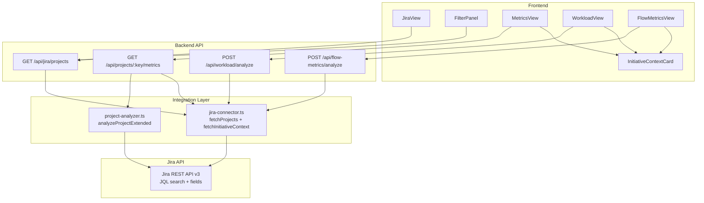

# Design Document: Jira Custom Fields Integration

## Overview

This feature integrates seven Jira custom fields (Tribu, Squad, Tipo de Iniciativa, Año de Ejecución, Centro de Costos, Avance Esperado %, Avance Real %) into the PO-AI system. The integration spans three layers:

1. **Data Fetching** — `jira-connector.ts` fetches custom field values from Jira issues of type "Iniciativa" via JQL for each project.
2. **API Layer** — `routes.ts` exposes the custom fields in project listing and metrics endpoints, with server-side filtering by Tribu, Squad, and Año.
3. **Frontend** — `JiraView` displays custom fields per project with filter dropdowns; a reusable `InitiativeContextCard` component shows organizational context and progress comparison in MetricsView, WorkloadView, and FlowMetricsView.

The custom field IDs are hardcoded constants (discovered via `discover-fields.js`):

| Field | Custom Field ID |
|---|---|
| Tribu/Chapter | `customfield_28477` |
| Squad | `customfield_28478` |
| Tipo de Iniciativa | `customfield_27929` |
| Año de Ejecución | `customfield_25441` |
| Centro de Costos | `customfield_15601` |
| Avance Esperado % | `customfield_25475` |
| Avance Real % | `customfield_25476` |

## Architecture



### Data Flow

1. **Project Listing**: `GET /api/jira/projects` → `fetchProjects()` fetches project list → for each project, a JQL query fetches the lead "Iniciativa" issue with custom fields → response includes custom fields + `filters` object with distinct values.
2. **Metrics Endpoints**: Each metrics endpoint (`/metrics`, `/workload/analyze`, `/flow-metrics/analyze`) calls a new `fetchInitiativeContext(credentials, projectKey)` function to get the custom fields, then includes them as `initiativeContext` in the response.
3. **Frontend Rendering**: `JiraView` uses the `filters` object to populate dropdowns and passes filter params back to the API. Metrics views receive `initiativeContext` in the response and pass it to `InitiativeContextCard`.

### Design Decisions

- **Hardcoded field IDs**: The custom field IDs are specific to this Jira instance and won't change. Using constants avoids an extra API call to `/rest/api/3/field` on every request. The existing `findCustomFieldId` function is available as fallback but not needed here.
- **JQL-based fetching**: Instead of fetching all fields for all issues, we use a targeted JQL query (`project = X AND issuetype = Iniciativa`) with `fields` parameter to request only the 7 custom fields. This minimizes payload size.
- **Server-side filtering**: Filters (tribu, squad, anio) are applied server-side after fetching all projects. Since the project count is small (< 100 GD/PRY projects), this is efficient and avoids complex JQL filter composition.
- **Shared `fetchInitiativeContext` function**: A single function handles fetching custom fields for a project key, reused by the projects endpoint and all three metrics endpoints.

## Components and Interfaces

### Backend

#### `jira-connector.ts` — New/Modified Exports

```typescript
// Custom field ID constants
const CUSTOM_FIELDS = {
  TRIBU: 'customfield_28477',
  SQUAD: 'customfield_28478',
  TIPO_INICIATIVA: 'customfield_27929',
  ANIO_EJECUCION: 'customfield_25441',
  CENTRO_COSTOS: 'customfield_15601',
  AVANCE_ESPERADO: 'customfield_25475',
  AVANCE_REAL: 'customfield_25476',
} as const;

// Extended JiraProject interface (modified)
export interface JiraProject {
  id: string;
  key: string;
  name: string;
  projectTypeKey: string;
  avatarUrl?: string;
  tribu: string;
  squad: string;
  tipoIniciativa: string;
  anioEjecucion: string;
  centroCostos: string;
  avanceEsperado: number | null;
  avanceReal: number | null;
}

// Initiative context for metrics responses
export interface InitiativeContext {
  tribu: string;
  squad: string;
  tipoIniciativa: string;
  anioEjecucion: string;
  centroCostos: string;
  avanceEsperado: number | null;
  avanceReal: number | null;
}

// New function: fetch initiative context for a single project
export async function fetchInitiativeContext(
  credentials: JiraCredentials,
  projectKey: string
): Promise<InitiativeContext>;

// Modified function: fetchProjects now enriches each project with custom fields
export async function fetchProjects(
  credentials: JiraCredentials,
  startYear?: number,
  endYear?: number,
  keyPrefix?: string,
  startDate?: string,
  endDate?: string
): Promise<JiraProject[]>;
```

#### `routes.ts` — Modified Endpoints

**`GET /api/jira/projects`** — New query params: `tribu`, `squad`, `anio`. Response now includes custom fields per project and a `filters` object:

```typescript
// Response shape
{
  projects: JiraProject[],
  filters: {
    tribus: string[],
    squads: string[],
    anios: string[]
  }
}
```

**`GET /api/projects/:projectKey/metrics`** — Response now includes `initiativeContext`:
```typescript
{ ...ExtendedProjectMetrics, jiraBaseUrl: string, initiativeContext: InitiativeContext }
```

**`POST /api/workload/analyze`** — Response now includes `initiativeContext`:
```typescript
{ ...WorkloadReport, initiativeContext: InitiativeContext }
```

**`POST /api/flow-metrics/analyze`** — Response now includes `initiativeContext`:
```typescript
{ ...FlowMetricsReport, initiativeContext: InitiativeContext }
```

### Frontend

#### `InitiativeContextCard.tsx` — New Component

```typescript
interface InitiativeContextCardProps {
  tribu: string;
  squad: string;
  tipoIniciativa: string;
  anioEjecucion: string;
  avanceEsperado: number | null;
  avanceReal: number | null;
}
```

Renders:
- Metadata badges: Tribu, Squad, Tipo de Iniciativa, Año
- Dual progress bar: Avance Esperado vs Avance Real
- Red highlight (`#DC2626`) when Real < Esperado by >10pp
- Green (`#009056`) when within 10pp
- "Sin datos" placeholder when values are null
- "Contexto de iniciativa no disponible" when all props empty/null

#### `JiraView.tsx` — Modified

- New `FilterPanel` section with 3 dropdowns (Tribu, Squad, Año)
- "Limpiar filtros" button
- Filtered results count display
- Custom field badges per project card (tribu, squad, tipoIniciativa, anioEjecucion)
- Dash ("—") for missing values

#### `MetricsView.tsx`, `WorkloadView.tsx`, `FlowMetricsView.tsx` — Modified

Each view:
- Extracts `initiativeContext` from API response
- Renders `<InitiativeContextCard />` at the top of the analysis results

## Data Models

### Custom Field Extraction from Jira

The JQL query to fetch custom fields for a project:

```
project = {projectKey} AND issuetype = Iniciativa ORDER BY created DESC
```

With `fields` parameter: `customfield_28477,customfield_28478,customfield_27929,customfield_25441,customfield_15601,customfield_25475,customfield_25476`

We take the first result (lead initiative issue). Field value extraction:

```typescript
// Text fields — may be string or { value: string } depending on field type
function extractTextField(field: any): string {
  if (!field) return '';
  if (typeof field === 'string') return field;
  if (field.value) return String(field.value);
  if (field.name) return String(field.name);
  return '';
}

// Numeric fields — may be number or string
function extractNumericField(field: any): number | null {
  if (field === null || field === undefined) return null;
  const num = typeof field === 'number' ? field : parseFloat(String(field));
  return isNaN(num) ? null : num;
}
```

### Filter Object

Computed server-side from the full (unfiltered) project list:

```typescript
interface ProjectFilters {
  tribus: string[];   // distinct non-empty tribu values, sorted
  squads: string[];   // distinct non-empty squad values, sorted
  anios: string[];    // distinct non-empty anioEjecucion values, sorted descending
}
```

### InitiativeContext Default

When custom fields cannot be fetched (error or no Iniciativa issue found):

```typescript
const DEFAULT_INITIATIVE_CONTEXT: InitiativeContext = {
  tribu: '',
  squad: '',
  tipoIniciativa: '',
  anioEjecucion: '',
  centroCostos: '',
  avanceEsperado: null,
  avanceReal: null,
};
```


## Correctness Properties

*A property is a characteristic or behavior that should hold true across all valid executions of a system — essentially, a formal statement about what the system should do. Properties serve as the bridge between human-readable specifications and machine-verifiable correctness guarantees.*

### Property 1: Field extraction produces correct defaults for missing values

*For any* Jira field value (null, undefined, empty string, valid string, object with `.value`, object with `.name`, number, or non-numeric string), `extractTextField` SHALL return an empty string for null/undefined inputs and a non-empty string for valid inputs, and `extractNumericField` SHALL return null for null/undefined/non-numeric inputs and a number for valid numeric inputs.

**Validates: Requirements 1.2**

### Property 2: Project filtering returns only matching projects

*For any* list of projects with arbitrary tribu, squad, and anioEjecucion values, and *for any* combination of filter parameters (tribu, squad, anio — zero or more active), the filtered result SHALL contain only projects where every active filter matches the corresponding field value, and SHALL contain all projects that match all active filters.

**Validates: Requirements 2.2, 2.3, 2.4, 2.5**

### Property 3: Filter options contain exactly the distinct non-empty values

*For any* list of projects with arbitrary tribu, squad, and anioEjecucion values, the computed `filters` object SHALL contain exactly the set of distinct non-empty values for each field, with tribus and squads sorted alphabetically and anios sorted in descending order.

**Validates: Requirements 2.6**

### Property 4: Progress bar color is determined by avance difference threshold

*For any* pair of numeric values (avanceEsperado, avanceReal) where both are non-null, the progress bar color SHALL be red (`#DC2626`) when `avanceEsperado - avanceReal > 10`, and green (`#009056`) when `avanceEsperado - avanceReal <= 10`.

**Validates: Requirements 5.5, 5.6**

## Error Handling

### Backend Errors

| Scenario | Behavior |
|---|---|
| Jira API error during custom field fetch for a project | Log warning, return project with default empty `InitiativeContext`. Do not fail the entire project list request. (Req 1.3) |
| Jira API error during `fetchInitiativeContext` in metrics endpoints | Return metrics response with default empty `initiativeContext`. (Req 6.4) |
| No "Iniciativa" issue found for a project | Return default empty `InitiativeContext` — all text fields `''`, numeric fields `null`. (Req 1.2) |
| Invalid/malformed custom field value in Jira response | `extractTextField` returns `''`, `extractNumericField` returns `null`. Graceful degradation. |
| Credential not found | Existing 404 error handling in routes remains unchanged. |

### Frontend Errors

| Scenario | Behavior |
|---|---|
| API returns project without custom fields (old API version) | Treat missing fields as empty/null, display "—" for text, "Sin datos" for progress. |
| All `initiativeContext` fields are empty/null | `InitiativeContextCard` renders "Contexto de iniciativa no disponible" placeholder. (Req 7.3) |
| Network error loading projects with filters | Existing error handling in JiraView displays error message. Filters remain in their current state. |

## Testing Strategy

### Property-Based Tests (fast-check)

The project uses Jest with TypeScript. Property-based tests will use `fast-check` (already available in the project based on existing property test files).

- **Minimum 100 iterations** per property test
- Each test tagged with: `Feature: jira-custom-fields, Property {N}: {description}`
- Tests target pure functions extracted from the integration layer:
  - `extractTextField`, `extractNumericField` — field extraction logic
  - `filterProjects` — filtering logic (extracted as pure function)
  - `computeFilterOptions` — distinct value computation
  - `getProgressBarColor` — color determination logic

### Unit Tests (Jest)

- `InitiativeContextCard` rendering with various prop combinations
- `FilterPanel` dropdown rendering and interaction
- JiraView project card custom field display
- "—" display for missing values
- "Sin datos" display for null avance values
- "Contexto de iniciativa no disponible" placeholder state
- Spanish label verification

### Integration Tests

- `GET /api/jira/projects` returns custom fields and filters object (mocked Jira)
- `GET /api/projects/:key/metrics` includes `initiativeContext` (mocked Jira)
- `POST /api/workload/analyze` includes `initiativeContext` (mocked Jira)
- `POST /api/flow-metrics/analyze` includes `initiativeContext` (mocked Jira)
- Error scenarios: Jira API failure returns default context
