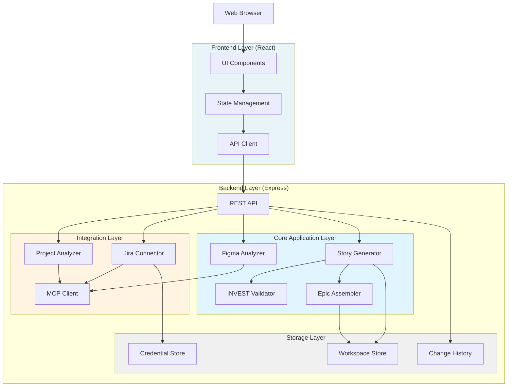
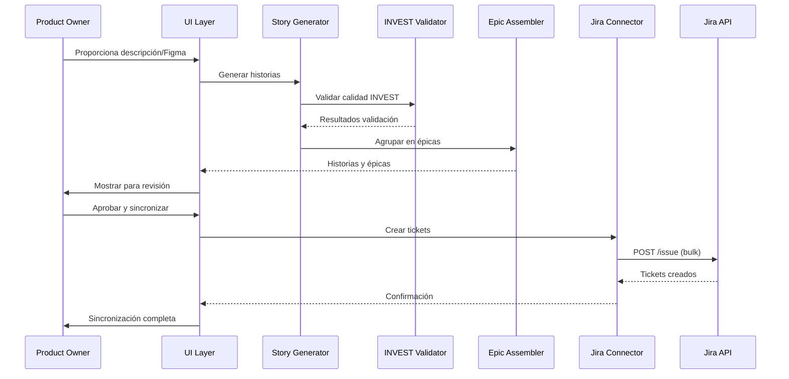

# Design Document: PO AI

## Overview

El sistema PO AI es una herramienta de automatización que reduce la carga operativa de Product Owners mediante la generación automática de historias de usuario, análisis de diseños Figma, sincronización bidireccional con Jira, y análisis de métricas de proyectos.

### Objetivos del Sistema

- Automatizar la generación de historias de usuario con criterios de aceptación en formato Gherkin
- Analizar diseños de Figma para extraer flujos y componentes UI
- Sincronizar historias con Jira manteniendo trazabilidad y estructura
- Validar calidad de historias según criterios INVEST
- Proporcionar análisis de métricas de gestión de proyectos
- Permitir refinamiento iterativo antes de la sincronización

### Principios de Diseño

1. **Separación de Responsabilidades**: Componentes independientes para generación, análisis, sincronización y validación
2. **Extensibilidad**: Arquitectura modular que permite agregar nuevos analizadores y conectores
3. **Seguridad**: Manejo seguro de credenciales con encriptación
4. **Validación Temprana**: Verificación de calidad antes de sincronización con sistemas externos
5. **Trazabilidad**: Mantenimiento de relaciones entre épicas, historias y criterios

## Architecture

### Arquitectura de Alto Nivel



### Flujo de Datos Principal



## Components and Interfaces

### 1. Story Generator

**Responsabilidad**: Generar historias de usuario y criterios de aceptación desde descripciones textuales.

**Interface**:
```typescript
interface StoryGenerator {
  generateStories(input: GenerationInput): Promise<GenerationResult>;
  refineStory(storyId: string, changes: StoryChanges): Promise<Story>;
  detectAmbiguities(description: string): Ambiguity[];
}

interface GenerationInput {
  description: string;
  context?: ProjectContext;
  figmaData?: FigmaAnalysisResult;
}

interface GenerationResult {
  stories: Story[];
  epics: Epic[];
  ambiguities: Ambiguity[];
  validationResults: ValidationResult[];
}

interface Story {
  id: string;
  title: string;
  role: string;
  action: string;
  value: string;
  acceptanceCriteria: AcceptanceCriterion[];
  components: string[];
  epicId?: string;
  investScore: InvestScore;
}

interface AcceptanceCriterion {
  id: string;
  given: string;
  when: string;
  then: string;
  type: 'positive' | 'negative' | 'error';
}
```

**Implementación**:
- Utiliza LLM para generación de historias con prompt engineering estructurado
- Aplica templates para formato "Como [rol], quiero [acción], para que [valor]"
- Genera mínimo 3 criterios de aceptación por historia (positivos, negativos, errores)
- Identifica roles de usuario basándose en contexto del dominio

### 2. Figma Analyzer

**Responsabilidad**: Analizar diseños de Figma para extraer componentes, flujos y generar historias.

**Interface**:
```typescript
interface FigmaAnalyzer {
  analyzeDesign(figmaUrl: string): Promise<FigmaAnalysisResult>;
  extractComponents(fileKey: string): Promise<UIComponent[]>;
  identifyFlows(fileKey: string): Promise<UserFlow[]>;
}

interface FigmaAnalysisResult {
  components: UIComponent[];
  flows: UserFlow[];
  screens: Screen[];
  interactions: Interaction[];
}

interface UIComponent {
  id: string;
  name: string;
  type: string;
  properties: Record<string, any>;
  interactions: string[];
}

interface UserFlow {
  id: string;
  name: string;
  screens: string[];
  sequence: FlowStep[];
}

interface FlowStep {
  screenId: string;
  action: string;
  trigger: string;
  nextScreenId?: string;
}
```

**Implementación**:
- Usa MCP (Model Context Protocol) para comunicación con Figma
- Utiliza servidor MCP de Figma para acceder a archivos y nodos
- Identifica componentes interactivos (botones, formularios, navegación)
- Mapea prototipos de Figma a flujos de usuario
- Preserva secuencia lógica de navegación

### 3. INVEST Validator

**Responsabilidad**: Validar calidad de historias según criterios INVEST.

**Interface**:
```typescript
interface INVESTValidator {
  validate(story: Story): ValidationResult;
  suggestImprovements(story: Story, failures: ValidationFailure[]): Suggestion[];
}

interface ValidationResult {
  isValid: boolean;
  score: InvestScore;
  failures: ValidationFailure[];
  suggestions: Suggestion[];
}

interface InvestScore {
  independent: number;  // 0-1
  negotiable: number;   // 0-1
  valuable: number;     // 0-1
  estimable: number;    // 0-1
  small: number;        // 0-1
  testable: number;     // 0-1
  overall: number;      // 0-1
}

interface ValidationFailure {
  criterion: 'I' | 'N' | 'V' | 'E' | 'S' | 'T';
  reason: string;
  severity: 'error' | 'warning';
}

interface Suggestion {
  criterion: string;
  improvement: string;
  example?: string;
}
```

**Implementación**:
- **Independent**: Verifica ausencia de dependencias explícitas con otras historias
- **Negotiable**: Valida que la historia describe "qué" no "cómo"
- **Valuable**: Confirma presencia de valor de negocio o usuario
- **Estimable**: Verifica claridad y ausencia de términos vagos
- **Small**: Estima complejidad basada en número de criterios y componentes
- **Testable**: Valida que criterios sean verificables y medibles

### 4. Epic Assembler

**Responsabilidad**: Agrupar historias relacionadas en épicas coherentes.

**Interface**:
```typescript
interface EpicAssembler {
  assembleEpics(stories: Story[]): Epic[];
  identifyDependencies(stories: Story[]): Dependency[];
  reorganizeStories(storyId: string, targetEpicId: string): void;
}

interface Epic {
  id: string;
  title: string;
  description: string;
  stories: string[];  // story IDs
  businessValue: string;
  dependencies: Dependency[];
}

interface Dependency {
  fromStoryId: string;
  toStoryId: string;
  type: 'blocks' | 'relates' | 'requires';
  reason: string;
}
```

**Implementación**:
- Agrupa historias por similitud semántica y componentes compartidos
- Identifica dependencias mediante análisis de criterios de aceptación
- Asegura que cada épica represente valor incremental
- Descompone funcionalidades grandes en múltiples épicas

### 5. Jira Connector

**Responsabilidad**: Sincronizar historias y épicas con Jira, gestionar autenticación.

**Interface**:
```typescript
interface JiraConnector {
  authenticate(credentials: JiraCredentials): Promise<AuthResult>;
  createIssues(issues: JiraIssue[]): Promise<CreateResult>;
  linkIssues(parentId: string, childIds: string[]): Promise<void>;
  validatePermissions(projectKey: string): Promise<PermissionCheck>;
  exportToJson(stories: Story[], epics: Epic[]): string;
  exportToCsv(stories: Story[], epics: Epic[]): string;
}

interface JiraCredentials {
  baseUrl: string;
  email: string;
  apiToken: string;
}

interface JiraIssue {
  projectKey: string;
  issueType: 'Epic' | 'Story';
  summary: string;
  description: string;
  components?: string[];
  epicLink?: string;
}

interface CreateResult {
  created: IssueReference[];
  failed: FailedIssue[];
}

interface IssueReference {
  localId: string;
  jiraKey: string;
  jiraId: string;
  url: string;
}
```

**Implementación**:
- Usa MCP (Model Context Protocol) para comunicación con Jira
- Utiliza servidor MCP de Jira para operaciones CRUD
- Almacena credenciales encriptadas usando AES-256 (gestionadas por MCP)
- Valida permisos antes de crear tickets mediante herramientas MCP
- Crea épicas primero, luego historias con epic link
- Preserva formato Markdown en descripciones
- Maneja errores con mensajes descriptivos

### 6. Project Analyzer

**Responsabilidad**: Analizar métricas de gestión de proyectos desde Jira.

**Interface**:
```typescript
interface ProjectAnalyzer {
  analyzeProject(projectKey: string): Promise<ProjectMetrics>;
  calculateVelocity(projectKey: string, sprints: number): Promise<VelocityData>;
  identifyBottlenecks(projectKey: string): Promise<Bottleneck[]>;
}

interface ProjectMetrics {
  velocity: VelocityData;
  cycleTime: CycleTimeData;
  distribution: StatusDistribution;
  blockedIssues: BlockedIssue[];
  bottlenecks: Bottleneck[];
}

interface VelocityData {
  averageStoryPoints: number;
  sprintVelocities: SprintVelocity[];
  trend: 'increasing' | 'stable' | 'decreasing';
}

interface CycleTimeData {
  averageDays: number;
  median: number;
  percentile90: number;
}

interface StatusDistribution {
  todo: number;
  inProgress: number;
  done: number;
  blocked: number;
}

interface Bottleneck {
  type: 'dependency' | 'resource' | 'blocker';
  affectedIssues: string[];
  description: string;
  severity: 'high' | 'medium' | 'low';
}
```

**Implementación**:
- Extrae datos de issues usando JQL queries
- Calcula velocidad basada en story points completados por sprint
- Identifica issues bloqueadas mediante status y flags
- Analiza dependencias para detectar cuellos de botella
- Calcula cycle time desde "In Progress" hasta "Done"

### 7. Credential Store

**Responsabilidad**: Almacenar y recuperar credenciales de forma segura.

**Interface**:
```typescript
interface CredentialStore {
  store(key: string, credentials: JiraCredentials): Promise<void>;
  retrieve(key: string): Promise<JiraCredentials | null>;
  update(key: string, credentials: JiraCredentials): Promise<void>;
  delete(key: string): Promise<void>;
}
```

**Implementación**:
- Encripta credenciales usando AES-256-GCM
- Almacena en sistema de archivos local o keychain del OS
- Usa clave derivada de contraseña maestra o sistema
- Nunca expone credenciales en logs

### 8. Workspace Store

**Responsabilidad**: Persistir historias, épicas y estado de trabajo.

**Interface**:
```typescript
interface WorkspaceStore {
  saveWorkspace(workspace: Workspace): Promise<void>;
  loadWorkspace(workspaceId: string): Promise<Workspace>;
  listWorkspaces(): Promise<WorkspaceMetadata[]>;
}

interface Workspace {
  id: string;
  name: string;
  projectKey: string;
  stories: Story[];
  epics: Epic[];
  metadata: WorkspaceMetadata;
}

interface WorkspaceMetadata {
  created: Date;
  modified: Date;
  syncStatus: 'pending' | 'synced' | 'modified';
  jiraProjectKey?: string;
}
```

**Implementación**:
- Almacena workspaces en formato JSON
- Mantiene índice de workspaces para listado rápido
- Guarda automáticamente cambios

### 9. Change History

**Responsabilidad**: Mantener historial de cambios en historias.

**Interface**:
```typescript
interface ChangeHistory {
  recordChange(storyId: string, change: Change): void;
  getHistory(storyId: string): Change[];
  revert(storyId: string, changeId: string): Promise<Story>;
}

interface Change {
  id: string;
  timestamp: Date;
  field: string;
  oldValue: any;
  newValue: any;
  author: string;
}
```

**Implementación**:
- Registra todos los cambios a historias
- Permite revertir cambios individuales
- Mantiene historial por workspace

## Data Models

### Core Domain Models

```typescript
// Story representa una historia de usuario completa
interface Story {
  id: string;
  title: string;
  role: string;              // "usuario", "administrador", etc.
  action: string;            // "crear una tarea", "ver el dashboard"
  value: string;             // "pueda organizar mi trabajo"
  description: string;       // Descripción completa generada
  acceptanceCriteria: AcceptanceCriterion[];
  components: string[];      // Componentes técnicos afectados
  epicId?: string;
  investScore: InvestScore;
  metadata: StoryMetadata;
}

interface StoryMetadata {
  created: Date;
  modified: Date;
  source: 'manual' | 'figma' | 'generated';
  figmaUrl?: string;
  jiraKey?: string;
  jiraId?: string;
}

// AcceptanceCriterion en formato Gherkin
interface AcceptanceCriterion {
  id: string;
  given: string;             // Precondición
  when: string;              // Acción
  then: string;              // Resultado esperado
  type: 'positive' | 'negative' | 'error';
}

// Epic agrupa historias relacionadas
interface Epic {
  id: string;
  title: string;
  description: string;
  businessValue: string;
  stories: string[];         // IDs de historias
  dependencies: Dependency[];
  metadata: EpicMetadata;
}

interface EpicMetadata {
  created: Date;
  modified: Date;
  jiraKey?: string;
  jiraId?: string;
}

// Ambiguity representa términos o conceptos que requieren aclaración
interface Ambiguity {
  id: string;
  type: 'vague_term' | 'missing_role' | 'missing_value' | 'unclear_scope';
  location: string;          // Dónde se encontró
  term: string;              // Término ambiguo
  question: string;          // Pregunta para aclarar
  suggestions: string[];     // Sugerencias de aclaración
}

// ProjectContext proporciona contexto del proyecto
interface ProjectContext {
  projectKey: string;
  domain: string;            // "e-commerce", "healthcare", etc.
  existingComponents: string[];
  userRoles: string[];
  conventions: ProjectConventions;
}

interface ProjectConventions {
  storyPointScale: number[]; // [1, 2, 3, 5, 8, 13]
  componentNaming: string;   // Convención de nombres
  customFields: CustomField[];
}

interface CustomField {
  name: string;
  type: string;
  required: boolean;
}
```

### Integration Models

```typescript
// Modelos para integración con Jira
interface JiraIssuePayload {
  fields: {
    project: { key: string };
    issuetype: { name: string };
    summary: string;
    description: {
      type: 'doc';
      version: 1;
      content: any[];  // Formato Atlassian Document Format
    };
    components?: Array<{ name: string }>;
    customfield_10014?: string;  // Epic Link
  };
}

// Modelos para integración con Figma
interface FigmaFile {
  name: string;
  lastModified: string;
  thumbnailUrl: string;
  version: string;
  document: FigmaNode;
}

interface FigmaNode {
  id: string;
  name: string;
  type: string;
  children?: FigmaNode[];
  prototypeStartNodeID?: string;
  prototypeDevice?: any;
}

interface FigmaPrototype {
  interactions: FigmaInteraction[];
}

interface FigmaInteraction {
  trigger: {
    type: string;  // "ON_CLICK", "ON_HOVER", etc.
  };
  action: {
    type: string;  // "NODE", "URL", "BACK"
    destinationId?: string;
    navigation?: string;
  };
}
```

### Export Models

```typescript
// Modelo para exportación JSON compatible con Jira
interface JiraExport {
  issueUpdates: JiraIssueUpdate[];
}

interface JiraIssueUpdate {
  fields: {
    project: { key: string };
    issuetype: { name: string };
    summary: string;
    description: string;
    components?: string[];
  };
}

// Modelo para exportación CSV
interface CsvRow {
  'Issue Type': string;
  'Summary': string;
  'Description': string;
  'Acceptance Criteria': string;
  'Components': string;
  'Epic Link': string;
}
```

## Correctness Properties


*A property is a characteristic or behavior that should hold true across all valid executions of a system-essentially, a formal statement about what the system should do. Properties serve as the bridge between human-readable specifications and machine-verifiable correctness guarantees.*

### Property 1: Story Format Compliance

*For any* generated story, the story SHALL follow the format "Como [rol], quiero [acción], para que [valor]" AND include at least 3 acceptance criteria where each criterion has the Gherkin format "Dado que... Cuando... Entonces..." with at least one positive scenario and one negative or error scenario.

**Validates: Requirements 1.1, 1.3, 3.1, 3.2**

### Property 2: INVEST Validation

*For any* generated story, the story SHALL pass INVEST validation with scores above threshold for all six criteria (Independent, Negotiable, Valuable, Estimable, Small, Testable).

**Validates: Requirements 1.2, 8.1, 8.2, 8.3, 8.4, 8.5, 8.6**

### Property 3: Ambiguity Detection

*For any* description containing vague terms, missing role information, or missing business value, the Story_Generator SHALL detect these ambiguities and provide specific clarifying questions.

**Validates: Requirements 1.5, 11.1, 11.2, 11.3, 11.4**

### Property 4: Figma Component Extraction

*For any* Figma design URL, the Figma_Analyzer SHALL extract all interactive components and user flows, and map each component to at least one generated story.

**Validates: Requirements 2.1, 2.2, 2.3**

### Property 5: Figma Flow Generation

*For any* Figma design with multiple screens, the Story_Generator SHALL generate stories for each identified flow.

**Validates: Requirements 2.4**

### Property 6: Navigation Sequence Preservation

*For any* Figma design with a defined navigation sequence, the generated stories SHALL preserve the logical order of navigation.

**Validates: Requirements 2.5**

### Property 7: Vague Terms Exclusion

*For any* generated acceptance criterion, it SHALL NOT contain vague terms such as "rápidamente", "adecuado", "user-friendly", or similar subjective terms.

**Validates: Requirements 3.4**

### Property 8: Error Criteria Inclusion

*For any* story description that mentions error conditions or validations, the generated acceptance criteria SHALL include at least one criterion of type 'error' addressing error handling.

**Validates: Requirements 3.5**

### Property 9: Epic Grouping

*For any* set of related stories (sharing components or domain concepts), the Epic_Assembler SHALL group them into logical epics.

**Validates: Requirements 4.1**

### Property 10: Dependency Identification

*For any* set of stories within an epic where one story references another, the Epic_Assembler SHALL identify and record the dependency relationship.

**Validates: Requirements 4.4**

### Property 11: Epic Decomposition

*For any* epic containing more than a threshold number of stories (e.g., 10), the Epic_Assembler SHALL decompose it into multiple smaller epics.

**Validates: Requirements 4.5**


### Property 12: Jira Ticket Creation

*For any* approved story, the Jira_Connector SHALL create a corresponding ticket in Jira with the correct project key and issue type.

**Validates: Requirements 5.1, 5.3, 5.4**

### Property 13: Markdown Preservation

*For any* story with Markdown formatting in description or acceptance criteria, the Jira_Connector SHALL preserve the Markdown format when creating the Jira ticket.

**Validates: Requirements 5.2**

### Property 14: Epic-Story Linking

*For any* story that belongs to an epic, the Jira_Connector SHALL create the epic link field in Jira pointing to the parent epic.

**Validates: Requirements 5.5**

### Property 15: Descriptive Error Messages

*For any* synchronization failure (invalid credentials, insufficient permissions, network error), the Jira_Connector SHALL provide an error message that includes the failure type and actionable details.

**Validates: Requirements 5.6**

### Property 16: Credential Encryption

*For any* stored Jira credentials, they SHALL be encrypted using AES-256 and NOT stored in plain text.

**Validates: Requirements 6.2**

### Property 17: Permission Validation

*For any* project key, before creating tickets, the Jira_Connector SHALL validate that the authenticated user has write permissions on that project.

**Validates: Requirements 6.4**

### Property 18: Jira Data Extraction

*For any* project analysis request, the Project_Analyzer SHALL extract issue data from Jira including status, timestamps, and relationships.

**Validates: Requirements 7.1**

### Property 19: Velocity Calculation

*For any* project with completed sprints, the Project_Analyzer SHALL calculate team velocity as the average story points completed per sprint.

**Validates: Requirements 7.2**

### Property 20: Blocked Issue Identification

*For any* project, the Project_Analyzer SHALL identify issues that are in blocked status or have been in the same status for longer than a threshold period.

**Validates: Requirements 7.3**

### Property 21: Status Distribution

*For any* project analysis, the Project_Analyzer SHALL generate a distribution report showing counts for each status (To Do, In Progress, Done, Blocked).

**Validates: Requirements 7.4**

### Property 22: Cycle Time Calculation

*For any* completed story with timestamps, the Project_Analyzer SHALL calculate cycle time as the duration from "In Progress" to "Done".

**Validates: Requirements 7.5**

### Property 23: Bottleneck Detection

*For any* project with dependency relationships, the Project_Analyzer SHALL identify dependency patterns that create bottlenecks (e.g., many issues depending on one issue).

**Validates: Requirements 7.6**

### Property 24: INVEST Improvement Suggestions

*For any* story that fails INVEST validation on one or more criteria, the Story_Generator SHALL provide specific improvement suggestions for each failed criterion.

**Validates: Requirements 8.7**


### Property 25: JSON Export Validation

*For any* export to JSON format, the output SHALL be valid JSON that conforms to the Jira API schema for bulk issue creation.

**Validates: Requirements 9.1, 9.4**

### Property 26: CSV Export Format

*For any* export to CSV format, the output SHALL include columns for all required Jira fields (Issue Type, Summary, Description, Acceptance Criteria, Components, Epic Link).

**Validates: Requirements 9.2, 9.3**

### Property 27: Selective Export

*For any* export operation with a selected subset of stories, only the selected stories SHALL appear in the exported file.

**Validates: Requirements 9.5**

### Property 28: Component Suggestion

*For any* generated story, the Story_Generator SHALL suggest at least one relevant technical component based on the story content and project context.

**Validates: Requirements 10.1**

### Property 29: Component Synchronization

*For any* story with assigned components, when creating the Jira ticket, the Jira_Connector SHALL include all assigned components in the ticket's component field.

**Validates: Requirements 10.3**

### Property 30: Component List Maintenance

*For any* project, after generating stories, the Story_Generator SHALL update the common components list to include any new components used.

**Validates: Requirements 10.4**

### Property 31: Story Reorganization

*For any* story moved from one epic to another, the system SHALL update the story's epicId reference and update both epics' story lists.

**Validates: Requirements 12.4**

### Property 32: Criteria Modification

*For any* story where acceptance criteria are added or removed, the story's acceptanceCriteria array length SHALL reflect the change.

**Validates: Requirements 12.3**

### Property 33: Re-validation After Changes

*For any* story that is modified (title, description, or criteria), the system SHALL re-run INVEST validation and update the investScore.

**Validates: Requirements 12.5**

### Property 34: Change History Recording

*For any* modification to a story (title, description, criteria, components, epic assignment), the system SHALL record a change entry with timestamp, field, old value, and new value.

**Validates: Requirements 12.6**

## Error Handling

### Error Categories

El sistema maneja las siguientes categorías de errores:

1. **Validation Errors**: Errores en validación de datos de entrada
2. **Integration Errors**: Errores en comunicación con APIs externas (Jira, Figma)
3. **Authentication Errors**: Errores de autenticación y autorización
4. **Business Logic Errors**: Errores en lógica de negocio (INVEST, ambigüedades)
5. **Storage Errors**: Errores en persistencia de datos

### Error Handling Strategy

```typescript
interface ErrorResponse {
  code: string;
  message: string;
  details?: any;
  recoverable: boolean;
  suggestedAction?: string;
}
```


### Specific Error Scenarios

**1. Jira Authentication Failure**
- Error Code: `JIRA_AUTH_FAILED`
- Message: "Autenticación con Jira falló. Verifica tus credenciales."
- Recoverable: Yes
- Suggested Action: "Actualiza tu API token en la configuración"

**2. Jira Permission Denied**
- Error Code: `JIRA_PERMISSION_DENIED`
- Message: "No tienes permisos de escritura en el proyecto {projectKey}"
- Recoverable: No
- Suggested Action: "Contacta al administrador de Jira para obtener permisos"

**3. Figma Access Denied**
- Error Code: `FIGMA_ACCESS_DENIED`
- Message: "No se puede acceder al diseño de Figma. Verifica el enlace y permisos."
- Recoverable: Yes
- Suggested Action: "Asegúrate de que el enlace sea público o proporciona un token de acceso"

**4. Invalid Story Format**
- Error Code: `INVALID_STORY_FORMAT`
- Message: "La historia no cumple con el formato requerido"
- Recoverable: Yes
- Suggested Action: "Revisa que la historia tenga rol, acción y valor definidos"

**5. INVEST Validation Failure**
- Error Code: `INVEST_VALIDATION_FAILED`
- Message: "La historia no cumple con criterios INVEST: {failedCriteria}"
- Recoverable: Yes
- Suggested Action: "Revisa las sugerencias de mejora proporcionadas"

**6. Component Not Found in Jira**
- Error Code: `JIRA_COMPONENT_NOT_FOUND`
- Message: "El componente '{componentName}' no existe en el proyecto {projectKey}"
- Recoverable: Yes
- Suggested Action: "Crea el componente en Jira o selecciona uno existente"

**7. Network Error**
- Error Code: `NETWORK_ERROR`
- Message: "Error de red al conectar con {service}"
- Recoverable: Yes
- Suggested Action: "Verifica tu conexión a internet y reintenta"

**8. Ambiguous Description**
- Error Code: `AMBIGUOUS_DESCRIPTION`
- Message: "La descripción contiene ambigüedades que requieren aclaración"
- Recoverable: Yes
- Suggested Action: "Responde las preguntas de aclaración proporcionadas"

### Error Recovery Mechanisms

- **Retry Logic**: Para errores de red, implementar retry con exponential backoff (3 intentos)
- **Graceful Degradation**: Si Figma no está disponible, permitir generación manual
- **Partial Success**: En sincronización masiva, reportar éxitos y fallos por separado
- **Rollback**: Si falla la creación de épica, no crear historias asociadas
- **User Notification**: Todos los errores se notifican al usuario con mensajes claros

## Testing Strategy

### Dual Testing Approach

El sistema requiere tanto pruebas unitarias como pruebas basadas en propiedades para garantizar corrección completa:

**Unit Tests**: Verifican ejemplos específicos, casos borde y condiciones de error
- Ejemplos concretos de generación de historias
- Casos de autenticación exitosa y fallida
- Manejo de componentes inexistentes en Jira
- Interacciones de UI (edición, reorganización)

**Property-Based Tests**: Verifican propiedades universales a través de múltiples entradas generadas
- Formato de historias y criterios (Property 1)
- Validación INVEST (Property 2)
- Detección de ambigüedades (Property 3)
- Todas las propiedades de corrección definidas

### Property-Based Testing Configuration

**Framework**: Se utilizará `fast-check` para TypeScript/JavaScript

**Configuración**:
- Mínimo 100 iteraciones por prueba de propiedad
- Cada prueba debe referenciar la propiedad del documento de diseño
- Tag format: `Feature: po-ai, Property {number}: {property_text}`

**Ejemplo de Prueba de Propiedad**:

```typescript
// Feature: po-ai, Property 1: Story Format Compliance
describe('Story Generation Properties', () => {
  it('should generate stories in correct format with valid criteria', () => {
    fc.assert(
      fc.property(
        fc.record({
          description: fc.string({ minLength: 20 }),
          context: fc.option(projectContextArbitrary())
        }),
        async (input) => {
          const result = await storyGenerator.generateStories(input);
          
          for (const story of result.stories) {
            // Verify format: "Como [rol], quiero [acción], para que [valor]"
            expect(story.role).toBeTruthy();
            expect(story.action).toBeTruthy();
            expect(story.value).toBeTruthy();
            
            // Verify at least 3 acceptance criteria
            expect(story.acceptanceCriteria.length).toBeGreaterThanOrEqual(3);
            
            // Verify Gherkin format
            for (const criterion of story.acceptanceCriteria) {
              expect(criterion.given).toBeTruthy();
              expect(criterion.when).toBeTruthy();
              expect(criterion.then).toBeTruthy();
            }
            
            // Verify at least one positive and one negative/error scenario
            const types = story.acceptanceCriteria.map(c => c.type);
            expect(types).toContain('positive');
            expect(types.some(t => t === 'negative' || t === 'error')).toBe(true);
          }
        }
      ),
      { numRuns: 100 }
    );
  });
});
```


### Unit Testing Focus Areas

**1. Story Generator**
- Generación con descripciones específicas conocidas
- Detección de términos vagos específicos
- Manejo de descripciones vacías o muy cortas

**2. Figma Analyzer**
- Parsing de estructuras Figma conocidas
- Manejo de diseños sin prototipos
- Manejo de enlaces inválidos

**3. INVEST Validator**
- Validación de historias que fallan criterios específicos
- Generación de sugerencias para cada criterio
- Cálculo de scores

**4. Jira Connector**
- Autenticación exitosa con credenciales válidas
- Autenticación fallida con credenciales inválidas
- Creación de ticket individual
- Manejo de componentes inexistentes
- Preservación de formato Markdown específico

**5. Project Analyzer**
- Cálculo de velocidad con datos de sprints conocidos
- Identificación de issues bloqueadas específicas
- Cálculo de cycle time con timestamps conocidos

**6. Epic Assembler**
- Agrupación de 2-3 historias relacionadas conocidas
- Identificación de dependencia explícita
- Descomposición de épica con 15 historias

**7. Credential Store**
- Almacenamiento y recuperación de credenciales
- Verificación de encriptación
- Actualización de credenciales

**8. Change History**
- Registro de cambio específico
- Recuperación de historial
- Reversión de cambio

### Integration Testing

**Jira Integration**:
- Flujo completo: autenticación → validación permisos → creación épica → creación historias → vinculación
- Manejo de rate limiting de Jira API
- Sincronización de 50+ historias

**Figma Integration**:
- Extracción de diseño real de Figma
- Manejo de archivos grandes
- Parsing de prototipos complejos

**End-to-End Scenarios**:
1. Descripción → Generación → Validación → Refinamiento → Sincronización Jira
2. Figma URL → Análisis → Generación → Exportación CSV
3. Proyecto Jira → Análisis → Reporte de métricas

### Test Data Generators

Para property-based testing, se requieren generadores de datos arbitrarios:

```typescript
// Generador de descripciones de funcionalidades
const descriptionArbitrary = () => fc.string({ minLength: 20, maxLength: 500 });

// Generador de contexto de proyecto
const projectContextArbitrary = () => fc.record({
  projectKey: fc.stringOf(fc.constantFrom('A', 'B', 'C', 'D'), { minLength: 2, maxLength: 5 }),
  domain: fc.constantFrom('e-commerce', 'healthcare', 'finance', 'education'),
  existingComponents: fc.array(fc.string(), { minLength: 1, maxLength: 10 }),
  userRoles: fc.array(fc.constantFrom('usuario', 'administrador', 'moderador'), { minLength: 1 })
});

// Generador de historias
const storyArbitrary = () => fc.record({
  id: fc.uuid(),
  title: fc.string({ minLength: 10, maxLength: 100 }),
  role: fc.constantFrom('usuario', 'administrador', 'Product Owner'),
  action: fc.string({ minLength: 10, maxLength: 100 }),
  value: fc.string({ minLength: 10, maxLength: 100 }),
  acceptanceCriteria: fc.array(acceptanceCriterionArbitrary(), { minLength: 3, maxLength: 10 }),
  components: fc.array(fc.string(), { minLength: 1, maxLength: 5 })
});

// Generador de criterios de aceptación
const acceptanceCriterionArbitrary = () => fc.record({
  id: fc.uuid(),
  given: fc.string({ minLength: 10 }),
  when: fc.string({ minLength: 10 }),
  then: fc.string({ minLength: 10 }),
  type: fc.constantFrom('positive', 'negative', 'error')
});

// Generador de épicas
const epicArbitrary = () => fc.record({
  id: fc.uuid(),
  title: fc.string({ minLength: 10, maxLength: 100 }),
  description: fc.string({ minLength: 20 }),
  businessValue: fc.string({ minLength: 20 }),
  stories: fc.array(fc.uuid(), { minLength: 2, maxLength: 10 })
});

// Generador de datos de Figma
const figmaDataArbitrary = () => fc.record({
  components: fc.array(fc.record({
    id: fc.uuid(),
    name: fc.string(),
    type: fc.constantFrom('BUTTON', 'INPUT', 'TEXT', 'FRAME')
  }), { minLength: 1, maxLength: 20 }),
  flows: fc.array(fc.record({
    id: fc.uuid(),
    name: fc.string(),
    screens: fc.array(fc.uuid(), { minLength: 2, maxLength: 5 })
  }), { minLength: 1, maxLength: 5 })
});
```

### Coverage Goals

- **Unit Test Coverage**: Mínimo 80% de cobertura de líneas
- **Property Test Coverage**: Todas las 34 propiedades deben tener al menos una prueba
- **Integration Test Coverage**: Todos los flujos principales end-to-end
- **Error Path Coverage**: Todos los códigos de error deben ser testeados

### Continuous Testing

- Ejecutar pruebas unitarias en cada commit
- Ejecutar pruebas de propiedades en cada PR
- Ejecutar pruebas de integración nocturnamente (requieren credenciales reales)
- Monitorear tiempo de ejecución de property tests (objetivo: < 5 minutos)

## Implementation Notes

### Technology Stack Recommendations

**Frontend**:
- React con TypeScript para UI
- Tailwind CSS para estilos
- React Query para gestión de estado y cache
- React Hook Form para formularios
- Zustand para estado global

**Backend/Core**:
- TypeScript/Node.js para lógica de negocio
- Express.js para API REST
- LLM API (OpenAI, Anthropic) para generación de historias
- Zod para validación de schemas

**APIs**:
- MCP Server para Jira (integración via Model Context Protocol)
- MCP Server para Figma (integración via Model Context Protocol)

**Storage**:
- Sistema de archivos local para workspaces (JSON)
- Keychain del OS para credenciales (macOS Keychain, Windows Credential Manager, Linux Secret Service)

**Testing**:
- Jest como test runner
- fast-check para property-based testing
- React Testing Library para tests de UI
- Nock para mocking de APIs HTTP

**Security**:
- crypto (Node.js) para encriptación AES-256-GCM
- dotenv para variables de entorno en desarrollo

### Deployment Considerations

- El sistema se ejecuta como aplicación web (frontend React + backend Node.js)
- Backend puede ejecutarse localmente o desplegarse en servidor
- Requiere acceso a internet para APIs de Jira y Figma via MCP
- Credenciales se almacenan localmente de forma segura en el backend
- Workspaces se almacenan en directorio de usuario o base de datos

### Performance Considerations

- Generación de historias: < 5 segundos por funcionalidad
- Análisis de Figma: < 10 segundos por archivo
- Sincronización con Jira: < 2 segundos por ticket (bulk creation)
- Análisis de proyecto: < 30 segundos para proyectos con < 1000 issues

### Extensibility Points

- **Custom Validators**: Permitir agregar validadores personalizados además de INVEST
- **Custom Templates**: Permitir templates personalizados para formato de historias
- **Additional Integrations**: Arquitectura permite agregar conectores para Azure DevOps, Linear, etc.
- **Custom Analyzers**: Permitir agregar analizadores adicionales (GitHub, GitLab)

