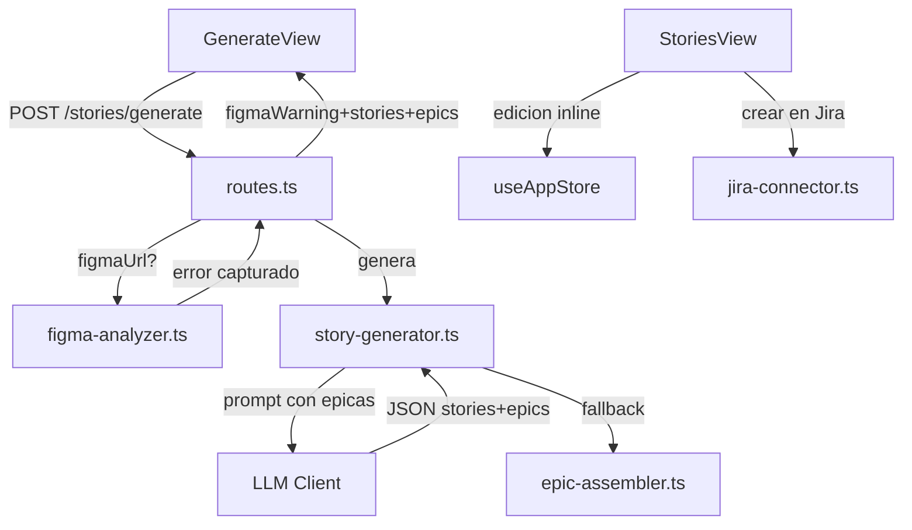

# Diseno Tecnico - Story Generator V2

## Vision General

4 mejoras al generador de HUs de PO-Agile-Master:

1. Manejo de errores de Figma: degradacion graceful con mensajes especificos (403, 404, red)
2. Edicion completa de HUs: edicion inline de todos los campos, CRUD de criterios, agregar/eliminar HUs
3. Epicas del LLM: prompt actualizado para epicas, edicion de epicas, mover HUs entre epicas
4. Creacion en Jira: buscador predictivo de proyectos, selector de epica padre, barra de progreso

Reutiliza modulos existentes. Sin dependencias nuevas.

## Arquitectura



Principios: cambios minimos a archivos existentes, degradacion graceful, estado centralizado en Zustand, sin dependencias nuevas.

Archivos impactados:

| Archivo | Cambio |
|---------|--------|
| routes.ts | Captura errores Figma, retorna figmaWarning junto con stories |
| story-generator.ts | Prompt actualizado para epicas, parseo de epicas, retorna epics |
| figma-analyzer.ts | Sin cambios (ya maneja 403/404/red) |
| epic-assembler.ts | Sin cambios (se usa como fallback) |
| jira-connector.ts | Nueva funcion fetchProjectEpics() |
| useAppStore.ts | Nuevas acciones CRUD stories/epics, moveStoryToEpic, editingStoryId |
| GenerateView.tsx | Muestra figmaWarning como advertencia amarilla |
| StoriesView.tsx | Edicion completa de HUs, CRUD criterios, gestion epicas, panel creacion Jira |

## Componentes e Interfaces

### 1. Manejo de errores de Figma (Backend: routes.ts)

El endpoint POST /api/stories/generate actualmente retorna 400 si Figma falla. El cambio: capturar el error, generar historias sin datos de Figma, y retornar 200 con figmaWarning.

```typescript
// En routes.ts, POST /stories/generate
let resolvedFigmaData = figmaData;
let figmaWarning: string | undefined;

if (figmaData?.figmaUrl) {
  try {
    const figmaCreds = await credentialStore.retrieve('figma-main');
    if (!figmaCreds?.accessToken) {
      figmaWarning = 'Figma no esta conectado. Configura tu token en Conexiones.';
    } else {
      resolvedFigmaData = await analyzeDesign(figmaData.figmaUrl, figmaCreds.accessToken);
    }
  } catch (figmaError: any) {
    resolvedFigmaData = undefined;
    if (figmaError.code === 'FIGMA_FORBIDDEN') {
      figmaWarning = 'El token de Figma no tiene permisos para este archivo.';
    } else if (figmaError.code === 'FIGMA_NOT_FOUND') {
      figmaWarning = 'Archivo de Figma no encontrado. Verifica la URL.';
    } else {
      figmaWarning = 'No se pudo conectar con Figma. Verifica tu conexion.';
    }
  }
}
const result = await generateStories({ ...input, figmaData: resolvedFigmaData });
return res.json({ ...result, epics, figmaWarning });
```

Frontend (GenerateView.tsx): si la respuesta incluye figmaWarning, mostrar banner amarillo con el mensaje y enlace a Conexiones si aplica.

### 2. Edicion completa de HUs (Frontend: StoriesView.tsx + Store)

Nuevas acciones en useAppStore.ts:

```typescript
removeStory: (storyId: string) => void;
addStory: (story: Story) => void;
updateEpic: (epic: Epic) => void;
addEpic: (epic: Epic) => void;
removeEpic: (epicId: string) => void;
moveStoryToEpic: (storyId: string, targetEpicId: string | null) => void;
editingStoryId: string | null;
setEditingStoryId: (id: string | null) => void;
```

StoryCard mejorado:
- Modo edicion: campos editables para title, role, action, value
- Lista de criterios con edicion inline (given/when/then)
- Botones: Agregar criterio, Eliminar criterio (con confirmacion), Eliminar HU
- Selector de epica (dropdown)
- Mientras editingStoryId !== null, sidebar deshabilitado

Boton "Agregar Historia" al final de la lista: formulario vacio, source: manual.

### 3. Epicas del LLM (Backend: story-generator.ts)

Prompt actualizado: se agrega al system prompt instrucciones para proponer epicas:

```
Ademas de las historias, propon epicas que agrupen las historias.
Cada epica: nombre, descripcion breve, lista de indices de historias.
Formato: "epics": [{ "title": "...", "description": "...", "storyIndices": [0,1] }]
```

Parseo en parseLLMResponse extendido:

```typescript
const epics: Epic[] = (parsed.epics || []).map((e: any) => {
  const epicStoryIds = (e.storyIndices || [])
    .map((idx: number) => stories[idx]?.id).filter(Boolean);
  const epic = createEpic({
    title: e.title, description: e.description,
    businessValue: e.description, stories: epicStoryIds,
  });
  for (const sid of epicStoryIds) {
    const s = stories.find(s => s.id === sid);
    if (s) s.epicId = epic.id;
  }
  return epic;
});
```

Fallback: si LLM no retorna epicas, usar assembleEpics(stories).

Tipo de retorno actualizado:

```typescript
export interface GenerationResult {
  stories: Story[];
  epics: Epic[];           // NUEVO
  ambiguities: Ambiguity[];
  figmaWarning?: string;   // NUEVO
}
```

Edicion de epicas en StoriesView: click en nombre activa edicion inline, boton Crear epica, contador de HUs por epica.

### 4. Creacion en Jira (Backend + Frontend)

Nueva funcion en jira-connector.ts:

```typescript
export async function fetchProjectEpics(
  credentials: JiraCredentials, projectKey: string
): Promise<Array<{ key: string; summary: string }>> {
  const response = await jiraRequest(credentials, 'POST',
    '/rest/api/3/search/jql', {
      jql: `project = ${projectKey} AND issuetype = Epic AND status != Done`,
      fields: ['summary'], maxResults: 100,
    });
  return (response?.issues ?? []).map((i: any) => ({
    key: i.key, summary: i.fields?.summary ?? '',
  }));
}
```

Nuevo endpoint: GET /api/jira/projects/:projectKey/epics

Panel de creacion en StoriesView:
1. Buscador predictivo: input con debounce 300ms, max 10 resultados
2. Al seleccionar proyecto: carga epicas con selector + opcion Crear nueva
3. Boton Crear en Jira con dialogo de confirmacion
4. Creacion individual por HU desde frontend para progreso real
5. Lista de resultados con keys y enlaces al terminar
6. Errores por HU con boton Reintentar fallidas

## Modelos de Datos

### Modelos existentes (sin cambios)

Los tipos Story, Epic, AcceptanceCriterion, Dependency de @po-ai/shared no requieren cambios.

### Cambios en interfaces

```typescript
// GenerationResult actualizado (story-generator.ts)
export interface GenerationResult {
  stories: Story[];
  epics: Epic[];           // NUEVO
  ambiguities: Ambiguity[];
  figmaWarning?: string;   // NUEVO
}
```

### Nuevos campos en Store (useAppStore.ts)

```typescript
editingStoryId: string | null;
setEditingStoryId: (id: string | null) => void;
addStory: (story: Story) => void;
removeStory: (storyId: string) => void;
updateEpic: (epic: Epic) => void;
addEpic: (epic: Epic) => void;
removeEpic: (epicId: string) => void;
moveStoryToEpic: (storyId: string, targetEpicId: string | null) => void;
```

### Formato LLM actualizado

```json
{
  "stories": [{ "title": "...", "role": "...", "action": "...", "value": "...",
    "description": "...", "acceptanceCriteria": [...], "components": [...] }],
  "epics": [{ "title": "...", "description": "...", "storyIndices": [0, 1] }],
  "clarificationQuestions": [...]
}
```

### Respuesta de epicas Jira

```typescript
// GET /api/jira/projects/:projectKey/epics
Array<{ key: string; summary: string }>
```

## Propiedades de Correctitud

Una propiedad es una caracteristica o comportamiento que debe cumplirse en todas las ejecuciones validas de un sistema. Las propiedades sirven como puente entre especificaciones legibles por humanos y garantias de correctitud verificables por maquina.

### Propiedad 1: Degradacion graceful de Figma

Para cualquier descripcion valida de funcionalidad y para cualquier error de Figma (403, 404, red, token ausente), el sistema debe retornar historias generadas (array no vacio si la descripcion es suficiente) junto con un campo figmaWarning no vacio.

**Valida: Requerimientos 1.1, 1.5, 1.6**

### Propiedad 2: Consistencia de actualizacion de historias

Para cualquier historia existente y para cualquier conjunto de cambios validos (titulo, rol, accion, valor, o criterios), al aplicar updateStory, los campos modificados deben tener los nuevos valores, los no modificados deben permanecer iguales, y metadata.modified debe ser posterior a la fecha original.

**Valida: Requerimientos 2.2, 2.4**

### Propiedad 3: Round-trip de agregar/eliminar criterios

Para cualquier historia y para cualquier criterio de aceptacion valido (given, when, then no vacios), agregar el criterio y luego eliminarlo por su ID debe producir una historia con la misma cantidad de criterios que la original.

**Valida: Requerimientos 2.5, 2.6**

### Propiedad 4: Consistencia de eliminacion de historias

Para cualquier lista de historias y epicas, y para cualquier historia en la lista, al eliminarla: la lista se reduce en 1, la historia no esta en la lista resultante, y si tenia epicId, la epica correspondiente no contiene su ID.

**Valida: Requerimiento 2.9**

### Propiedad 5: Metadata source de historias manuales

Para cualquier historia creada manualmente via addStory, la historia en el store debe tener metadata.source === 'manual'.

**Valida: Requerimiento 2.8**

### Propiedad 6: Consistencia del parseo de epicas del LLM

Para cualquier respuesta JSON valida del LLM con N historias y M epicas con storyIndices validos, al parsear: cada historia referenciada debe tener epicId correspondiente a su epica, y cada epica debe contener exactamente los IDs de las historias referenciadas.

**Valida: Requerimiento 3.2**

### Propiedad 7: Consistencia de mover historias entre epicas

Para cualquier conjunto de epicas y para cualquier historia asignada a una epica, al moverla a otra: la epica origen deja de contener el ID, la epica destino lo contiene, el epicId de la historia es el destino, y la cantidad total de historias no cambia.

**Valida: Requerimiento 3.7**

### Propiedad 8: Filtrado de proyectos en buscador

Para cualquier lista de proyectos Jira y para cualquier query de busqueda, los resultados filtrados deben contener solo proyectos cuyo nombre o clave incluya el query (case-insensitive) y tener como maximo 10 elementos.

**Valida: Requerimiento 4.9**

### Propiedad 9: Reintento solo de issues fallidos

Para cualquier resultado de creacion en Jira con issues creados y fallidos, al reintentar solo se deben enviar los issues fallidos. Los ya creados no se reenvian.

**Valida: Requerimiento 4.7**

## Manejo de Errores

| Escenario | Codigo | Mensaje | Accion |
|-----------|--------|---------|--------|
| Token Figma ausente | - | Figma no esta conectado... | Genera sin Figma, figmaWarning |
| Figma HTTP 403 | FIGMA_FORBIDDEN | Token sin permisos... | Genera sin Figma, figmaWarning |
| Figma HTTP 404 | FIGMA_NOT_FOUND | Archivo no encontrado... | Genera sin Figma, figmaWarning |
| Figma error de red | timeout/ECONNREFUSED | No se pudo conectar... | Genera sin Figma, figmaWarning |
| LLM sin JSON valido | - | - | Fallback a mock generator |
| LLM sin epicas | - | - | Fallback a assembleEpics |
| Edicion: campos vacios | - | Validacion frontend | No permite guardar |
| Jira auth fallida | 401 | Credenciales invalidas | Redirige a Conexiones |
| Jira sin permisos | 403 | Sin permisos en proyecto | Muestra error |
| Jira issue falla | variable | Error especifico por HU | Permite reintentar fallidas |

## Estrategia de Testing

### Testing unitario

- Tests de ejemplo para el mapeo de errores Figma a mensajes (Req 1.2, 1.3, 1.4)
- Tests de ejemplo para el parseo de respuesta LLM con epicas (Req 3.1, 3.3)
- Tests de ejemplo para JQL de fetchProjectEpics (Req 4.10)
- Tests de ejemplo para renderizado de campos editables y formularios
- Tests de edge case: historia sin epica, epica vacia, LLM malformado

### Testing basado en propiedades

Libreria: fast-check (ya en el proyecto). Minimo 100 iteraciones por test.

Tag: // Feature: story-generator-v2, Property N: [descripcion]

Cada propiedad de correctitud se implementa con UN SOLO test de propiedades.

| Propiedad | Modulo | Generadores |
|-----------|--------|-------------|
| P1: Degradacion Figma | routes/story-generator | Descripciones + errores aleatorios |
| P2: Update story | models/store | Stories + cambios parciales |
| P3: Add/remove criterio | models | Stories + criterios aleatorios |
| P4: Remove story | store | Listas stories + epicas |
| P5: Source manual | store | Stories manuales |
| P6: Parseo epicas LLM | story-generator | JSON LLM aleatorio |
| P7: Move story | store/epic-assembler | Epicas + stories |
| P8: Filtrado proyectos | funcion filtrado | Proyectos + queries |
| P9: Retry fallidos | logica retry | Resultados creacion |