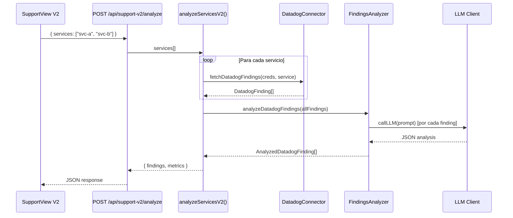
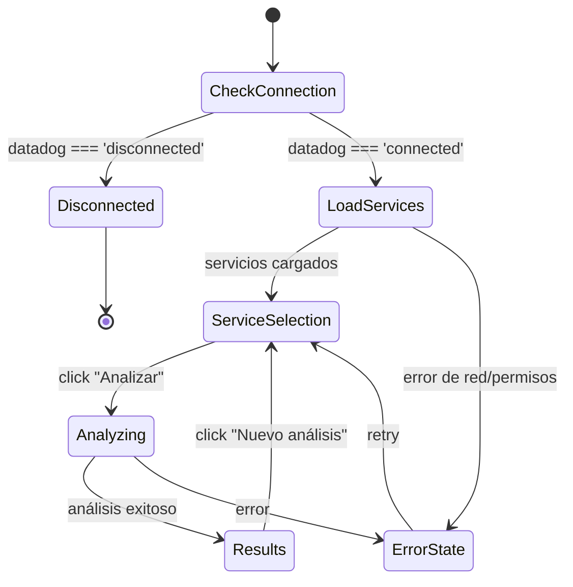

# Diseño Técnico — Support Agent V2

## Resumen

Support Agent V2 reemplaza el flujo actual del Support Agent (basado en Jira como fuente primaria) por un flujo Datadog-first. El usuario selecciona servicios de Datadog, el backend obtiene hallazgos (logs, monitores, incidentes), los analiza con LLM (fallback heurístico), y retorna resultados priorizados por criticidad. Opcionalmente, si Jira está conectado, se pueden crear issues desde cualquier hallazgo.

El diseño es minimalista: reutiliza `DatadogConnector`, `datadog-findings-analyzer`, `llm-client`, y los modelos existentes en `support-agent-models.ts`. Los cambios se concentran en:

1. Un nuevo endpoint `POST /api/support-v2/analyze`
2. Una función orquestadora `analyzeServicesV2()` en un nuevo archivo `support-agent-v2.ts`
3. Reescritura completa de `SupportView.tsx` con el flujo Datadog-first

## Arquitectura



### Flujo del Frontend



## Componentes e Interfaces

### Backend

#### 1. `support-agent-v2.ts` (nuevo)

Función orquestadora que coordina la obtención y análisis de hallazgos.

```typescript
// packages/backend/src/core/support-agent-v2.ts

interface AnalyzeServicesRequest {
  services: string[];
}

interface AnalyzeServicesResponse {
  findings: AnalyzedDatadogFinding[];
  metrics: {
    totalFindings: number;
    distributionByType: Record<DatadogFindingType, number>;
    distributionByCriticality: Record<SuggestedCriticality, number>;
  };
}

async function analyzeServicesV2(
  credentials: DatadogCredentials,
  request: AnalyzeServicesRequest
): Promise<AnalyzeServicesResponse>;
```

Lógica interna:
1. Para cada servicio en `request.services`, llama a `fetchDatadogFindings(credentials, service)`
2. Deduplica hallazgos por `id` (un mismo finding puede aparecer en múltiples servicios)
3. Pasa todos los hallazgos a `analyzeDatadogFindings(findings)`
4. Ordena resultados por criticidad (critical > high > medium > low)
5. Calcula métricas agregadas
6. Retorna `{ findings, metrics }`

#### 2. Nuevo endpoint en `routes.ts`

```typescript
// POST /api/support-v2/analyze
// Body: { services: string[] }
// Response: AnalyzeServicesResponse
```

Flujo:
1. Valida que `services` sea un array no vacío → 400 si no
2. Obtiene credenciales de Datadog desde `CredentialStore.retrieve('datadog-main')` → 404 si no existen
3. Llama a `analyzeServicesV2(credentials, { services })`
4. Retorna resultado JSON

#### 3. Reutilización de endpoints existentes

- `GET /api/support/datadog/services` — ya existe, se reutiliza sin cambios para listar servicios
- `POST /api/support/datadog/create-issue` — ya existe, se reutiliza sin cambios para crear issues en Jira

### Frontend

#### `SupportView.tsx` (reescritura completa)

Estados del componente:

```typescript
type ViewState = 'loading-services' | 'select-services' | 'analyzing' | 'results' | 'error';

// Estado principal
const [viewState, setViewState] = useState<ViewState>('loading-services');
const [services, setServices] = useState<string[]>([]);
const [selectedServices, setSelectedServices] = useState<Set<string>>(new Set());
const [searchFilter, setSearchFilter] = useState('');
const [findings, setFindings] = useState<AnalyzedDatadogFinding[]>([]);
const [metrics, setMetrics] = useState<AnalysisMetrics | null>(null);
const [error, setError] = useState<string | null>(null);
const [createdIssues, setCreatedIssues] = useState<Record<string, { key: string; url: string }>>({});
```

Subcomponentes (internos al archivo):
- `ServiceSelector` — lista de servicios con checkboxes, buscador predictivo, botones seleccionar/deseleccionar todos
- `FindingCard` — tarjeta expandible de hallazgo analizado (reutiliza diseño visual existente)
- `MetricsSummary` — panel de métricas resumen
- `CreateIssueModal` — modal de creación de issue (reutiliza lógica existente, llama a `POST /api/support/datadog/create-issue`)

Flujo de datos:
1. Al montar, verifica `connections.datadog`. Si `disconnected`, muestra mensaje con enlace a Conexiones
2. Si `connected`, llama a `GET /api/support/datadog/services` para cargar lista
3. PO filtra y selecciona servicios
4. Click "Analizar" → `POST /api/support-v2/analyze` con `{ services: [...selectedServices] }`
5. Muestra resultados agrupados por criticidad
6. Si Jira está conectado, muestra botón "Crear Issue" en cada tarjeta

## Modelos de Datos

### Tipos existentes reutilizados (sin cambios)

De `support-agent-models.ts`:
- `DatadogFinding` — hallazgo crudo de Datadog
- `AnalyzedDatadogFinding` — hallazgo analizado con criticidad, sugerencia, pasos
- `DatadogFindingType` — `'log' | 'monitor' | 'incident'`
- `SuggestedCriticality` — `'critical' | 'high' | 'medium' | 'low'`

De `datadog-connector.ts`:
- `DatadogCredentials` — `{ apiKey, appKey, site }`

### Tipos nuevos

```typescript
// En support-agent-v2.ts

interface AnalyzeServicesRequest {
  services: string[];
}

interface AnalysisMetrics {
  totalFindings: number;
  distributionByType: Record<DatadogFindingType, number>;
  distributionByCriticality: Record<SuggestedCriticality, number>;
}

interface AnalyzeServicesResponse {
  findings: AnalyzedDatadogFinding[];
  metrics: AnalysisMetrics;
}
```

### Formato de respuesta del endpoint

```json
{
  "findings": [
    {
      "finding": {
        "id": "log-abc123",
        "type": "log",
        "title": "NullPointerException in PaymentService",
        "message": "...",
        "service": "payment-api",
        "tags": ["env:production"],
        "timestamp": "2024-01-15T10:30:00Z"
      },
      "suggestedCriticality": "high",
      "affectedService": "payment-api",
      "affectedEndpoint": "/api/payments/process",
      "resolutionSuggestion": "Validar input nulo antes de procesar pago",
      "resolutionSteps": ["Revisar logs...", "Agregar validación..."],
      "label": "Sugerencia del Agente IA Support"
    }
  ],
  "metrics": {
    "totalFindings": 12,
    "distributionByType": { "log": 8, "monitor": 3, "incident": 1 },
    "distributionByCriticality": { "critical": 1, "high": 3, "medium": 6, "low": 2 }
  }
}
```


## Propiedades de Correctitud

*Una propiedad es una característica o comportamiento que debe mantenerse verdadero en todas las ejecuciones válidas de un sistema — esencialmente, una declaración formal sobre lo que el sistema debe hacer. Las propiedades sirven como puente entre especificaciones legibles por humanos y garantías de correctitud verificables por máquina.*

### Propiedad 1: Filtrado predictivo retorna subconjunto correcto

*Para cualquier* lista de servicios y *cualquier* texto de búsqueda, los servicios mostrados tras filtrar deben ser exactamente aquellos cuyo nombre contiene el texto de búsqueda (case-insensitive), y el resultado debe ser un subconjunto de la lista original.

**Validates: Requirements 1.2**

### Propiedad 2: Hallazgos cubren todos los servicios solicitados

*Para cualquier* conjunto no vacío de servicios, al ejecutar `analyzeServicesV2`, cada servicio del input debe haber sido consultado vía `fetchDatadogFindings`, y los hallazgos retornados deben incluir únicamente findings cuyos servicios pertenecen al conjunto solicitado (o findings sin servicio asignado).

**Validates: Requirements 3.1**

### Propiedad 3: Invariante de hallazgo analizado completo

*Para cualquier* `AnalyzedDatadogFinding` retornado por el sistema, debe cumplir: `suggestedCriticality` es uno de `['critical', 'high', 'medium', 'low']`, `resolutionSuggestion` es un string no vacío, `resolutionSteps` es un array con al menos un elemento, y `label` es exactamente `"Sugerencia del Agente IA Support"`.

**Validates: Requirements 3.2, 3.5**

### Propiedad 4: Ordenamiento por criticidad descendente

*Para cualquier* lista de hallazgos analizados retornada por `analyzeServicesV2`, los hallazgos deben estar ordenados por criticidad de mayor a menor (critical < high < medium < low en índice), es decir, para todo par consecutivo `findings[i]` y `findings[i+1]`, el orden de criticidad de `findings[i]` debe ser menor o igual al de `findings[i+1]`.

**Validates: Requirements 3.4**

### Propiedad 5: Consistencia de métricas con hallazgos

*Para cualquier* respuesta de `analyzeServicesV2`, `metrics.totalFindings` debe ser igual a `findings.length`, la suma de valores en `metrics.distributionByType` debe ser igual a `metrics.totalFindings`, y la suma de valores en `metrics.distributionByCriticality` debe ser igual a `metrics.totalFindings`.

**Validates: Requirements 4.3, 6.4**

### Propiedad 6: Validación de input rechaza servicios vacíos

*Para cualquier* request al endpoint `POST /api/support-v2/analyze` donde `services` sea un array vacío, undefined, null, o no sea un array, el endpoint debe retornar status 400.

**Validates: Requirements 6.2**

### Propiedad 7: Seleccionar todos y deseleccionar todos son inversos

*Para cualquier* lista de servicios visibles (filtrados), ejecutar "Seleccionar todos" debe resultar en que todos los servicios visibles estén en el set de seleccionados, y ejecutar "Deseleccionar todos" inmediatamente después debe resultar en un set vacío de seleccionados.

**Validates: Requirements 7.1, 7.2**

### Propiedad 8: Contador de selección y estado del botón Analizar

*Para cualquier* estado del set de servicios seleccionados, el contador mostrado debe ser igual a `selectedServices.size`, y el botón "Analizar" debe estar deshabilitado si y solo si `selectedServices.size === 0`.

**Validates: Requirements 7.3, 7.4**

## Manejo de Errores

| Escenario | Código HTTP | Mensaje | Acción en UI |
|---|---|---|---|
| Datadog desconectado | N/A (estado local) | "Se requiere conexión con Datadog" | Muestra enlace a Conexiones |
| Array de servicios vacío | 400 | "Se requiere al menos un servicio para analizar" | Muestra error en pantalla |
| Credenciales Datadog no encontradas | 404 | "Credenciales de Datadog no encontradas" | Muestra error en pantalla |
| Error de red al consultar Datadog | 502 | "No se pudo conectar con Datadog" | Muestra error con opción de reintentar |
| Permisos insuficientes en Datadog | 403 | "Credenciales sin permisos suficientes" | Muestra error en pantalla |
| LLM no disponible | N/A (fallback) | Sin mensaje visible | Usa análisis heurístico automáticamente |
| Error al crear issue en Jira | 500/401/403 | Mensaje del error | Muestra error en modal sin cerrarlo |
| Lista de servicios vacía | 200 (lista vacía) | "No se encontraron servicios en Datadog" | Muestra mensaje informativo |
| Sin hallazgos para servicios | 200 (findings: []) | "No se encontraron hallazgos" | Muestra mensaje informativo |

## Estrategia de Testing

### Testing Unitario

Tests unitarios para casos específicos y edge cases:

- `support-agent-v2.test.ts`:
  - Retorna findings vacíos cuando no hay hallazgos
  - Deduplica findings que aparecen en múltiples servicios
  - Maneja error de credenciales no encontradas
  - Maneja error de red de Datadog

- Endpoint `POST /api/support-v2/analyze`:
  - Retorna 400 con body vacío
  - Retorna 400 con services: []
  - Retorna 404 sin credenciales Datadog
  - Retorna 200 con estructura correcta

- `SupportView.tsx`:
  - Muestra mensaje de conexión requerida cuando Datadog está desconectado
  - Muestra "Cargando servicios..." durante la carga
  - Muestra "No se encontraron servicios" con lista vacía
  - Muestra botón "Crear Issue" solo cuando Jira está conectado
  - Modal de creación muestra error sin cerrarse ante fallo

### Testing basado en Propiedades

Librería: `fast-check` (ya disponible o se agrega como devDependency)

Cada propiedad del diseño se implementa como un test con mínimo 100 iteraciones.

- **Feature: support-agent-v2, Property 1: Filtrado predictivo retorna subconjunto correcto**
  - Genera listas aleatorias de strings (servicios) y strings de búsqueda
  - Verifica que el resultado del filtro es subconjunto y contiene exactamente los matches

- **Feature: support-agent-v2, Property 2: Hallazgos cubren todos los servicios solicitados**
  - Genera conjuntos aleatorios de servicios y findings mockeados
  - Verifica que la orquestación consulta cada servicio

- **Feature: support-agent-v2, Property 3: Invariante de hallazgo analizado completo**
  - Genera DatadogFinding aleatorios, pasa por heuristicAnalysis (determinístico)
  - Verifica que cada resultado tiene todos los campos requeridos

- **Feature: support-agent-v2, Property 4: Ordenamiento por criticidad descendente**
  - Genera listas aleatorias de AnalyzedDatadogFinding con criticidades aleatorias
  - Aplica la función de ordenamiento y verifica orden correcto

- **Feature: support-agent-v2, Property 5: Consistencia de métricas con hallazgos**
  - Genera listas aleatorias de AnalyzedDatadogFinding
  - Calcula métricas y verifica consistencia numérica

- **Feature: support-agent-v2, Property 6: Validación de input rechaza servicios vacíos**
  - Genera variantes de inputs inválidos (undefined, null, [], string, number)
  - Verifica que todos producen error de validación

- **Feature: support-agent-v2, Property 7: Seleccionar/deseleccionar todos round-trip**
  - Genera listas aleatorias de servicios y filtros
  - Verifica que selectAll → deselectAll = set vacío

- **Feature: support-agent-v2, Property 8: Contador y estado del botón**
  - Genera sets aleatorios de servicios seleccionados
  - Verifica que contador === size y disabled === (size === 0)
