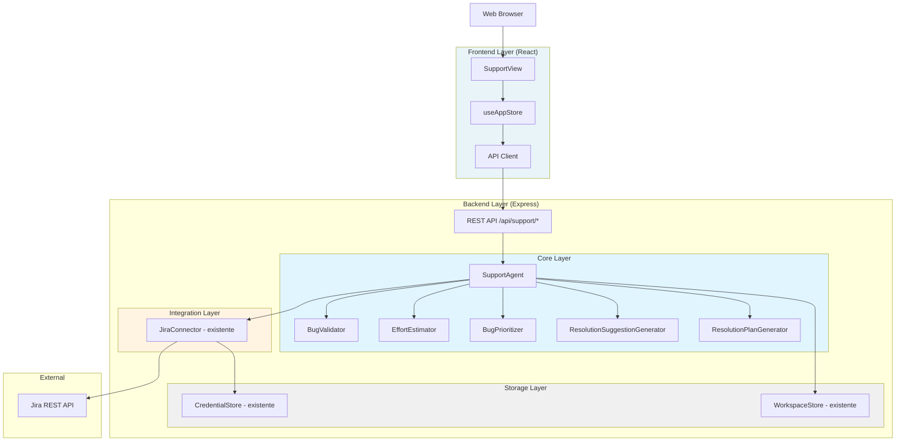
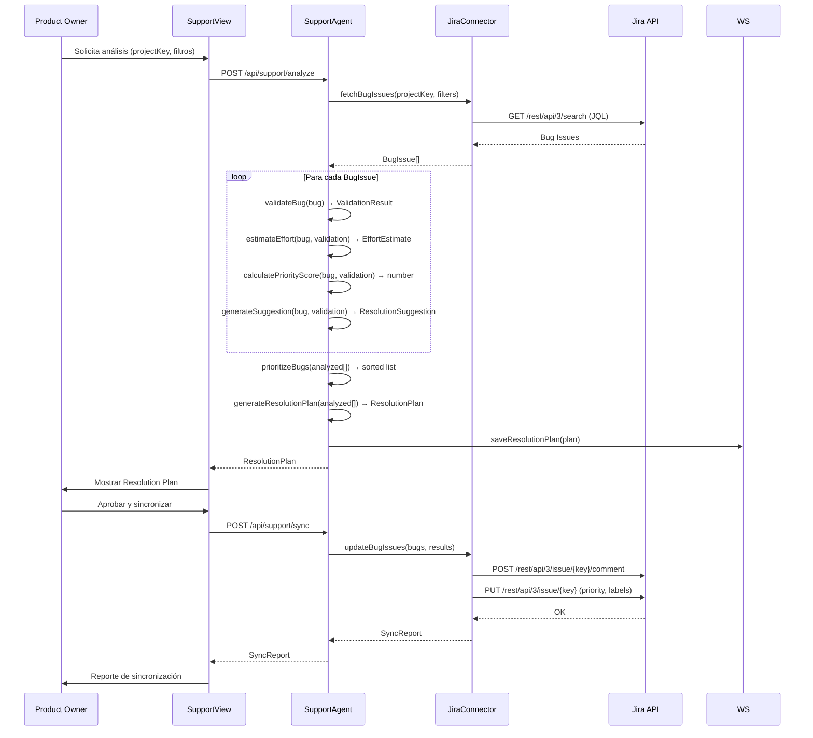

# Design Document: Support Agent

## Overview

El Support Agent es un nuevo módulo del sistema PO AI que actúa como experto en resolución de problemas técnicos. Consulta bugs de Jira, valida cada incidencia con criterio experto, estima el esfuerzo en story points Fibonacci, prioriza con un Priority Score ponderado, genera sugerencias técnicas de resolución y produce un Resolution Plan en Markdown. Los resultados se sincronizan de vuelta a Jira.

### Objetivos del Módulo

- Reutilizar el Jira Connector existente para lectura y escritura de bugs
- Añadir un componente `SupportAgent` en la capa Core siguiendo los patrones existentes
- Exponer nuevos endpoints REST en la API existente
- Integrar una nueva vista `SupportView` en el frontend React existente
- Persistir Resolution Plans en el Workspace Store existente

### Principios de Diseño

1. **Reutilización**: El Support Agent no reimplementa integración con Jira; delega en el Jira Connector existente
2. **Separación de Responsabilidades**: Validación, estimación, priorización y generación de sugerencias son funciones puras independientes
3. **Resiliencia Parcial**: Un fallo en el análisis de un bug individual no interrumpe el análisis del resto
4. **Trazabilidad**: Cada resultado referencia el Bug Issue de Jira de origen

## Architecture

### Arquitectura de Alto Nivel



### Flujo de Datos Principal



## Components and Interfaces

### 1. SupportAgent (Orquestador Principal)

**Responsabilidad**: Coordinar el flujo completo de análisis de bugs: consulta, validación, estimación, priorización, generación de sugerencias y plan de resolución.

**Ubicación**: `packages/backend/src/core/support-agent.ts`

```typescript
export interface AnalysisRequest {
  projectKey: string;
  credentialKey: string;
  filters?: BugFilters;
}

export interface BugFilters {
  statuses?: ('Open' | 'In Progress' | 'Reopened')[];
  severities?: Severity[];
  components?: string[];
  createdAfter?: Date;
  createdBefore?: Date;
}

export interface AnalysisResult {
  plan: ResolutionPlan;
  syncReport?: SyncReport;
}

export async function analyzeBugs(request: AnalysisRequest): Promise<ResolutionPlan>;
export async function syncPlanToJira(
  planId: string,
  credentialKey: string
): Promise<SyncReport>;
```

### 2. BugValidator

**Responsabilidad**: Analizar un Bug Issue y determinar su validez, severidad y componentes afectados.

**Ubicación**: `packages/backend/src/core/bug-validator.ts`

```typescript
export type BugClassification = 'valid' | 'duplicate' | 'expected_behavior' | 'needs_more_info';
export type Severity = 'Critical' | 'High' | 'Medium' | 'Low';

export interface ValidationResult {
  classification: BugClassification;
  severity: Severity;
  severityDefaulted: boolean;       // true si se asignó Medium por defecto
  justification: string;
  affectedComponents: string[];
  duplicateOfId?: string;           // presente si classification === 'duplicate'
  missingInfo?: string[];           // presente si classification === 'needs_more_info'
}

export function validateBug(bug: BugIssue, allBugs: BugIssue[]): ValidationResult;
export function detectDuplicates(bug: BugIssue, candidates: BugIssue[]): string | undefined;
export function inferSeverity(bug: BugIssue): { severity: Severity; defaulted: boolean };
```

### 3. EffortEstimator

**Responsabilidad**: Calcular el esfuerzo de resolución en story points Fibonacci para bugs válidos.

**Ubicación**: `packages/backend/src/core/effort-estimator.ts`

```typescript
export type FibonacciPoint = 1 | 2 | 3 | 5 | 8 | 13;
export type ConfidenceLevel = 'High' | 'Medium' | 'Low';

export interface EffortEstimate {
  storyPoints: FibonacciPoint;
  justification: string;
  confidence: ConfidenceLevel;
  factors: EstimationFactors;
}

export interface EstimationFactors {
  severityScore: number;
  complexityScore: number;
  componentCount: number;
  hasReproductionSteps: boolean;
}

export const FIBONACCI: FibonacciPoint[] = [1, 2, 3, 5, 8, 13];

export function estimateEffort(bug: BugIssue, validation: ValidationResult): EffortEstimate;
export function nearestFibonacci(value: number): FibonacciPoint;
export function calculateTotalEffort(estimates: EffortEstimate[]): number;
```

### 4. BugPrioritizer

**Responsabilidad**: Calcular el Priority Score ponderado y ordenar/categorizar los bugs.

**Ubicación**: `packages/backend/src/core/bug-prioritizer.ts`

```typescript
export type PriorityCategory = 'critical' | 'important' | 'planned';

export interface PriorityScore {
  total: number;                    // 0-100
  severityComponent: number;        // peso 40%
  ageComponent: number;             // peso 30%
  usersAffectedComponent: number;   // peso 20%
  criticalImpactComponent: number;  // peso 10%
}

export interface PrioritizedBug {
  bug: BugIssue;
  validation: ValidationResult;
  estimate: EffortEstimate;
  suggestion: ResolutionSuggestion;
  priorityScore: PriorityScore;
  category: PriorityCategory;
}

export const PRIORITY_WEIGHTS = {
  severity: 0.4,
  age: 0.3,
  usersAffected: 0.2,
  criticalImpact: 0.1,
} as const;

export function calculatePriorityScore(bug: BugIssue, validation: ValidationResult): PriorityScore;
export function categorizeBug(score: number): PriorityCategory;
export function prioritizeBugs(bugs: AnalyzedBug[]): PrioritizedBug[];
```

### 5. ResolutionSuggestionGenerator

**Responsabilidad**: Generar sugerencias técnicas concretas de resolución para cada bug válido.

**Ubicación**: `packages/backend/src/core/resolution-suggestion-generator.ts`

```typescript
export type AffectedLayer = 'backend' | 'frontend' | 'database' | 'configuration' | 'multiple';

export interface ResolutionSuggestion {
  steps: string[];                  // pasos técnicos concretos (mínimo 1)
  probableOrigin: string;           // componente/área de código probable
  testingApproach: string;          // cómo verificar la corrección
  affectedLayers: AffectedLayer[];  // capas que requieren cambios
  reproductionStepsUsage?: string;  // cómo usar los pasos de reproducción (si existen)
  errorInterpretation?: string;     // interpretación del error/stack trace (si existe)
}

export function generateSuggestion(
  bug: BugIssue,
  validation: ValidationResult
): ResolutionSuggestion;
export function extractErrorInfo(description: string): string | undefined;
export function inferAffectedLayers(components: string[], description: string): AffectedLayer[];
```

### 6. ResolutionPlanGenerator

**Responsabilidad**: Ensamblar el Resolution Plan completo en formato estructurado y Markdown.

**Ubicación**: `packages/backend/src/core/resolution-plan-generator.ts`

```typescript
export interface ResolutionPlanMetrics {
  totalAnalyzed: number;
  validCount: number;
  duplicateCount: number;
  expectedBehaviorCount: number;
  needsMoreInfoCount: number;
  validPercentage: number;
  totalEffortPoints: number;
  effortByCategory: Record<PriorityCategory, number>;
  distributionBySeverity: Record<Severity, number>;
}

export interface ResolutionPlan {
  id: string;
  projectKey: string;
  generatedAt: Date;
  executiveSummary: string;
  prioritizedBugs: PrioritizedBug[];
  failedBugs: FailedBugAnalysis[];
  metrics: ResolutionPlanMetrics;
}

export interface FailedBugAnalysis {
  bugId: string;
  summary: string;
  reason: string;
}

export function generateResolutionPlan(
  projectKey: string,
  prioritized: PrioritizedBug[],
  failed: FailedBugAnalysis[]
): ResolutionPlan;

export function exportToMarkdown(plan: ResolutionPlan): string;
export function filterPlan(
  plan: ResolutionPlan,
  filter: { severity?: Severity; category?: PriorityCategory }
): ResolutionPlan;
```

### 7. Extensión del JiraConnector

Se añaden las siguientes funciones al `jira-connector.ts` existente para soporte de lectura de bugs y escritura de resultados:

```typescript
// Nuevas funciones a añadir en jira-connector.ts

export interface BugIssue {
  id: string;
  key: string;
  summary: string;
  description: string;
  priority: string;
  status: string;
  reporter: string;
  assignee?: string;
  createdDate: Date;
  comments: JiraComment[];
  components: string[];
  labels: string[];
}

export interface JiraComment {
  id: string;
  author: string;
  body: string;
  created: Date;
}

export interface BugUpdatePayload {
  bugKey: string;
  comment: string;           // Validation + Estimate + Suggestion en ADF
  priority: string;          // Jira priority name
  labels: string[];          // incluye 'support-agent-reviewed'
}

export interface SyncReport {
  totalAttempted: number;
  successCount: number;
  failedCount: number;
  updatedKeys: string[];
  failedUpdates: Array<{ key: string; error: string }>;
}

export async function fetchBugIssues(
  credentials: JiraCredentials,
  projectKey: string,
  filters?: BugFilters
): Promise<BugIssue[]>;

export async function updateBugWithAnalysis(
  credentials: JiraCredentials,
  updates: BugUpdatePayload[]
): Promise<SyncReport>;
```

### 8. Nuevos Endpoints REST

Se añaden las siguientes rutas al `routes.ts` existente:

```typescript
// POST /api/support/analyze
// Body: { projectKey, credentialKey, filters? }
// Response: ResolutionPlan

// GET /api/support/plans
// Query: credentialKey
// Response: ResolutionPlan[] (listado desde WorkspaceStore)

// GET /api/support/plans/:planId
// Response: ResolutionPlan

// POST /api/support/sync
// Body: { planId, credentialKey }
// Response: SyncReport

// GET /api/support/plans/:planId/markdown
// Response: text/markdown (Resolution Plan exportado)
```

### 9. SupportView (Frontend)

**Responsabilidad**: Vista React que permite iniciar análisis, visualizar el Resolution Plan y aprobar la sincronización con Jira.

**Ubicación**: `packages/frontend/src/components/SupportView.tsx`

La vista se integra en `App.tsx` añadiendo un nuevo item de navegación `{ id: 'support', label: 'Support' }`.

**Estados de la vista**:
1. **Idle**: Formulario para ingresar `projectKey` y filtros opcionales
2. **Loading**: Indicador de progreso durante el análisis
3. **Plan**: Visualización del Resolution Plan con métricas, lista priorizada y sugerencias
4. **Syncing**: Progreso de sincronización con Jira
5. **SyncDone**: Reporte de sincronización

## Data Models

### Modelos de Dominio del Support Agent

```typescript
// BugIssue - Ticket de Jira de tipo Bug
interface BugIssue {
  id: string;
  key: string;                    // ej: "PROJ-123"
  summary: string;
  description: string;
  priority: string;               // prioridad original de Jira
  status: string;                 // "Open" | "In Progress" | "Reopened"
  reporter: string;
  assignee?: string;
  createdDate: Date;
  comments: JiraComment[];
  components: string[];
  labels: string[];
}

// ValidationResult - Resultado del análisis experto
interface ValidationResult {
  classification: 'valid' | 'duplicate' | 'expected_behavior' | 'needs_more_info';
  severity: 'Critical' | 'High' | 'Medium' | 'Low';
  severityDefaulted: boolean;
  justification: string;
  affectedComponents: string[];
  duplicateOfId?: string;
  missingInfo?: string[];
}

// EffortEstimate - Estimación en story points Fibonacci
interface EffortEstimate {
  storyPoints: 1 | 2 | 3 | 5 | 8 | 13;
  justification: string;
  confidence: 'High' | 'Medium' | 'Low';
  factors: {
    severityScore: number;
    complexityScore: number;
    componentCount: number;
    hasReproductionSteps: boolean;
  };
}

// PriorityScore - Puntuación ponderada de prioridad
interface PriorityScore {
  total: number;                  // 0-100
  severityComponent: number;
  ageComponent: number;
  usersAffectedComponent: number;
  criticalImpactComponent: number;
}

// ResolutionSuggestion - Sugerencia técnica de resolución
interface ResolutionSuggestion {
  steps: string[];
  probableOrigin: string;
  testingApproach: string;
  affectedLayers: ('backend' | 'frontend' | 'database' | 'configuration' | 'multiple')[];
  reproductionStepsUsage?: string;
  errorInterpretation?: string;
}

// PrioritizedBug - Bug completamente analizado y priorizado
interface PrioritizedBug {
  bug: BugIssue;
  validation: ValidationResult;
  estimate: EffortEstimate;
  suggestion: ResolutionSuggestion;
  priorityScore: PriorityScore;
  category: 'critical' | 'important' | 'planned';
}

// ResolutionPlan - Plan completo de resolución
interface ResolutionPlan {
  id: string;
  projectKey: string;
  generatedAt: Date;
  executiveSummary: string;
  prioritizedBugs: PrioritizedBug[];
  failedBugs: Array<{ bugId: string; summary: string; reason: string }>;
  metrics: {
    totalAnalyzed: number;
    validCount: number;
    duplicateCount: number;
    expectedBehaviorCount: number;
    needsMoreInfoCount: number;
    validPercentage: number;
    totalEffortPoints: number;
    effortByCategory: { critical: number; important: number; planned: number };
    distributionBySeverity: { Critical: number; High: number; Medium: number; Low: number };
  };
}

// SyncReport - Reporte de sincronización con Jira
interface SyncReport {
  totalAttempted: number;
  successCount: number;
  failedCount: number;
  updatedKeys: string[];
  failedUpdates: Array<{ key: string; error: string }>;
}
```

### Persistencia en WorkspaceStore

Los Resolution Plans se persisten en el WorkspaceStore existente usando una clave con prefijo `support-plan-{id}`. El formato de almacenamiento es JSON con serialización de fechas como ISO strings.

## Correctness Properties

*A property is a characteristic or behavior that should hold true across all valid executions of a system — essentially, a formal statement about what the system should do. Properties serve as the bridge between human-readable specifications and machine-verifiable correctness guarantees.*

### Property 1: Bug Query Filter Correctness

*For any* list of Jira issues with mixed statuses, severities, components and date ranges, applying the bug filters should return only issues that match ALL specified filter criteria simultaneously.

**Validates: Requirements 1.2, 1.5**

### Property 2: Bug Issue Field Completeness

*For any* bug issue returned by the Jira Connector, the mapped `BugIssue` object must contain non-null values for all required fields: `id`, `key`, `summary`, `description`, `priority`, `status`, `reporter`, `createdDate`, `components`, and `labels`.

**Validates: Requirements 1.3**

### Property 3: Validation Result Structural Invariant

*For any* bug issue analyzed, the `ValidationResult` must have: a `classification` from the allowed set `{valid, duplicate, expected_behavior, needs_more_info}`, a `severity` from `{Critical, High, Medium, Low}`, a non-empty `justification` string, and a non-empty `affectedComponents` array. If `classification === 'duplicate'`, then `duplicateOfId` must reference an ID present in the analyzed set.

**Validates: Requirements 2.1, 2.2, 2.3, 2.4, 2.5**

### Property 4: Effort Estimate Fibonacci Invariant

*For any* valid bug issue, the `EffortEstimate.storyPoints` must be a value from the Fibonacci set `{1, 2, 3, 5, 8, 13}`, the `justification` must be non-empty, the `confidence` must be one of `{High, Medium, Low}`, and if the bug has `Severity === 'Critical'` then `storyPoints >= 3`.

**Validates: Requirements 3.1, 3.3, 3.5, 3.6**

### Property 5: Effort Estimation Monotonicity

*For any* two bugs that are identical except that one has a higher severity, the bug with higher severity should receive an effort estimate greater than or equal to the bug with lower severity.

**Validates: Requirements 3.2**

### Property 6: Total Effort Arithmetic

*For any* set of analyzed bugs, the `metrics.totalEffortPoints` in the Resolution Plan must equal the sum of `storyPoints` across all `PrioritizedBug` entries, and `metrics.effortByCategory[cat]` must equal the sum of `storyPoints` for all bugs in that category.

**Validates: Requirements 3.4, 4.5**

### Property 7: Priority Score and Ordering

*For any* set of valid bugs, the `PriorityScore.total` must be in the range `[0, 100]` and equal `0.4 * severityComponent + 0.3 * ageComponent + 0.2 * usersAffectedComponent + 0.1 * criticalImpactComponent`. The resulting `prioritizedBugs` list must be sorted in descending order by `priorityScore.total`, with ties broken by ascending `createdDate`.

**Validates: Requirements 4.1, 4.2, 4.3**

### Property 8: Priority Category Completeness and Disjointness

*For any* set of prioritized bugs, every bug must belong to exactly one category from `{critical, important, planned}`, and the union of all categories must equal the full set of valid bugs.

**Validates: Requirements 4.4**

### Property 9: Resolution Suggestion Structural Invariant

*For any* valid bug issue, the `ResolutionSuggestion` must have: at least one non-empty string in `steps`, a non-empty `probableOrigin`, a non-empty `testingApproach`, and at least one value in `affectedLayers`. If the bug description contains reproduction steps, `reproductionStepsUsage` must be non-null.

**Validates: Requirements 5.1, 5.2, 5.3, 5.4, 5.5**

### Property 10: Resolution Plan Structural Invariant

*For any* analysis result, the `ResolutionPlan` must contain: a non-empty `id`, a non-empty `projectKey`, a `generatedAt` timestamp, a non-empty `executiveSummary`, a `prioritizedBugs` array, a `failedBugs` array, and a `metrics` object where `metrics.totalAnalyzed === prioritizedBugs.length + failedBugs.length` and `metrics.validPercentage === (validCount / totalAnalyzed) * 100`.

**Validates: Requirements 6.1, 6.2, 6.3, 6.6, 9.3**

### Property 11: Markdown Export Completeness

*For any* Resolution Plan, the exported Markdown string must contain headings for: executive summary, metrics section, prioritized bug list (with each bug's Jira ID, severity, priority score, effort estimate, and suggestion), and failed bugs list.

**Validates: Requirements 6.4**

### Property 12: Plan Filter Correctness

*For any* Resolution Plan filtered by severity or category, the resulting plan must contain only bugs matching the specified filter, and the metrics must be recalculated to reflect only the filtered subset.

**Validates: Requirements 6.5**

### Property 13: Jira Sync Update Invariant

*For any* approved Resolution Plan, the Jira update payload for each bug must include: a comment containing the validation result, effort estimate and resolution suggestion; the priority field set according to the Priority Score; and the label `support-agent-reviewed`.

**Validates: Requirements 7.1, 7.2, 7.3**

### Property 14: Partial Failure Resilience

*For any* batch operation (analysis or Jira sync) where a subset of items fail, the system must: process all remaining items, collect all errors, and return a result that includes both successful and failed items. The count of `successCount + failedCount` must equal `totalAttempted`.

**Validates: Requirements 7.4, 7.5, 9.2**

### Property 15: Jira Error Notification

*For any* Jira connection failure (network error, auth failure, project not found), the error response must include a descriptive message identifying the failure type and the affected project or operation.

**Validates: Requirements 9.1, 9.5**

### Property 16: Resolution Plan Persistence Round Trip

*For any* generated Resolution Plan, saving it to the WorkspaceStore and loading it back must produce an equivalent plan with all fields intact (including nested objects and Date values).

**Validates: Requirements 8.5**

## Error Handling

### Categorías de Error del Support Agent

```typescript
// Códigos de error específicos del Support Agent
type SupportAgentErrorCode =
  | 'JIRA_AUTH_FAILED'           // heredado del JiraConnector
  | 'JIRA_NOT_FOUND'             // proyecto no existe
  | 'JIRA_PERMISSION_DENIED'     // sin permisos de lectura/escritura
  | 'JIRA_RATE_LIMITED'          // rate limit de la API
  | 'NETWORK_ERROR'              // error de red
  | 'BUG_ANALYSIS_FAILED'        // fallo en análisis de un bug individual
  | 'PLAN_NOT_FOUND'             // plan no encontrado en WorkspaceStore
  | 'SYNC_PARTIAL_FAILURE';      // sincronización con fallos parciales
```

### Estrategia de Manejo de Errores

**Errores fatales** (interrumpen el análisis completo):
- `JIRA_AUTH_FAILED`: Credenciales inválidas — notificar al usuario, no continuar
- `JIRA_NOT_FOUND`: Proyecto no existe — notificar al usuario, no continuar
- `JIRA_PERMISSION_DENIED`: Sin permisos — notificar al usuario, no continuar

**Errores parciales** (se registran y el proceso continúa):
- `BUG_ANALYSIS_FAILED`: El bug se añade a `failedBugs` con la razón del fallo
- `SYNC_PARTIAL_FAILURE`: Los bugs fallidos se registran en `SyncReport.failedUpdates`

**Valores por defecto ante información insuficiente**:
- Severity no determinable → `Medium` con `severityDefaulted: true`
- Componentes no identificables → array vacío `[]`
- Usuarios afectados no mencionados → `0` (no contribuye al score)

### Retry Logic

Para errores de red (`NETWORK_ERROR`) y rate limiting (`JIRA_RATE_LIMITED`), se aplica el mismo mecanismo de retry con exponential backoff que usa el JiraConnector existente (máximo 3 intentos).

## Testing Strategy

### Enfoque Dual de Testing

El Support Agent requiere tanto pruebas unitarias como pruebas basadas en propiedades:

**Unit Tests** — verifican ejemplos concretos y casos borde:
- Análisis de un bug con descripción mínima → clasificación `needs_more_info`
- Bug con Severity Critical → estimate >= 3 story points
- Dos bugs con summary idéntico → detección de duplicado
- Proyecto inexistente → error descriptivo
- Sincronización con un bug fallido → los demás se procesan

**Property-Based Tests** — verifican propiedades universales con entradas generadas:
- Todas las propiedades de corrección definidas en la sección anterior

### Configuración de Property-Based Testing

**Framework**: `fast-check` (ya disponible en el proyecto)

**Configuración**:
- Mínimo 100 iteraciones por prueba de propiedad
- Tag format: `Feature: support-agent, Property {N}: {property_text}`

**Arbitrarios necesarios**:

```typescript
// Generadores de datos de prueba
const bugIssueArbitrary = () => fc.record({
  id: fc.string({ minLength: 1 }),
  key: fc.string({ minLength: 3 }),
  summary: fc.string({ minLength: 1, maxLength: 200 }),
  description: fc.string(),
  priority: fc.constantFrom('Highest', 'High', 'Medium', 'Low', 'Lowest'),
  status: fc.constantFrom('Open', 'In Progress', 'Reopened'),
  reporter: fc.string({ minLength: 1 }),
  assignee: fc.option(fc.string()),
  createdDate: fc.date(),
  comments: fc.array(commentArbitrary()),
  components: fc.array(fc.string()),
  labels: fc.array(fc.string()),
});

const bugFiltersArbitrary = () => fc.record({
  statuses: fc.option(fc.array(fc.constantFrom('Open', 'In Progress', 'Reopened'))),
  severities: fc.option(fc.array(fc.constantFrom('Critical', 'High', 'Medium', 'Low'))),
  components: fc.option(fc.array(fc.string())),
});
```

**Ejemplos de pruebas de propiedad**:

```typescript
// Feature: support-agent, Property 4: Effort Estimate Fibonacci Invariant
it('effort estimate is always a Fibonacci number', () => {
  fc.assert(
    fc.property(bugIssueArbitrary(), validationResultArbitrary(), (bug, validation) => {
      const estimate = estimateEffort(bug, validation);
      expect(FIBONACCI).toContain(estimate.storyPoints);
      expect(estimate.justification.length).toBeGreaterThan(0);
      expect(['High', 'Medium', 'Low']).toContain(estimate.confidence);
      if (validation.severity === 'Critical') {
        expect(estimate.storyPoints).toBeGreaterThanOrEqual(3);
      }
    }),
    { numRuns: 100 }
  );
});

// Feature: support-agent, Property 7: Priority Score and Ordering
it('prioritized bugs are sorted descending by priority score', () => {
  fc.assert(
    fc.property(fc.array(analyzedBugArbitrary(), { minLength: 2 }), (bugs) => {
      const prioritized = prioritizeBugs(bugs);
      for (let i = 0; i < prioritized.length - 1; i++) {
        const a = prioritized[i].priorityScore.total;
        const b = prioritized[i + 1].priorityScore.total;
        expect(a).toBeGreaterThanOrEqual(b);
      }
    }),
    { numRuns: 100 }
  );
});

// Feature: support-agent, Property 14: Partial Failure Resilience
it('sync report counts sum to total attempted', () => {
  fc.assert(
    fc.property(syncReportArbitrary(), (report) => {
      expect(report.successCount + report.failedCount).toBe(report.totalAttempted);
    }),
    { numRuns: 100 }
  );
});
```

### Ubicación de los Tests

```
packages/backend/tests/
  unit/
    core/
      bug-validator.test.ts
      effort-estimator.test.ts
      bug-prioritizer.test.ts
      resolution-suggestion-generator.test.ts
      resolution-plan-generator.test.ts
      support-agent.test.ts
  property/
    support-agent.property.test.ts
  integration/
    support-agent.integration.test.ts   (con Jira mock)
```
