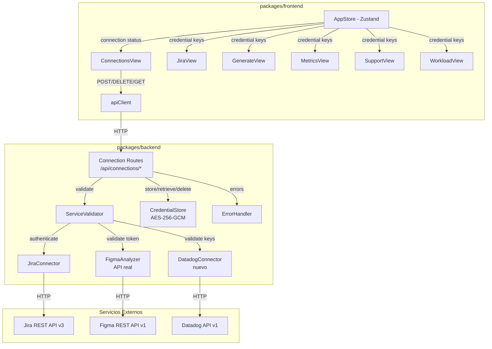
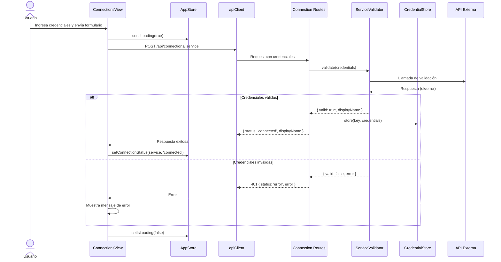
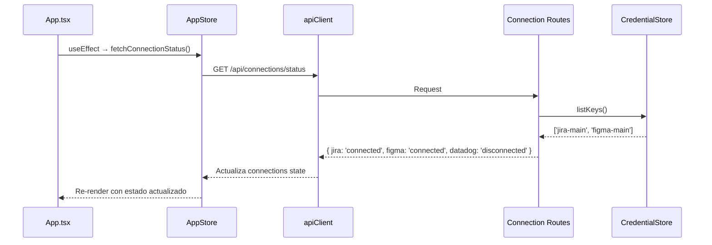

# Diseño Técnico — Panel de Conexiones (Autenticación Unificada)

## Resumen

Este documento describe el diseño técnico para el Panel de Conexiones, que centraliza la gestión de credenciales de servicios externos (Jira, Figma, Datadog) en PO AI. El diseño se apoya en la infraestructura existente: `CredentialStore` con AES-256-GCM, `apiClient` en el frontend, y Zustand como state manager. Los cambios principales son:

1. Generalizar el `CredentialStore` para aceptar credenciales de cualquier servicio (actualmente tipado solo para `JiraCredentials`).
2. Crear endpoints REST dedicados bajo `/api/connections/` para el ciclo de vida de credenciales.
3. Implementar validadores por servicio (Jira, Figma, Datadog) que verifiquen credenciales contra las APIs reales antes de almacenarlas.
4. Crear el componente `ConnectionsView` en el frontend con tarjetas por servicio.
5. Extender el `AppStore` de Zustand con estado de conexiones y consumo automático en vistas existentes.
6. Reemplazar el mock de `figma-analyzer` con integración real a la API de Figma.
7. Crear un `DatadogConnector` nuevo para la integración con Datadog.

## Arquitectura



### Decisiones de Diseño

1. **Endpoints dedicados `/api/connections/*` en lugar de reutilizar `/api/jira/authenticate`**: Separar la gestión de conexiones de la lógica de negocio de cada servicio. Los endpoints existentes de Jira siguen funcionando pero las vistas consumirán credenciales del store global.

2. **Validación antes de almacenamiento**: Cada servicio tiene su propio validador que hace una llamada real a la API externa. Solo se persisten credenciales que pasan la validación.

3. **`CredentialStore` genérico con `Record<string, unknown>`**: En lugar de tipar `JiraCredentials`, el store acepta cualquier objeto JSON. El tipado específico se maneja en los validadores y conectores.

4. **Estado de conexión derivado de la existencia de keys en el store**: `GET /api/connections/status` verifica qué `Credential_Key`s existen en el store. No se mantiene un estado separado.

5. **Figma API real usando `https` nativo**: Consistente con el patrón de `jira-connector.ts` que usa `https`/`http` nativos de Node.js sin dependencias externas.

## Componentes e Interfaces

### Backend

#### 1. Connection Routes (`packages/backend/src/api/connection-routes.ts`)

Nuevo archivo de rutas dedicado a la gestión de conexiones.

```typescript
// POST /api/connections/jira
// Body: { baseUrl: string, email: string, apiToken: string }
// Response: { status: 'connected' | 'error', displayName?: string, error?: string }

// POST /api/connections/figma
// Body: { accessToken: string }
// Response: { status: 'connected' | 'error', displayName?: string, error?: string }

// POST /api/connections/datadog
// Body: { apiKey: string, appKey: string, site: string }
// Response: { status: 'connected' | 'error', error?: string }

// GET /api/connections/status
// Response: { jira: ConnectionStatus, figma: ConnectionStatus, datadog: ConnectionStatus }

// DELETE /api/connections/:service
// Response: { status: 'disconnected' }
```

#### 2. Service Validators (`packages/backend/src/integration/service-validators.ts`)

Módulo con funciones de validación por servicio.

```typescript
interface ValidationResult {
  valid: boolean;
  displayName?: string;
  error?: string;
}

function validateJiraCredentials(credentials: JiraCredentials): Promise<ValidationResult>;
function validateFigmaToken(accessToken: string): Promise<ValidationResult>;
function validateDatadogCredentials(apiKey: string, appKey: string, site: string): Promise<ValidationResult>;
```

- **Jira**: Reutiliza la función `authenticate()` existente de `jira-connector.ts` que llama a `/rest/api/3/myself`.
- **Figma**: Llama a `GET https://api.figma.com/v1/me` con header `X-Figma-Token`.
- **Datadog**: Llama a `GET https://api.{site}/api/v1/validate` con headers `DD-API-KEY` y `DD-APPLICATION-KEY`.

#### 3. Datadog Connector (`packages/backend/src/integration/datadog-connector.ts`)

Nuevo módulo para la integración con Datadog.

```typescript
interface DatadogCredentials {
  apiKey: string;
  appKey: string;
  site: string; // e.g. "datadoghq.com", "datadoghq.eu"
}

interface DatadogValidationResult {
  valid: boolean;
  error?: string;
}

function validateDatadog(credentials: DatadogCredentials): Promise<DatadogValidationResult>;
function datadogRequest(credentials: DatadogCredentials, method: string, path: string): Promise<any>;
```

#### 4. Figma Analyzer actualizado (`packages/backend/src/integration/figma-analyzer.ts`)

Se modifica `analyzeDesign()` para aceptar un `accessToken` opcional. Si se proporciona, usa la API real de Figma; si no, mantiene el comportamiento mock actual.

```typescript
// Firma actualizada
async function analyzeDesign(figmaUrl: string, accessToken?: string): Promise<FigmaAnalysisResult>;

// Nueva función interna
function figmaRequest(accessToken: string, path: string): Promise<any>;
```

#### 5. CredentialStore generalizado

Se cambia el tipo de `store()` y `retrieve()` para aceptar `Record<string, unknown>` en lugar de `JiraCredentials`. Se añade un método `exists(key: string): Promise<boolean>`.

```typescript
class CredentialStore {
  async store(key: string, credentials: Record<string, unknown>): Promise<void>;
  async retrieve(key: string): Promise<Record<string, unknown> | null>;
  async delete(key: string): Promise<void>;
  async exists(key: string): Promise<boolean>;
  async listKeys(): Promise<string[]>;
}
```

### Frontend

#### 6. ConnectionsView (`packages/frontend/src/components/ConnectionsView.tsx`)

Componente React que muestra una tarjeta por servicio con:
- Estado visual (verde = connected, gris = disconnected, rojo = error)
- Formulario de credenciales cuando está desconectado
- Botón "Desconectar" cuando está conectado
- Indicador de carga durante validación

#### 7. AppStore extendido (`packages/frontend/src/store/useAppStore.ts`)

Se añade al store de Zustand:

```typescript
type ConnectionStatus = 'connected' | 'disconnected' | 'error';

interface ConnectionState {
  jira: ConnectionStatus;
  figma: ConnectionStatus;
  datadog: ConnectionStatus;
}

// Nuevos campos en AppState
connections: ConnectionState;
setConnectionStatus: (service: string, status: ConnectionStatus) => void;
fetchConnectionStatus: () => Promise<void>;
```

#### 8. Navegación actualizada (`packages/frontend/src/App.tsx`)

Se añade "Conexiones" a `NAV_ITEMS` con un indicador de notificación cuando hay servicios desconectados.


## Modelos de Datos

### ConnectionStatus (shared)

```typescript
// packages/shared/src/types/connections.ts

type ConnectionStatus = 'connected' | 'disconnected' | 'error';

interface ConnectionStatusResponse {
  jira: ConnectionStatus;
  figma: ConnectionStatus;
  datadog: ConnectionStatus;
}

interface ConnectionResult {
  status: ConnectionStatus;
  displayName?: string;
  error?: string;
}
```

### Credenciales por Servicio (backend)

```typescript
// Jira - ya existe, se reutiliza
interface JiraCredentials {
  baseUrl: string;
  email: string;
  apiToken: string;
}

// Figma - nuevo
interface FigmaCredentials {
  accessToken: string;
}

// Datadog - nuevo
interface DatadogCredentials {
  apiKey: string;
  appKey: string;
  site: string; // "datadoghq.com" | "datadoghq.eu" | custom
}
```

### Credential Keys (convención)

| Servicio | Credential_Key | Tipo de credenciales |
|----------|---------------|---------------------|
| Jira     | `jira-main`   | `JiraCredentials`   |
| Figma    | `figma-main`  | `FigmaCredentials`  |
| Datadog  | `datadog-main`| `DatadogCredentials`|

### CredentialStore en disco

El archivo `~/.po-ai/credentials.json` mantiene su estructura actual:

```json
[
  {
    "key": "jira-main",
    "data": {
      "encrypted": "...",
      "iv": "...",
      "authTag": "...",
      "salt": "..."
    },
    "timestamp": "2025-01-15T10:30:00.000Z"
  },
  {
    "key": "figma-main",
    "data": { "encrypted": "...", "iv": "...", "authTag": "...", "salt": "..." },
    "timestamp": "2025-01-15T10:31:00.000Z"
  }
]
```

### Flujo de datos: Conexión de un servicio



### Flujo de datos: Carga inicial de la app




## Propiedades de Correctitud

*Una propiedad es una característica o comportamiento que debe mantenerse verdadero en todas las ejecuciones válidas de un sistema — esencialmente, una declaración formal sobre lo que el sistema debe hacer. Las propiedades sirven como puente entre especificaciones legibles por humanos y garantías de correctitud verificables por máquina.*

### Propiedad 1: Round-trip de almacenamiento con sobreescritura

*Para cualquier* Credential_Key y *para cualquier* par de objetos JSON arbitrarios (credenciales A y credenciales B), si se almacenan las credenciales A con esa key, luego se almacenan las credenciales B con la misma key, entonces al recuperar con esa key se deben obtener exactamente las credenciales B.

**Valida: Requerimientos 1.1, 1.3**

### Propiedad 2: Invariante de encriptación

*Para cualquier* Credential_Key y *para cualquier* objeto de credenciales almacenado, el contenido en disco (campo `encrypted` del archivo JSON) no debe contener ningún valor en texto plano de las credenciales originales.

**Valida: Requerimiento 1.2**

### Propiedad 3: Key inexistente retorna null

*Para cualquier* string que no haya sido usado como Credential_Key en una operación `store`, invocar `retrieve` con ese string debe retornar `null`.

**Valida: Requerimiento 1.4**

### Propiedad 4: Estado de conexión refleja el CredentialStore

*Para cualquier* secuencia de operaciones `store` y `delete` sobre las Credential_Keys de los servicios (`jira-main`, `figma-main`, `datadog-main`), el endpoint `GET /api/connections/status` debe retornar `connected` para cada servicio cuya key existe en el store, y `disconnected` para cada servicio cuya key no existe.

**Valida: Requerimientos 2.4, 2.5**

### Propiedad 5: Rechazo de credenciales inválidas

*Para cualquier* conjunto de credenciales que falle la validación contra la API externa, el endpoint `POST /api/connections/:service` debe retornar HTTP 401, y las credenciales no deben quedar almacenadas en el CredentialStore.

**Valida: Requerimiento 2.6**

### Propiedad 6: Mapeo de Credential_Key en AppStore

*Para cualquier* servicio externo cuyo Estado_de_Conexión es `connected` en el AppStore, la Credential_Key correspondiente (`jira-main`, `figma-main`, o `datadog-main`) debe estar disponible para las vistas que la consuman.

**Valida: Requerimiento 5.3**

### Propiedad 7: Actualización inmediata del estado en AppStore

*Para cualquier* transición de Estado_de_Conexión (de `disconnected` a `connected` o viceversa), el AppStore de Zustand debe reflejar el nuevo estado inmediatamente después de invocar `setConnectionStatus`, sin requerir recarga de página ni re-fetch.

**Valida: Requerimiento 5.4**

### Propiedad 8: Indicador de notificación en navegación

*Para cualquier* combinación de estados de conexión donde al menos un Servicio_Externo tiene Estado_de_Conexión `disconnected`, el elemento "Conexiones" en la barra de navegación debe mostrar un indicador visual de notificación. Cuando todos los servicios están `connected`, el indicador no debe mostrarse.

**Valida: Requerimiento 7.3**

### Propiedad 9: Construcción de peticiones Datadog

*Para cualquier* valor de `site` y *para cualquier* path de API, el Datadog_Connector debe construir la URL base como `https://api.{site}` y debe incluir las cabeceras `DD-API-KEY` y `DD-APPLICATION-KEY` con los valores correspondientes de las credenciales almacenadas.

**Valida: Requerimientos 9.2, 9.3**

## Manejo de Errores

### Errores por servicio

| Servicio | Código HTTP | Condición | Mensaje |
|----------|-------------|-----------|---------|
| Jira     | 401 | Credenciales inválidas | Error de autenticación de Jira (del `authenticate()` existente) |
| Figma    | 401 | Token inválido | "Token de Figma inválido o expirado." |
| Figma    | 403 | Sin permisos | "Token de Figma sin permisos para acceder a este archivo." |
| Figma    | 404 | Archivo no encontrado | "Archivo de Figma no encontrado. Verifica la URL." |
| Datadog  | 401 | Keys inválidas | "Credenciales de Datadog inválidas." |
| Datadog  | 403 | Sin permisos | "Credenciales de Datadog inválidas o sin permisos suficientes." |
| Todos    | 502 | Error de red | "No se pudo conectar con el servicio. Verifica tu conexión de red." |
| Todos    | 400 | Campos faltantes | "Campos requeridos: {lista de campos}" |

### Estrategia de errores

- Los errores de red (`ECONNREFUSED`, `ENOTFOUND`, `ETIMEDOUT`) se mapean a HTTP 502 con mensaje genérico.
- Los errores de autenticación (401/403 de la API externa) se mapean a HTTP 401 en nuestra API.
- Se reutiliza el `ErrorHandler` existente (`formatErrorResponse`, `normalizeError`) extendiendo los `ErrorCode` con: `FIGMA_AUTH_FAILED`, `DATADOG_AUTH_FAILED`, `DATADOG_PERMISSION_DENIED`, `SERVICE_UNREACHABLE`.
- Las credenciales nunca se almacenan si la validación falla.
- Los errores del frontend se muestran en la tarjeta del servicio correspondiente, no como modal global.

## Estrategia de Testing

### Testing unitario

Tests unitarios para verificar ejemplos específicos, edge cases y condiciones de error:

- **CredentialStore**: store/retrieve con diferentes tipos de credenciales, delete, listKeys, exists.
- **ServiceValidators**: Cada validador con mocks de HTTP para respuestas exitosas y fallidas (401, 403, 404, network error).
- **DatadogConnector**: Construcción de URLs, headers, manejo de errores específicos.
- **FigmaAnalyzer (API real)**: Parsing de respuestas reales de Figma, extracción de componentes, manejo de errores 403/404.
- **Connection Routes**: Tests de integración con mocks para cada endpoint (POST, GET status, DELETE).
- **ConnectionsView**: Tests de renderizado con React Testing Library para cada estado (connected, disconnected, loading, error).
- **AppStore**: Tests del estado de conexiones, fetchConnectionStatus, setConnectionStatus.
- **Navegación**: Test del indicador de notificación y navegación al panel.

### Testing basado en propiedades

Se usará `fast-check` (ya instalado en el backend) para los tests de propiedades del backend, y se añadirá `fast-check` al frontend para tests de propiedades de componentes.

Configuración:
- Mínimo 100 iteraciones por test de propiedad.
- Cada test debe referenciar la propiedad del diseño con un comentario.
- Formato del tag: **Feature: unified-auth, Property {número}: {texto de la propiedad}**

| Propiedad | Ubicación del test | Librería |
|-----------|-------------------|----------|
| 1: Round-trip almacenamiento | `packages/backend/tests/property/credential-store.property.test.ts` | fast-check |
| 2: Invariante de encriptación | `packages/backend/tests/property/credential-store.property.test.ts` | fast-check |
| 3: Key inexistente retorna null | `packages/backend/tests/property/credential-store.property.test.ts` | fast-check |
| 4: Estado refleja store | `packages/backend/tests/property/connection-status.property.test.ts` | fast-check |
| 5: Rechazo credenciales inválidas | `packages/backend/tests/property/connection-routes.property.test.ts` | fast-check |
| 6: Mapeo Credential_Key | `packages/frontend/src/store/__tests__/connections.property.test.ts` | fast-check |
| 7: Actualización inmediata | `packages/frontend/src/store/__tests__/connections.property.test.ts` | fast-check |
| 8: Indicador notificación | `packages/frontend/src/components/__tests__/navigation.property.test.ts` | fast-check |
| 9: Construcción peticiones Datadog | `packages/backend/tests/property/datadog-connector.property.test.ts` | fast-check |

Cada propiedad de correctitud se implementará como un único test basado en propiedades (property-based test) usando `fast-check`. Los tests unitarios complementan cubriendo ejemplos concretos, edge cases (errores 403/404 de Figma, error de red → 502) y flujos de integración entre componentes.
