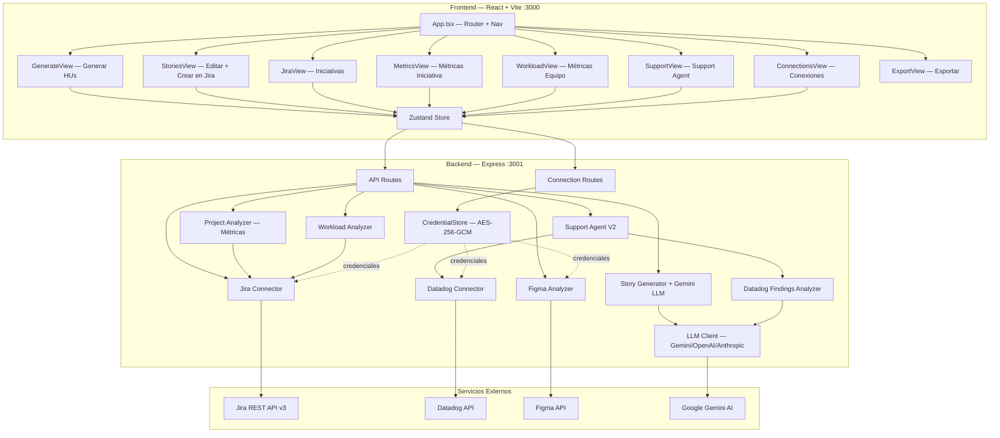
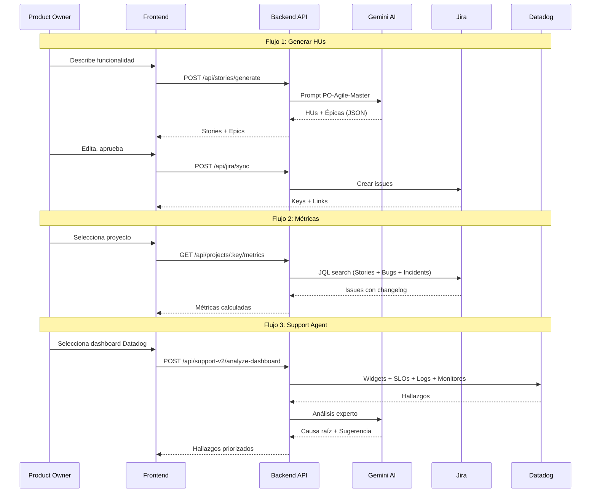

# PO AI — Asistente Inteligente para Product Owners

Plataforma que automatiza la gestión de iniciativas, generación de historias de usuario, análisis de métricas de equipo, y monitoreo de producción integrando Jira, Datadog y Gemini AI.

## Arquitectura

```
packages/
├── backend/     # Express API (puerto 3001)
├── frontend/    # React + Vite + Tailwind (puerto 3000)
└── shared/      # Tipos TypeScript compartidos
```

### Diagrama General



### Flujo de Datos Principal



## Inicio Rápido

```bash
# 1. Instalar dependencias
npm install

# 2. Compilar shared
cd packages/shared && npm run build && cd ../..

# 3. Configurar backend
cp packages/backend/.env.example packages/backend/.env
# Editar .env con: LLM_PROVIDER=gemini, LLM_API_KEY=tu-key

# 4. Compilar y arrancar backend
cd packages/backend && npm run build && npm run dev

# 5. Arrancar frontend (otra terminal)
cd packages/frontend && npm run dev
```

Abrir `http://localhost:3000`

## Módulos Funcionales

### 1. Generador de Historias de Usuario (PO-Agile-Master)
- Genera HUs con Gemini AI usando metodología INVEST
- Propone épicas automáticamente
- Edición completa: campos, criterios de aceptación, épicas
- Creación directa en Jira con selector de proyecto y épica padre
- Integración opcional con Figma para análisis de diseños
- **Archivos**: `story-generator.ts`, `GenerateView.tsx`, `StoriesView.tsx`
- **Spec**: `.kiro/specs/po-ai/`, `.kiro/specs/story-generator-v2/`

### 2. Iniciativas en Jira
- Lista proyectos con buscador predictivo
- Filtro por fecha de actividad
- Acceso a análisis de métricas, workload y support agent
- **Archivos**: `jira-connector.ts`, `JiraView.tsx`
- **Spec**: `.kiro/specs/corporate-auth-jsm/`

### 3. Métricas de Iniciativa
- Velocity, Cycle Time, Lead Time, Throughput
- Distribución por tipo de actividad (Historia, Error Productivo, Spike, etc.)
- Calidad: bugs por severidad, tasa de defectos, tiempo de resolución
- Salud en producción: incidentes activos, problemas abiertos
- Cumplimiento de entregables
- Observaciones automáticas de riesgo
- Filtro por rango de fechas
- **Archivos**: `project-analyzer.ts`, `MetricsView.tsx`

### 4. Métricas del Equipo (Workload)
- Carga por desarrollador con métricas avanzadas
- Lead Time, Cycle Time, Throughput, WIP, Aging WIP
- Ratio de re-trabajo, predictibilidad, equidad de carga
- Observaciones por desarrollador (sobrecarga, multitasking, HUs estancadas)
- Tooltips explicativos en cada métrica
- **Archivos**: `workload-analyzer.ts`, `metrics-calculator.ts`, `WorkloadView.tsx`

### 5. Support Agent (Datadog-first)
- Análisis independiente de Jira, basado en Datadog
- Selección de servicios o dashboards de Datadog
- Análisis de SLOs, logs de error, monitores en alerta, incidentes
- Priorización por severidad con causa raíz y sugerencia de corrección (Gemini)
- Creación opcional de issues en Jira
- **Archivos**: `support-agent-v2.ts`, `datadog-findings-analyzer.ts`, `datadog-connector.ts`, `SupportView.tsx`
- **Spec**: `.kiro/specs/support-agent-v2/`, `.kiro/specs/datadog-support-agent/`

### 6. Panel de Conexiones
- Configuración centralizada de Jira, Figma y Datadog
- Credenciales encriptadas con AES-256-GCM
- Validación de credenciales antes de almacenar
- Indicador de servicios desconectados en la navegación
- **Archivos**: `connection-routes.ts`, `service-validators.ts`, `credential-store.ts`, `ConnectionsView.tsx`
- **Spec**: `.kiro/specs/unified-auth/`

## Integraciones

| Servicio | Uso | Credenciales |
|----------|-----|-------------|
| Jira REST API v3 | Proyectos, issues, épicas, sincronización | baseUrl, email, apiToken |
| Datadog API | Logs, monitores, incidentes, SLOs, dashboards | apiKey, appKey, site |
| Figma API | Análisis de diseños (opcional) | accessToken |
| Gemini AI | Generación de HUs, análisis de hallazgos | LLM_API_KEY en .env |

## API REST (Backend)

### Historias de Usuario
- `POST /api/stories/generate` — Generar HUs con Gemini
- `PUT /api/stories/:id/refine` — Refinar una HU
- `POST /api/stories/detect-ambiguities` — Detectar ambigüedades

### Jira
- `GET /api/jira/projects` — Listar proyectos (params: credentialKey, startDate, prefix)
- `GET /api/jira/projects/:key/epics` — Listar épicas de un proyecto
- `POST /api/jira/sync` — Sincronizar HUs con Jira
- `POST /api/jira/authenticate` — Autenticar con Jira

### Métricas
- `GET /api/projects/:key/metrics` — Métricas de iniciativa (params: startDate, endDate)
- `POST /api/workload/analyze` — Análisis de carga del equipo

### Support Agent
- `POST /api/support-v2/analyze` — Análisis por servicios Datadog
- `POST /api/support-v2/analyze-dashboard` — Análisis de dashboard
- `GET /api/support/datadog/services` — Listar servicios
- `GET /api/support/datadog/dashboards` — Listar dashboards
- `POST /api/support/datadog/create-issue` — Crear issue en Jira

### Conexiones
- `POST /api/connections/jira` — Conectar Jira
- `POST /api/connections/figma` — Conectar Figma
- `POST /api/connections/datadog` — Conectar Datadog
- `GET /api/connections/status` — Estado de conexiones
- `DELETE /api/connections/:service` — Desconectar servicio

## Documentación de Specs

Cada funcionalidad tiene su spec completo en `.kiro/specs/`:

| Spec | Descripción |
|------|-------------|
| `po-ai` | Spec original del sistema PO AI |
| `unified-auth` | Panel de Conexiones (autenticación unificada) |
| `datadog-support-agent` | Integración Datadog con Support Agent |
| `corporate-auth-jsm` | Auth Google, JSM, filtro por tribus |
| `support-agent-v2` | Support Agent independiente (Datadog-first) |
| `story-generator-v2` | Mejoras al generador de HUs |

Cada spec contiene: `requirements.md`, `design.md`, `tasks.md`

## Sistema de Diseño

El frontend usa el sistema de diseño de Seguros Bolívar:
- Color primario: `#009056` (verde corporativo)
- Tipografía: Roboto
- Documentación: `.kiro/steering/sistema-diseno.md`

## Variables de Entorno

### Backend (`packages/backend/.env`)
```
PORT=3001
NODE_ENV=development
PO_AI_MASTER_KEY=cambiar-en-produccion-clave-segura-32chars
CORS_ORIGINS=http://localhost:3000
LLM_PROVIDER=gemini
LLM_API_KEY=tu-gemini-api-key
LLM_MODEL=gemini-2.0-flash
```

### Frontend (`packages/frontend/.env`)
```
VITE_API_URL=http://localhost:3001/api
```

## Seguridad

### Medidas implementadas
- **Helmet**: Headers HTTP de seguridad (XSS protection, content-type sniffing, HSTS, etc.)
- **CORS restringido**: Solo acepta peticiones del origen configurado en `CORS_ORIGINS`
- **Rate limiting**: 100 req/min general, 20 req/min en endpoints de credenciales
- **Validación de entrada**: Schemas Zod en endpoints críticos (generación, análisis, workload)
- **Sanitización HTML**: Prevención de XSS almacenado
- **Encriptación AES-256-GCM**: Credenciales almacenadas con cifrado simétrico
- **Permisos de archivo**: Archivo de credenciales con permisos 0600 (solo propietario)
- **Master key configurable**: Variable `PO_AI_MASTER_KEY` para producción
- **Sin stack traces en producción**: Errores genéricos cuando `NODE_ENV=production`
- **0 vulnerabilidades npm** en backend

### Para producción
1. Configurar `PO_AI_MASTER_KEY` con una clave segura de al menos 32 caracteres
2. Configurar `CORS_ORIGINS` con el dominio real del frontend
3. Establecer `NODE_ENV=production`
4. Usar HTTPS (reverse proxy con nginx o similar)
5. Las 4 vulnerabilidades moderadas del frontend son de tooling (esbuild/vite) y no afectan el build final
